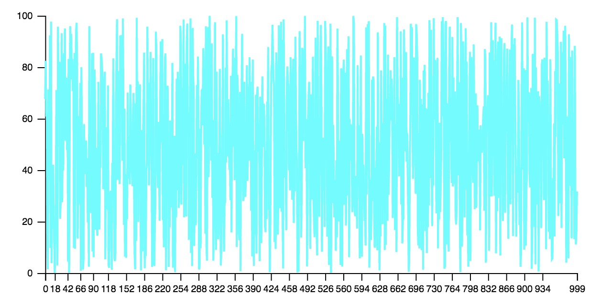
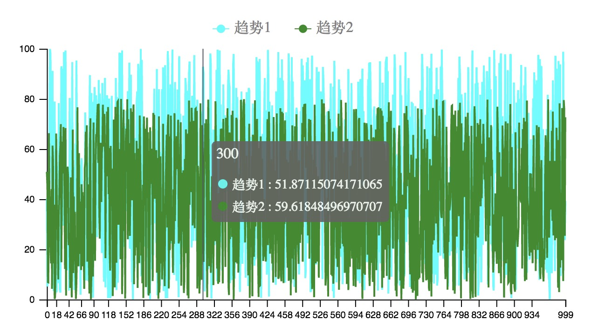
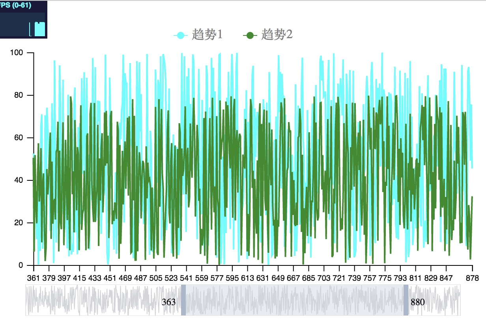
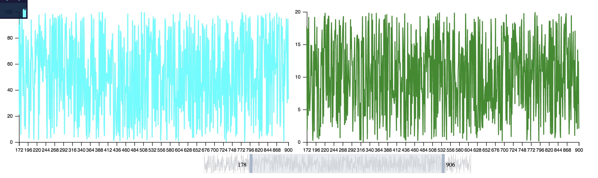
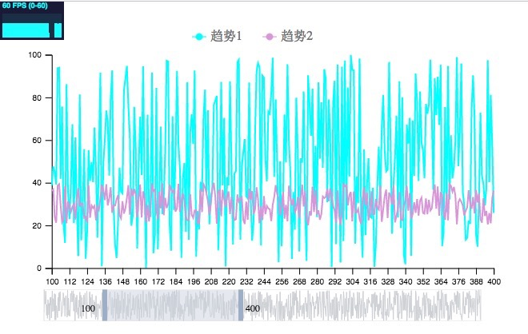
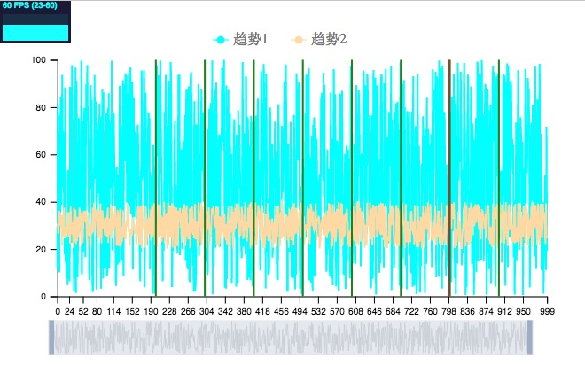

# 自研react趋势图控件

## 为什么要自研趋势图控件
[echarts](https://echarts.apache.org/examples/zh/index.html#chart-type-line)是我们常用的数据可视化图表库，但在在具体业务场景的使用中展示趋势图时，还是发现了不少问题，如
* 当数据量达到百万级别时，趋势图渲染和交互存在明显卡顿
* 多个趋势图之间的联动难以实现
* 趋势图提供的交互能力较少，难以实现定制化的交互需求

因此，结合实际业务的需要，我封装了一个基于[D3.js](https://d3js.org/), 用于`react`的趋势图控件
源码地址：[bigdata-react-tendency-chart](https://github.com/qsz/bigdata-react-tendency-chart)

### 功能亮点
* 采用组件化的使用方式，提供多个组件，按需引用
* 提供区域选择步长功能，区域变化数量达到步长时才会渲染，用于减少图表的频繁渲染
* 提供多个交互事件，可实现特定功能
* 提供自定义辅助线功能，更直观地展示数据


## 使用教程
**安装**
```
npm install --save bigdata-react-tendency-chart
```

### 基本使用
```jsx
import { TendencyChart } from 'bigdata-react-tendency-chart';

const Demo = () => {

  const dataset_1 = []
  for (let i = 0; i < 1000; i += 1) {
    dataset_1.push({
      text: i,
      value: Math.random() * 100
    });
  }

  return (
    <>
      <TendencyChart
        width={900}
        height={400}
        dataset={[{
          data: dataset_1,
          name: '趋势1'
        }]}
        lineColors={['#00FFFF']}
        startIndex={0}
        endIndex={1000}
      />
    </>
  )
}
```



### 按需引用所需辅助组件
**Legend图例组件**
```jsx
import { TendencyChart, Legend, Dispatcher } from 'bigdata-react-tendency-chart';

const dispatcher = new Dispatcher();

dispatcher.createDispatch(
  [].concat(
    dispatcher.eventTypes.ChartEventTypes,
    dispatcher.eventTypes.TooltipEventTypes,
    dispatcher.eventTypes.LegendEventTypes
  )
);

const Demo = () => {
  const dataset_1 = []
  for (let i = 0; i < 1000; i += 1) {
    dataset_1.push({
      text: i,
      value: Math.random() * 100
    });
  }

  const dataset_2 = []
  for (let i = 0; i < 1000; i += 1) {
    dataset_2.push({
      text: i,
      value: Math.random() * 100
    });
  }

  const dataset_2 = []
  for (let i = 0; i < 1000; i += 1) {
    dataset_2.push({
      text: i,
      value: Math.random() * 80
    });
  }

  return (
    <>
      <div style={{
        width: '600px'
      }}>
        <Legend dispatcher={dispatcher} />
      </div>
      <TendencyChart
        width={600}
        height={300}
        dataset={[{
          data: dataset_1,
          name: '趋势1'
        }, {
          data: dataset_2,
          name: '趋势2'
        }]}
        tooltip={{ show: true }}
        lineColors={['#00FFFF', '#228B22']}
        startIndex={0}
        endIndex={1000}
        dispatcher={dispatcher}
      />
    </>
  )
}
```


**Brush区域选择组件**
```jsx
import {
  TendencyChart,
  Brush,
  Dispatcher,
  Legend,
} from 'bigdata-react-tendency-chart';

const dispatcher = new Dispatcher();

dispatcher.createDispatch(
  [].concat(
    dispatcher.eventTypes.ChartEventTypes,
    dispatcher.eventTypes.BrushEventTypes,
    dispatcher.eventTypes.TooltipEventTypes,
    dispatcher.eventTypes.LegendEventTypes
  )
);

const Demo = () => {
  const dataset_1 = []
  for (let i = 0; i < 1000; i += 1) {
    dataset_1.push({
      text: i,
      value: Math.random() * 100
    });
  }

  const dataset_2 = []
  for (let i = 0; i < 1000; i += 1) {
    dataset_2.push({
      text: i,
      value: Math.random() * 80
    });
  }

  return (
    <>
      <div style={{
        width: '600px'
      }}>
        <Legend dispatcher={dispatcher} />
      </div>
      <TendencyChart
        width={600}
        height={300}
        dataset={[{
          data: dataset_1,
          name: '趋势1'
        }, {
          data: dataset_2,
          name: '趋势2'
        }]}
        tooltip={{ show: true }}
        lineColors={['#00FFFF', '#228B22']}
        startIndex={0}
        endIndex={1000}
        dispatcher={dispatcher}
      />


      <Brush
        dispatcher={dispatcher}
        width={600}
        height={40}
        lineDataset={dataset_1}
        startIndex={0}
        endIndex={1000}
        linear
      />
    </>
  )
};
```



### 多图联动
```jsx
<>
  <div style={{
    display: 'flex'
  }}>
    <TendencyChart
      width={600}
      height={300}
      dataset={[{
        data: dataset_1,
        name: '趋势1'
      }]}
      tooltip={{ show: true }}
      lineColors={['#00FFFF']}
      startIndex={0}
      endIndex={1000}
      dispatcher={dispatcher}
    />

    <TendencyChart
      width={600}
      height={300}
      dataset={[{
        data: dataset_2,
        name: '趋势2'
      }]}
      tooltip={{ show: true }}
      lineColors={['#228B22']}
      startIndex={0}
      endIndex={1000}
      dispatcher={dispatcher}
    />
  </div>

  <div style={{
    display: 'flex',
    justifyContent: 'center'
  }}>
    <Brush
      dispatcher={dispatcher}
      width={600}
      height={40}
      lineDataset={dataset_1}
      startIndex={0}
      endIndex={1000}
      linear
    />
  </div>
</>
```


### 设置步长
```jsx
<Brush
  dispatcher={dispatcher}
  width={600}
  height={40}
  lineDataset={dataset_1}
  startIndex={0}
  endIndex={1000}
  linear
  step={100} // 步长100，当改变的数量达到100时，才会渲染
/>
```


### 添加自定义辅助线
**xAxis.customLines**: 子项支持函数的形式，会批量添加辅助线
```jsx
<TendencyChart
  width={600}
  height={300}
  dataset={[{
    data: dataset_1,
    name: '趋势1'
  }, {
    data: dataset_2,
    name: '趋势2'
  }]}
  tooltip={{ show: true }}
  lineColors={['#00FFFF', '#FFDEAD']}
  startIndex={0}
  endIndex={1000}
  dispatcher={dispatcher}
  xAxis={{
    customLines: [
      (xaxisProps) => {
        const domainSource = xaxisProps.axis.domain;
        const ticks = [];
        let nextVal = 200;

        while (nextVal <= domainSource[domainSource.length - 1]) {
          ticks.push({
            tickValue: nextVal, // 需要渲染的刻度值
            strokeWidth: 2, // 线段宽度
            strokeColor: '#228B22', // 线段颜色
          });
          nextVal += 100;
        }

        return ticks;
      },
      {
        strokeColor: "#A94442",
        strokeWidth: 2,
        tickValue: 798,
      }
    ]
  }}
/>
```


### 多种交互事件
**图表点击事件**
```jsx
<TendencyChart
  dispatcher={dispatcher}
  width={1500}
  height={500}
  dataset={dataset}
  lineColors={['#00FFFF', '#FFD700']}
  tooltip={{ show: true }}
  onClick={(chartState, currentDataIndex) => {}}
/>
```

**选择区域改变事件**
```jsx
<Brush
  dispatcher={dispatcher}
  width={brushWidth}
  height={80}
  onRangeChange={({ startIndex, endIndex, total, step }) => {}}
/>
```


## 配置项
**TendencyChart组件** 
```jsx
  static propTypes = {
    width: PropTypes.number, // 容器宽度
    height: PropTypes.number, // 容器高度
    grid: PropTypes.shape({
      // 网格
      top: PropTypes.number, // 曲线区域到容器上侧的距离
      right: PropTypes.number,
      bottom: PropTypes.number,
      left: PropTypes.number,
    }),
    lineStrokeWidth: PropTypes.number, // 曲线宽度
    tooltip: PropTypes.shape({
      formatter: PropTypes.shape({
        label: PropTypes.func,
        name: PropTypes.func,
        value: PropTypes.func,
      }), // 框浮层内容格式器
      show: PropTypes.bool, // 是否显示tooltip
    }),
    dataset: PropTypes.arrayOf(
      PropTypes.shape({
        data: PropTypes.arrayOf(
          PropTypes.shape({
            value: PropTypes.number,
            text: PropTypes.oneOfType([PropTypes.string, PropTypes.number]),
          })
        ), // 曲线数据
        name: PropTypes.oneOfType([PropTypes.string, PropTypes.number]), // 曲线名字
      })
    ), // 曲线数据集
    lineColors: PropTypes.arrayOf(PropTypes.string), // 曲线颜色，与数据集一一对应
    dispatcher: PropTypes.object, // 用于brush, toolTip, legend联动
    startIndex: PropTypes.number, // 开始下标
    endIndex: PropTypes.number, // 结束下标
    formatDispatrchIndex: PropTypes.func, // 根据Brush的步长自定义index
    maxValue: PropTypes.number, // 最大值 设置后可提高性能
    minValue: PropTypes.number, // 最小值 设置后可提高性能

    xAxis: PropTypes.shape({
      tickInterval: PropTypes.number, // 刻度的最小间隔
      axisLine: PropTypes.shape({
        tickStrokeWidth: PropTypes.number, // 刻度线宽度
        tickSize: PropTypes.number, // 内侧和外侧刻度的大小
        tickPadding: PropTypes.number, // 刻度和刻度文本之间的间距
      }),
      splitLine: PropTypes.shape({
        // 网格
        show: PropTypes.bool, // 是否显示
        interval: PropTypes.oneOfType([PropTypes.string, PropTypes.number]), // 间隔
      }),
      customLines: PropTypes.arrayOf(
        // 自定义线
        PropTypes.oneOfType([
          PropTypes.shape({
            tickIndex: PropTypes.number, // 需要渲染的刻度的序号
            tickValue: PropTypes.oneOfType([
              PropTypes.string,
              PropTypes.number,
            ]), // 需要渲染的刻度值
            strokeWidth: PropTypes.number, // 线段宽度
            strokeColor: PropTypes.string, // 线段颜色
          }),
          PropTypes.func,
        ])
      ),
    }),
    yAxis: PropTypes.shape({
      tickNumber: PropTypes.number, // y轴刻度的数量建议值
      axisLine: PropTypes.shape({
        tickStrokeWidth: PropTypes.number, // 刻度线宽度
        tickSize: PropTypes.number, // 内侧和外侧刻度的大小
        tickPadding: PropTypes.number, // 刻度和刻度文本之间的间距
      }),
      splitLine: PropTypes.shape({
        // 网格
        show: PropTypes.bool, // 是否显示
        interval: PropTypes.oneOfType([PropTypes.string, PropTypes.number]), // 间隔
      }),
    }),

    onClick: PropTypes.func, // 点击事件，可获取趋势图的状态
  };
```

**Brush组件**
```jsx
  static propTypes = {
    lineDataset: PropTypes.array, // 用于展示预览图
    length: PropTypes.number, // 总数
    width: PropTypes.number, // 宽度
    height: PropTypes.number, // 长度
    handleWidth: PropTypes.number, // handle元素宽度
    fontSize: PropTypes.number, // 文字大小
    textMargin: PropTypes.number, // 文字与handle的间隔
    startIndex: PropTypes.number, // 开始下标
    endIndex: PropTypes.number, // 结束下标
    dispatcher: PropTypes.object, // 用于chart联动
    onBrush: PropTypes.func, // 移动事件
    onRangeChange: PropTypes.func, // 区间大小改变事件
    autoAdjustRangeWhenClickBrush: PropTypes.bool, // 点击brush调整range
    step: PropTypes.number, // 每次移动的最小步长
    autoDispatchWhenRangeChange: PropTypes.bool, // 当拖动handle至range改变时，是否自动发送数据给tendency
    previewLines: PropTypes.arrayOf(
      // 自定义线
      PropTypes.shape({
        tickIndex: PropTypes.number, // 需要渲染的刻度的序号
        tickValue: PropTypes.oneOfType([PropTypes.string, PropTypes.number]), // 需要渲染的刻度值
        strokeWidth: PropTypes.number, // 线段宽度
        strokeColor: PropTypes.string, // 线段颜色
      })
    ),
    linear: PropTypes.bool,
    formatter: PropTypes.func, // 文字内容格式器
  };
```

