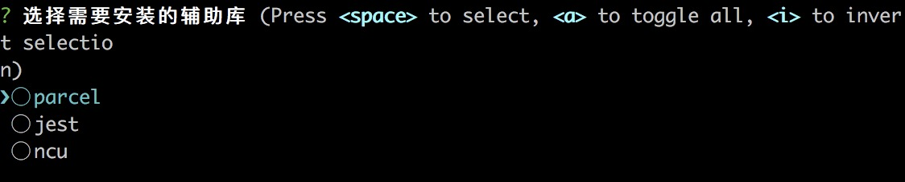

# 撸一个用于创建typescript库的脚手架

## 前言
学习`typescript`的时候往往需要搭一套环境，好在github有大神提供脚手架[typescript-library-starter](https://github.com/alexjoverm/typescript-library-starter)。但这个脚手架需要每次`git clone`，稍显繁琐。本文我们就打算将其改造成类似`vue-cli`的工具，顺便学习一下如何创建命令行工具。

> [代码地址](https://github.com/qsz/ts-lib-cli)

#### 参考：

https://github.com/alexjoverm/typescript-library-starter

#### 用到的库

* [commander](https://github.com/tj/commander.js)：用户命令行输入和参数解析的工具
* [Inquirer](https://github.com/SBoudrias/Inquirer.js)：用户与命令行交互的工具

## 开发

### 初始化项目

#### npm初始化

首先在空文件夹，用`npm init`命令创建初始项目，并安装上述工具库`npm install --save  commander inquirer` 

#### 创建npm链接

新建文件夹`bin`，并在文件夹下创建入口文件`cli.js`.	修改`package.json`文件

```json
 "bin": {
    "tlc": "bin/cli.js"
  },
```

`bin`的作用是我们的项目链接的全局。为了让`bin`起作用，修改`cli.js`

```js
#!/usr/bin/env node
console.log('this is ts-cli')
```

文件的第一行`#!/usr/bin/env node`作用是告诉系统用`node`解析文件。

最后执行`npm link`命令, 将npm 模块链接到对应的运行项目中去。尝试命令行运行`tlc`, 输出

> this is ts-cli

### 命令行交互

#### commander库

`commander`可以帮助我们方便的读取用户命令行输入

主要api如下

* command   创建一个执行的命令

* option：      可选参数

* alias：          命令简写

* description  命令描述

* action           执行命令后所执行的方法
* version        注册版本号

**举个例子**

```js
const program = require('commander');
program.version('1.0.0');  // 版本号1.0.0
program
    .command('create')
    .option('--f', '快速创建项目')
    .description('初始化项目')
    .action(function (option) {
        if(option.f){ // 如果快速快速创建项目
            // TODO
        } 
        console.log('创建项目')
    });

program.on('--help', function(){
    console.log('')
    console.log('Examples:');
    console.log('  $ tlc create');
    console.log('  $ tlc create --f');
});

program.parse(process.argv)   
```

命令行输入：`tlc create`,	输出

> 创建项目

查看版本：`tlc -V`, 输出

> 1.0.0

查看帮助：`tlc -h`, 输出

> Examples:
>    tlc
>    tlc --f

#### inquirer库

`inquirer`提供了大量用户与命令行交互的方式，如`input`, `confirm`, `list`, `rawlist`, `expand`, `checkbox`, `password`, `editor`

**举个例子**

```js
const inquirer = require('inquirer');
const promptList = [
    {
        type: 'checkbox',                 // checkbox类型的问题
        name: 'lib',                      // 问题回答的变量
        message: '选择需要安装的辅助库',     // 问题的描述
        choices:  ["parcel","jest","ncu"];      // 选项
    },
    {
        type: 'input',                   // checkbox类型的问题
        name: 'name',
        message: '项目名称',
        default: 'ts-lib-cli'            // 默认值  
    }
]
inquirer.prompt(promptList).then(function(answers) {
    console.log(answers)
});
```

运行如下



### typescript运行环境

`typescript-library-starter`已经提供了一套typescript开发环境模版，包括

* [RollupJS](https://rollupjs.org/)：打包文件
* [Prettier](https://github.com/prettier/prettier) 和 [TSLint](https://palantir.github.io/tslint/)：帮助我们格式化代码以及保证代码风格一致性。
* [TypeDoc](https://typedoc.org/) ：帮助我们自动生成ts库的文档
*  [Jest](https://jestjs.io/)：单元测试库
* [Commitizen](https://github.com/commitizen/cz-cli)：生成规范化的提交注释
*  [Semantic release](https://github.com/semantic-release/semantic-release)：管理版本和发布
* [husky](https://github.com/typicode/husky)：更简单地使用 git hooks
*  [Conventional changelog](https://github.com/conventional-changelog/conventional-changelog)：通过代码提交信息自动生成 change log。

因此我们只需要在项目下新建一份`typescript-library-starter`模版，通过执行命令行工具，将其复制到我们的项目地址。

#### 提供用户自定义选择需要的npm包

上述工具库，除了`RollupJS`和`TSLint`	，其他都不是必须的。我们对`typescript-library-starter`进行改进，让用户可以自定义选择安装上述npm包。

```js
const libChoices =  [ // 自定义需要的库
    "parcel",
    "jest",
    "ncu"
];
const promptList = [
    {
        type: 'checkbox',
        name: 'lib',
        message: '选择需要安装的辅助库',
        choices: libChoices
    },
    {
        type: 'input',
        name: 'name',
        message: '项目名称',
        default: 'ts-lib-cli'
    }
]
 
program
    .option('--f', '快速创建项目')
    .description('初始化项目')
    .action(function (option) {
        if(option.f){
            const answers = {
                name: 'ts-lib-cli',
                lib: libChoices
            }
            prompt(answers)
            return
        } 
        inquirer.prompt(promptList).then(function(answers) {
            prompt(answers)
        });
    });

function prompt() {
  // TODO
}
```

`prompt`方法则根据用户的选项进行不同的操作。

### 发布到npm

为了我们下次使用方便，最后将我们的脚手架发布到`npm仓库`


## 小结

本文的重点并不是讲解`typescript`开发环境的配置，`typescript-library-starter`库已经配置的很完整。经过本次学习，是想向大家介绍下如何撸一个命令行工具。在日后的工作中，大家也可以将一些配置化的操作封装成一个脚本工具，从而省去这些重复繁琐的操作。

`typescript-library-starter`配置了很多辅助库，很惭愧，我只了解过`RollupJS`，`tslint`, `jest`。因此在脚手架中只配置了这三个库，同时增加了`parcel`(一个零配置的打包工具)和`npm-check-updates`(npm升级工具)。

后续计划学习其余的几个工具库，并完善脚手架，将这些工具库加入到脚手架中