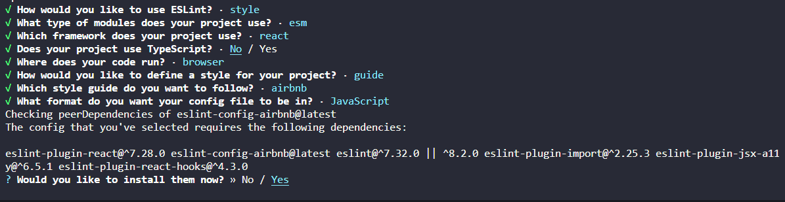
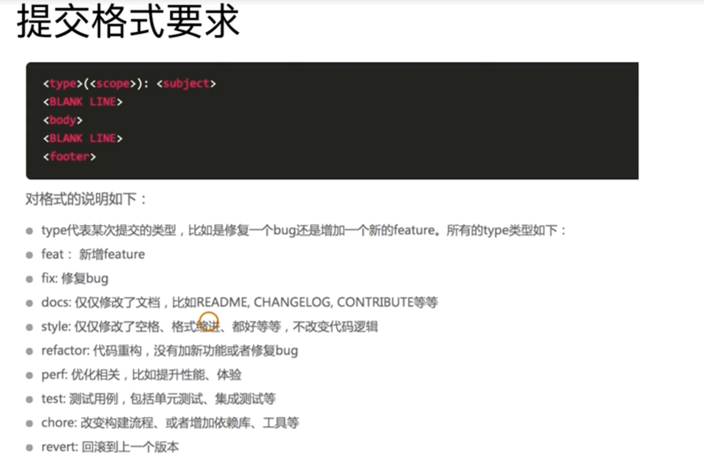
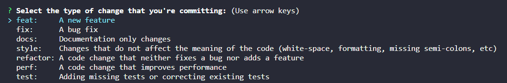

# 从0到1配置前端开发规范

## 前言
在配置前端开发规范规范之前，我想谈谈什么是前端工程化，或者说，为什么要进行前端工程化。
随着前端技术的快速发展，前端开发不再像以前只需要精通jquery和css编写页面。在如今的前端领域，我们需要掌握webpack、rollup、babel等编译构建工具，掌握react、vue等前端框架，要会使用node、npm、yarn、pnpm，会使用less、sass等预处理语言，JavaScript 语言的标准也在不断发布。
在前端技术蓬勃发展的同时，也带来了一个问题，我们的前端项目越来越复杂了。前端工程化就是为了在庞大的前端工程下，帮助我们提高生产效率、提升项目质量。

### 前端工程化具体是什么
我觉得，前端工程化可以从两个维度讨论：功能性和项目阶段。
按功能性，可以分为：
* 规范化
* 组件化
* 模块化
* 自动化
按项目阶段，可以分为：
* 开发/构建阶段
* 测试阶段
* 部署阶段
* 生产环境监控阶段

在这篇文章中，我要介绍的是在开发阶段，如何做到规范化。
开发阶段的规范化，主要为了统一团队开发人员的编码规范和提交规范，保证风格统一。
有人会说，我们可以编写一套文档来定义这些规范呀？但在实际工作中，这是不可行的，没有人回会对照着文档中的规范一条条编写代码，也没有人能做到保证不出错。因此，我们需要借助工具，帮助团队成员规范开发。

## 编码规范化
编码规范化，针对的是js和css。

### ESLint 
ESLint是javascript代码检测工具，用于检测代码是否符合语法以及制定的风格，标记出有语法问题、不符合规范的代码，并提供修复的功能。

开发环境：node@14.20.0 + vscode

#### 安装并初始化 `eslint`
> npm install --save-dev eslint
> npx eslint --init

如图所示, 在安装过程中会询问使用EsLint做什么、模块引入方式、前端使用的框架、使用哪种规范标准等等问题。初始化完成后，会生成`.eslintrc.js`文件，并且会安装对应的工具包。


```js
module.exports = {
  env: {
    browser: true,
    es2021: true,
  },
  extends: [
    'plugin:react/recommended',
    'airbnb',
  ],
  overrides: [
  ],
  parserOptions: {
    ecmaVersion: 'latest',
    sourceType: 'module',
  },
  plugins: [
    'react',
  ],
  rules: {
  },
};
```

安装的包主要有
* eslint-config-airbnb： Airbnb团队提供的规则配置，与之相似的还有[eslint-config-standard](https://npmjs.com/package/eslint-config-standard)
* eslint-plugin-react：因为我在初始化的时候选择了react库，所以eslint-plugin-react、eslint-plugin-react-hooks、eslint-plugin-jsx-a11y都是为了配合检查react的语法规则

#### 检测、修复代码
```shell
# 命令行运行，将会在终端输出代码的错误信息
npx eslint demo.js 

# 修复代码中的问题
npx eslint demo.js
```

#### 结合vscode 实时提示问题并自动修复
每次手动修复错误信息非常麻烦，在vscode中开发时，我们可以利用[ESLint](https://marketplace.visualstudio.com/items?itemName=dbaeumer.vscode-eslint)，做到开发时界面实时提示问题，代码保存时，自动修复问题。
安装完插件后，在vscode中按下Ctrl+Shift+P，输入settings，打开settings.json文件，
并且添加如下配置。
```json
{
    "editor.codeActionsOnSave": {
        "source.fixAll.eslint": true
    },
}
// 低版本是 "eslint.autoFixOnSave": true
```

#### .eslintrc.js常用的配置项
**rules**
顾名思义，rules配置的就是项目的规则项，具体有哪些规则，可参考[内置规则](http://eslint.cn/docs/rules/)

**plugins**
插件可以提供处理器。处理器可以从另一种文件中提取 JavaScript 代码，然后让 ESLint 检测 JavaScript 代码。或者处理器可以在预处理中转换 JavaScript 代码。

**extends**
extends可以看作是env、plugins、rules等配置项的集合，让我们可以采用推荐的配置或者社区中成熟的配置，而不用我们自己一个个去配。
当extends提供的配置无法满足我们的需求时，我们就可以借助插件去实现或者修改配置。
以[eslint-plugin-react-hooks](https://www.npmjs.com/package/eslint-plugin-react-hooks)为例，它是用来规范hooks的使用。
我们可以直接放在extends中，使用它预设的规则
```json
{
  "extends": [
    // ...
    "plugin:react-hooks/recommended"
  ]
}
```
也可以配置plugins和rules，来修改预设的规则
```json
{
  "plugins": [
    // ...
    "react-hooks"
  ],
  "rules": {
    // ...
    "react-hooks/rules-of-hooks": "error",
    "react-hooks/exhaustive-deps": "warn"
  }
}
```

### Stylelint
[Stylelint](https://www.stylelint.com.cn/) 是一个强大、先进的 CSS 代码检查器（linter），可以帮助你规避 CSS 代码中的错误并保持一致的编码风格。

#### 安装 Stylelint 及其 标准配置
> npm install --save-dev stylelint stylelint-config-standard

#### 创建 .stylelintrc.json 配置文件
```json
{
  // 使用标准配置
  "extends": ["stylelint-config-standard"],
  // 自定义4个空格缩进
  "rules": {
    "indentation": 4
  }
}
```

#### 结合vscode自动修复问题
[Stylelint](https://marketplace.visualstudio.com/items?itemName=stylelint.vscode-stylelint)
```json
{
    "editor.codeActionsOnSave": {
        "source.fixAll.stylelint": true
    },
    "stylelint.validate": ["css", "scss", "less"]
}
```

### Prettier
[Prettier](https://www.prettier.cn/)是一个代码格式化工具，与ESLint主要解决是的代码质量问题（顺便解决格式化问题）不同，Prettier更侧重于解决代码和样式风格问题，在项目中，我们可以把Prettier与ESLint、Stylelint结合，更完美地解决编码规范的问题。
需要安装的包有
* prettier
* [eslint-config-prettier](https://www.npmjs.com/package/eslint-config-prettier)：关闭ESLint中所有不必要的或可能与Prettier冲突的规则。
* [eslint-plugin-prettier](https://www.npmjs.com/package/eslint-plugin-prettier)：将prettier与ESLint结合，当代码不符合prettie配置的规范时，会作为ESLint的错误抛出，ESLint也会修复该错误
* [stylelint-config-prettier](https://www.npmjs.com/package/stylelint-config-prettier)：与`eslint-config-prettier`同理
* [stylelint-prettier](https://www.npmjs.com/package/stylelint-prettier)：与`eslint-plugin-prettier`同理

#### Prettier + ESLint
修改ESLint配置
```json
{
  "extends": [
    "airbnb",
    "plugin:prettier/recommended", // 新增
  ],
  "plugins": ["prettier"],
}
```
**.prettierrc 自定义**
可以新建.prettierrc来自定义规范
```json
{
  // 不使用分号
  "semi": false
}
```
**vscode插件**
[Prettier](https://marketplace.visualstudio.com/items?itemName=esbenp.prettier-vscode)

#### Prettier + Stylelint
修改`.stylelintrc`
```json
{
  "extends": [
    "stylelint-prettier/recommended",
    "stylelint-config-prettier"
  ],
  "rules": {
      "prettier/prettier": "error",
  },
}
```


## 提交规范化
指定完开发时的规范之后，为了防止漏改问题，在代码提交时，我们仍需要把关，对代码再次进行校验。

### commitizen规范commit信息
使用[commitizen](https://github.com/commitizen/cz-cli)提交时，系统会提示您在提交时填写所有必需的commit字段。
[cz-conventional-changelog](https://github.com/commitizen/cz-conventional-changelog)会按内置的规则，规定commit时需要哪些信息。
两者结合，可以保证我们提交的信息符合规范


安装
> npm install --save-dev commitizen cz-conventional-changelog

配置package.json
```json
{
  "scripts": {
    "commit": "git-cz",
  },
  "config": {
    "commitizen": {
      "path": "node_modules/cz-conventional-changelog"
    }
  }
}
```
执行`npm run commit`后，将会以问询的方式，协助我们按规范填写git提交信息


### husky + lint-staged 二次把关
[husky](https://github.com/typicode/husky) 是一个处理Git Hooks的工具，可以利用它在提交前会校验ESLint的规则和commit信息的规范
[lint-staged](https://github.com/okonet/lint-staged) 专门用于在提交代码之前，对暂存区的代码执行格式化
将两者结合使用，我们可以只检查本次有改动的代码，而不用检查全局代码，可以提交效率


安装
> npm install --save-dev husky lint-staged

配置package.json
```json
{
  "scripts": {
    "prepare": "husky install",
  },
  "lint-staged": {
    "*.{js,jsx}": [
      "eslint --fix"
    ],
    "*.{css,less}": [
      "stylelint --fix"
    ]
  }
}
```

**pre-commit 钩子**
执行`npm run prepare`启动husky，会在项目文件夹下，生成一个`.husky`文件夹
执行`npx husky add .husky/pre-commit`添加 pre-commit 钩子，并自动生成`.husky/pre-commit`脚本
修改`pre-commit`，当git commit时，将会修复暂存区的js、css代码
```shell
#!/usr/bin/env sh
. "$(dirname -- "$0")/_/husky.sh"

npx lint-staged

```

**pre-push 钩子**
执行`npx husky add .husky/pre-push`
配置package.json
```json
{
  "scripts": {
    "eslint": "eslint ./src --ext .js,.jsx",
    "stylelint": "stylelint src/**/*.less",
    "lint": "npm run eslint & npm run stylelint"
  }
}

```
修改`pre-push`，当git push时，将检查代码是否符合规范。如果不符合规范，代码将不会提交
```shell
#!/usr/bin/env sh
. "$(dirname -- "$0")/_/husky.sh"

npm run lint

```

## 小结
这边文章中介绍的方案，也是我日常工作中普遍采用，希望对大家有所帮助。


