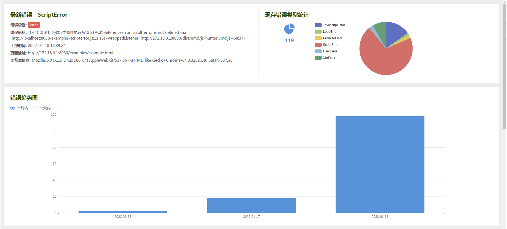
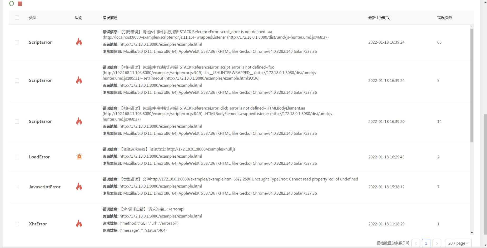

# 自研前端异常监控系统：js-hunter-server（服务端篇）

## 前言
在上一篇文章[自研前端异常监控系统：js-hunter（客户端篇）](/blog/#/前端工程/自研前端异常监控系统上)中，我们介绍了如何开发一个客户端前端异常数据捕获、上报的SDK。有了数据之后，我们就要对其进行接收、存储、聚合、展示。接下来，我们就来开发异常监控系统的服务端

项目源码地址：[js-hunter-server](https://github.com/qsz/js-hunter-server)

## 数据库设计
### 表设计
提供两张表，用于存储错误总数以及错误详情
* log_day 每天上报错误数量表
* log_info 错误详情表

### 数据阀值
出了性能的考虑，我们对数据存储的数量做一些限制
* 只保存七天内的数据
* 相同 eventKey 的数据最多记录 200 条
* 总共存储 10w 条数据

### 具体实现
数据库采用`mysql`, 服务端程序采用`promise-mysql`来调用`mysql`，让我们可以用`async 函数`的方式来写代码。
数据结构
```js
export interface eventData {
  eventKey?: string; // 用于过滤相同的数据
  type?: string; // 上报类型
  originType?: string; // 原生事件类型类型 Event.type
  message?: string; // 异常信息文字描述
  timestamp?: number; // 该eventKey第一次上报时间戳
  start_timestamp?: number; // 异常开始时间戳
  pageUrl?: string; // 页面地址
  userAgent?: string; // 浏览器信息
  level?: string; // 上报级别
  request?: {
    // 请求数据
    method?: string;
    url?: string;
    body?: any;
  };
  response?: {
    // 响应数据
    message?: string;
    status?: number;
  };
  customInfo?: string; // 用户自定义的信息
}
```
调用`mysql`
```js
import Mysql from 'promise-mysql';

// 建立连接池
const connectPool = Mysql.createPool({
  host: 'mysql',
  port: 3306,
  user: 'root',
  password: '123456',
  database: 'js_hunter_docker',
});

/**
 * sql查询
 * @param sql
 * @param values
 */
export async function query(sql: string, values: any = ''): Promise<any> {
  const pool = await connectPool;
  const connection = await pool.getConnection();
  const result = await connection.query(sql, values);
  connection.release(); // 连接完成后，释放
  return await result;
}

/**
 * 创建log表
 * deleteTable('log_info');
 * createTable();
 */
export async function createTable(): Promise<any> {
  const sql = `CREATE TABLE IF NOT EXISTS log_info (
    id INT PRIMARY KEY NOT NULL AUTO_INCREMENT COMMENT '(自增长)',
    eventKey VARCHAR ( 50 ) COMMENT '用于过滤相同的数据',
    type VARCHAR ( 30 ) COMMENT '上报类型',
    message VARCHAR ( 1000 ) COMMENT '异常信息文字描述',
    timestamp BIGINT ( 13 ) COMMENT 'eventKey第一次上报时间戳',
    updateTime BIGINT ( 13 ) COMMENT '更新时间',
    level VARCHAR ( 20 ) COMMENT '上报级别',
    pageUrl VARCHAR ( 1000 ) COMMENT '页面地址',
    userAgent VARCHAR ( 500 ) COMMENT '浏览器信息',
    request VARCHAR ( 1000 ) COMMENT '请求数据',
    response VARCHAR ( 1000 ) COMMENT '响应数据',
    originType VARCHAR ( 20 ) COMMENT '原生事件类型类型',
    customInfo VARCHAR ( 1000 ) COMMENT '用户自定义的信息',
    count INT ( 10 ) COMMENT '错误出现次数'
  ) ENGINE = INNODB charset = utf8;`;
  return await query(sql);
}

/**
 * 创建每天上报错误记录表
 * deleteTable('log_day');
 * createDayTable();
 */
export async function createDayTable(): Promise<any> {
  const sql = `CREATE TABLE IF NOT EXISTS log_day (
    id INT PRIMARY KEY NOT NULL AUTO_INCREMENT COMMENT '(自增长)',
    eventKey VARCHAR ( 50 ) COMMENT '用于过滤相同的数据',
    type VARCHAR ( 30 ) COMMENT '上报类型',
    timestamp BIGINT ( 13 ) COMMENT 'eventKey第一次上报时间戳'
  ) ENGINE = INNODB charset = utf8;`;
  return await query(sql);
}

/**
 * 添加字段
 * @param sql
 * addTableColumn(`eventKey VARCHAR ( 100 ) COMMENT '用于过滤相同的数据' AFTER type`);
 */
export async function addTableColumn(sql: string): Promise<any> {
  const querySql = `alter table log_info Add column ${sql};`;
  return await query(querySql);
}

/**
 * 修改字段
 * @param sql
 * updateTableColumn(`userAgent userAgent VARCHAR ( 500 ) COMMENT '浏览器信息'`);
 */
export async function updateTableColumn(sql: string): Promise<any> {
  const querySql = `alter table log_info change ${sql};`;
  return await query(querySql);
}

/**
 * 删除七天前的数据
 * @param table
 */
async function deleteLogTimeBeforeAdd(table): Promise<any> {
  const sql = `
  delete from ${table}
  where
    date(convert_tz(from_unixtime(timestamp / 1000),'SYSTEM','+08:00'))
    <=
    date_sub(convert_tz(CURDATE(),'SYSTEM','+08:00'), INTERVAL 8 DAY)
  `;
  return await query(sql);
}

/**
 * 总共存储 10w 条数据
 * @param table
 */
async function checkLogTotalLimitBeforeAdd(table): Promise<any> {
  const sql = `select count(*) as num from ${table}`;
  const count = await query(sql);
  const total = (count && count[0] && count[0].num) || 0;
  if (total > 100000) {
    // 总共存储10w条数据
    return true;
  }
  return false;
}

/**
 * 记录每天上报的数量
 * @param timestamp
 * 只保存七天内的数据
 */
async function addDayLog(eventKey, type, timestamp): Promise<any> {
  // 删除过期数据
  await deleteLogTimeBeforeAdd('log_day');

  // 总共存储 10w 条数据
  if (await checkLogTotalLimitBeforeAdd('log_day')) {
    return;
  }

  // 相同eventKey的log数量最多保存200条
  const l_sql = `select * from log_day where eventKey='${eventKey}'`; // 找到相同eventKey的log
  const logs = await query(l_sql);
  if (logs.length > 200) {
    return;
  }

  const a_sql = `insert into log_day(eventKey,type,timestamp) values(?,?,?)`;
  return await query(a_sql, [eventKey, type, timestamp]);
}

/**
 * 添加一条数据
 * @param data
 * TODO 更新时间
 */
export async function addLog(data: eventData): Promise<any> {
  const {
    eventKey,
    type,
    message,
    timestamp = new Date().getTime(),
    level,
    pageUrl,
    userAgent,
    request,
    response,
    originType,
    customInfo,
  } = data;

  // 删除过期数据
  await deleteLogTimeBeforeAdd('log_info');

  // 总共存储 10w 条数据
  if (await checkLogTotalLimitBeforeAdd('log_info')) {
    return;
  }

  // 记录每天上报错误数量
  await addDayLog(eventKey, type, timestamp);

  const k_sql = `select * from log_info where eventKey='${eventKey}'`; // 找到相同的eventKey
  const logs = await query(k_sql);
  const hasLog = logs && logs[0]; // 是否已存在

  if (hasLog) {
    // 更新count和updateTime
    let count = logs[0].count || 0;
    count += 1;
    const update_sql = `update log_info set count=${count}, updateTime=${timestamp} where eventKey='${eventKey}'`;
    return await query(update_sql);
  } else {
    // 新增
    const add_sql = `insert into 
      log_info(eventKey,type,message,timestamp,updateTime,level,pageUrl,userAgent,request,response,originType,customInfo, count) 
      values(?,?,?,?,?,?,?,?,?,?,?,?,?)`;
    const count = 1;
    const values = [
      eventKey,
      type,
      message,
      timestamp,
      timestamp,
      level,
      pageUrl,
      userAgent,
      request,
      response,
      originType,
      customInfo,
      count,
    ];
    return await query(add_sql, values);
  }
}

/**
 * 获取数据
 * @param pageNo
 * @param pageSize
 */
export async function getLogs({ pageNo, pageSize }: { pageNo: any; pageSize: any }): Promise<any> {
  const pageN = +pageNo;
  const pageS = +pageSize;
  const pageLimit = `${(pageN - 1) * pageS},${pageN * pageS}`; // 分页查询
  const sql = `select * from log_info order by updateTime desc limit ${pageLimit};`;
  const logs = await query(sql);
  return await logs;
}

/**
 * 获取数据总数, 累加count
 */
export async function getLogTotalByCount(): Promise<any> {
  const sql = 'select sum(count) as num from log_info';
  const count = await query(sql);
  const total = (count && count[0] && count[0].num) || 0;
  return await total;
}

/**
 * 获取数据总条数
 */
export async function getLogTotal(): Promise<any> {
  const sql = 'select count(*) as num from log_info';
  const count = await query(sql);
  const total = (count && count[0] && count[0].num) || 0;
  return await total;
}

/**
 * 按天统计数据
 * 带时区 东八区
 * @param pageNo
 * date_sub() 函数从日期减去指定的时间间隔。
 * TODO 补齐
 */
export async function getLogsGroupByDay(type?: any): Promise<any> {
  let days = 7;
  let sql = `
    select from_unixtime(timestamp / 1000) as unixtime, count(*) as num
    from log_day
    where 
      date_sub(convert_tz(CURDATE(),'SYSTEM','+08:00'), INTERVAL ${days} DAY) 
      <= 
      date(convert_tz(from_unixtime(timestamp / 1000),'SYSTEM','+08:00'))
    group by date(convert_tz(unixtime,'SYSTEM','+08:00'))
  `;

  if (type === 'day') {
    days = 1;
    sql = `
    select date_format(convert_tz(from_unixtime(timestamp / 1000),'SYSTEM','+08:00'),'%Y-%m-%d %H') as hours,count(id) as num
    from log_day
    where 
      date_sub(convert_tz(CURDATE(),'SYSTEM','+08:00'), INTERVAL ${days} DAY) 
      <= 
      date(convert_tz(from_unixtime(timestamp / 1000),'SYSTEM','+08:00'))
    group by hours;`;
  }

  return await query(sql);
}

/**
 * 按错误类型分组统计数据
 */
export async function getLogsGroupByType(): Promise<any> {
  // const sql = `select count(*),type from log_info group by type`;
  const sql = `select type,sum(count) as num from log_info group by type`;
  return await query(sql);
}

/**
 * 删除一条数据
 * @param id
 */
export async function deleteLog(id: any): Promise<any> {
  const sql = `delete from log_info where id=${id}`;
  return await query(sql);
}

/**
 * 删除多条数据
 * @param ids
 */
export async function deleteLogs(ids: any): Promise<any> {
  const sql = `delete from log_info where id in (${ids})`;
  return await query(sql);
}

/**
 * 删除deleteLogByEventKey相同的数据
 * @param field
 * @param value
 */
export async function deleteLogsByEventKey(eventKeys: any): Promise<any> {
  const sql = `delete from log_info where eventKey in (${eventKeys})`; // 多条
  return await query(sql);
}

/**
 * 删除表
 * @param tableName
 */
export async function deleteTable(tableName: string): Promise<any> {
  const sql = `drop table ${tableName}`;
  return await query(sql);
}

```

## 服务端实现
服务端，我们选用`koa`，主要提供几个接口：
* /request： 存储数据，在存储数据时，会进行以下几步操作
    * 删除过期数据
    * 判断数据是否超多10w条
    * 判断数据是否存在，选择更新或者新增
* /datasByDay：按天分组统计数据
* /datasByType：按错误类型分组统计数据
* /deleteLogs：批量删除数据
* /deleteLogsByEventKey: 删除EventKey相同的数据

```js
import Koa from 'koa';
import Router from 'koa-router';
import Cors from 'koa2-cors';
import Static from 'koa-static';
import bodyParser from 'koa-bodyparser';
import path from 'path';
import {
  query,
  addLog,
  getLogs,
  getLogTotal,
  getLogTotalByCount,
  deleteLogs,
  getLogsGroupByDay,
  getLogsGroupByType,
  deleteLogsByEventKey,
} from './mysql';

const PORT = 3300;

const router = new Router();
const app = new Koa();

async function delayer(time = 2000) {
  return new Promise<any>((resolve) => {
    setTimeout(() => {
      resolve(time);
    }, time);
  });
}

/**
 * 获取当天零时的时间戳
 * @param date
 */
function getLocaleDateTime(date?: any) {
  return new Date(new Date(date || new Date()).toLocaleDateString()).getTime();
}
const oneDay = 1000 * 60 * 60 * 24;

/**
 * 记录数据
 */
router.post('/request', async (ctx, next) => {
  const request = ctx.request;
  if (request && request.body) {
    try {
      await addLog(request.body);
      ctx.body = {
        status: 'success',
      };
    } catch (err) {
      ctx.body = err.message;
    }
  }
});

// 获取数据,总条数
router.get('/datas', async (ctx, next) => {
  const request = ctx.request;
  if (request && request.query) {
    try {
      if (request.query) {
        const { pageNo = 1, pageSize = 500 } = request.query;
        const logs = await getLogs({ pageNo, pageSize });
        const total = await getLogTotal();
        ctx.body = {
          logs,
          total,
        };
      }
    } catch (err) {
      ctx.body = err.message;
    }
  }
});

// 按天分组统计数据
// TODO 一天内 一周内 一月内
router.get('/datasByDay', async (ctx, next) => {
  const request = ctx.request;
  let dayType = 'week';
  try {
    if (request && request.query && (request.query.type === 'week' || request.query.type === 'day')) {
      dayType = request.query.type;
    }
    const logs = await getLogsGroupByDay(dayType);
    ctx.body = {
      logs,
    };
  } catch (err) {
    ctx.body = err.message;
  }
});

// 按错误类型分组统计数据
router.get('/datasByType', async (ctx, next) => {
  try {
    const logs = await getLogsGroupByType();
    const total = await getLogTotalByCount();
    ctx.body = {
      logs,
      total,
    };
  } catch (err) {
    ctx.body = err.message;
  }
});

// 获取最新的一条数据
router.get('/latest', async (ctx, next) => {
  try {
    const logs = await getLogs({ pageNo: 1, pageSize: 1 });
    ctx.body = {
      log: logs ? logs[0] : null,
    };
  } catch (err) {
    ctx.body = err.message;
  }
});

// 获取数据总数
router.get('/total', async (ctx, next) => {
  try {
    const total = await getLogTotalByCount();
    ctx.body = {
      total,
    };
  } catch (err) {
    ctx.body = err.message;
  }
});

// 删除数据
router.get('/deleteLogs', async (ctx, next) => {
  const request = ctx.request;
  if (request && request.query) {
    try {
      const { ids } = request.query;
      if (ids) {
        await deleteLogs(ids);
      }
      ctx.body = {
        status: 'success',
      };
    } catch (err) {
      ctx.body = err.message;
    }
  }
});

// 根据EventKey删除数据
router.get('/deleteLogsByEventKey', async (ctx, next) => {
  const request = ctx.request;
  if (request && request.query) {
    try {
      const { eventKeys } = request.query;
      let eventKeysStr = '';
      if (typeof eventKeys === 'string') {
        const eventKeysArray = eventKeys.split(',');
        eventKeysArray.forEach((key) => {
          eventKeysStr += `'${key}',`;
        });
      }
      if (eventKeysStr) {
        await deleteLogsByEventKey(eventKeysStr.slice(0, -1));
      }

      ctx.body = {
        status: 'success',
      };
    } catch (err) {
      ctx.body = err.message;
    }
  }
});

// 测试mysql连接
router.get('/testdb', async (ctx) => {
  try {
    const res = await query('SHOW TABLES');
    ctx.body = res;
  } catch (err) {
    ctx.body = err.message;
  }
});

app.use(Cors()); // 允许跨域
app.use(bodyParser());
app.use(Static(path.join(__dirname, 'static'), { extensions: ['html', 'js', 'css'] })); // 渲染静态文件
app.use(router.routes());
app.use(router.allowedMethods());

app.listen(PORT);
console.log(`Server is now listening on port ${PORT}`);

```


## 打包部署

利用`docker`打包项目后，将镜像推送到镜像仓库上
### 开发环境

启动 docker 容器

```
docker-compose -f docker-compose-dev.yml up -d
```

### 部署

打包项目

```
npm run build
```

创建镜像并标记本地镜像

```
cd ./build
docker build -t js-hunter-server-build:tag .
docker tag js-hunter-server-build:tag  yourlibrary/js-hunter-server-build:tag
```

推送镜像

```
docker push yourlibrary/js-hunter-server-build:tag
```

利用`MobaXterm`工具, 上传 `docker-compose.yml`文件.
在 `docker-compose.yml` 所在目录, 启动 docker 容器

```
docker-compose up -d
```

## 页面展示

`/logs.html`



## 小结
至此，我们实现了前端异常监控系统服务端的功能，可以看到，这只是一个简易的实现。
如果要在生产环境中使用，还面临了许多问题
* 数据量大
* 无用信息太多
* 短时间内错误大量爆发，大量数据并发上报

等等许多问题，都需要我们进行深入的研究


