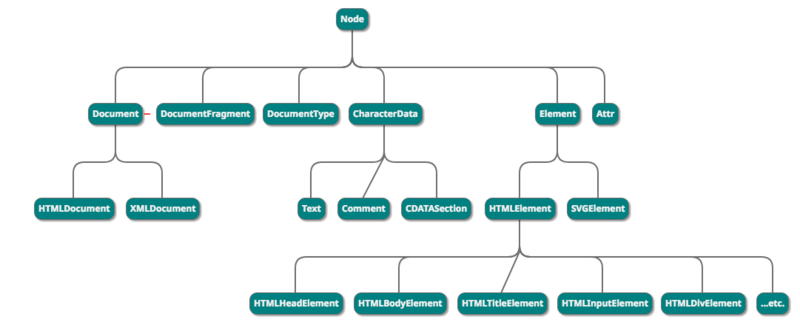

# NodeList, HTMLCollection, HTMLElement

最近在使用`querySelectorAll` 获取元素时，发现返回`NodeList`对象，而`getElementsByTagName`返回的却是`HTMLCollection`对象。这两个方法都是用于都是获取元素，返回的类型却不同，接下来让我们学习一下`NodeList`与`HTMLCollection`对象 


## NodeList

`NodeList` 对象是一个节点的集合，是由 [`Node.childNodes`](https://developer.mozilla.org/zh-CN/docs/Web/API/Node/childNodes) 和 [`document.querySelectorAll`](https://developer.mozilla.org/zh-CN/docs/Web/API/Document/querySelectorAll) 返回的. 

`NodeList`既是实时集合，也是静态集合：

* 实时集合的意思是文档中的节点树发生变化，则已经存在的实时 `NodeList` 对象也会随之变化。

  ```js
  //当Node.childNodes获取NodeList时，伪代码
  const parent = document.getElementById('parent')
  const child_nodes = parent.childNodes;
  const nodes_length_1 = child_nodes.length
  parent.appendChild(document.createElement('div'))
  const nodes_length_2 = child_nodes.length
  ```

  发现` child_nodes.length`改变，`nodes_length_2 = nodes_length_1 + 1`，这个结果就是实时的
  
* 静态集合，也就意味着随后对文档对象模型的任何改动都不会影响集合的内容
  
  document.querySelectorAll获取的NodeList就是静态的，代码 
  
  ```html
  <ul id='parent'>
    <li>first</li>
</ul>  
  
  <script>
  // js: 
  const parentUl = document.querySelector('#parent')
  const child_li = document.querySelectorAll('#parent li')  
cosnt child_li_1 = child_li.length   // child_li_1 === 1
  
  const secondLi = document.createElement('li');
  const textNode = document.createTextNode('second'); 
secondLi.appendChild(textNode)
  
  parentUl.appendChild(secondLi)
  cosnt child_li_2 = child_li.length   
  </script>
  ```
  

​       以上代码结果，发现` child_li_1 === child_li_2`，而且此时`child_li`仍只有一个`first li`元素。这就说 明当NodeList集合定义后，后续的改动都不会影响集合的内容，这种特性就是静态的

  

## HTMLCollection

HTMLCollection对象表示一个包含了元素（元素顺序为文档流中的顺序）的通用集合

### 与NodeList的区别

* `HTMLCollection` 是即时更新的，即是实时集合；当其所包含的文档结构发生改变时，它会自动更新。而`NodeList`有时是实时集合，有时是静态集合

* `HTMLCollection`集合只包含元素节点，而`NodeList`包含任何类型的节点

  以`Node.children `和 `Node.childNodes`为例子

  ```html
  <div id="box">
       <!-- 这是注释节点 -->
       这是文本节点
       <p>这是p元素</p>
  </div>
  
  <script>
  //js伪代码
  box.children：HTMLCollection [p]
  box.childNodes：NodeList(5) [text, comment, text, p, text]
  </script>
  ```
  通过观察，发现`box.children`返回`HTMLCollection`集合，里面只包含一个元素节点
  `box.childNodes`返回`NodeList`集合，包含的元素比`HTMLCollection`多很多，里面有`注释节点`,`文本节点`,`元素节点`。


## HTMLElement  

在区别中说到, `HTMLCollection`和`NodeList`集合包含不同的节点类型，那么这些节点有何不同呢。

继续上个例子，我们将`注释节点`,`文本节点`,`元素节点`展开，获取各自的`__proto__`属性

```js
box.childNodes.forEach((node) => {
	console.log('node:', node.__proto__)
})
```

打印发现`注释节点`,`文本节点`,`元素节点`分别继承`Comment`,`Text`,`HTMLParagraphElement`对象，我们再继承沿着原型链寻找

```js
// Text和Comment继承自CharacterData
Text.prototype.__proto__ === CharacterData.prototype
Comment.prototype.__proto__ === CharacterData.prototype

// HTMLParagraphElement继承自HTMLElement
HTMLParagraphElement.prototype.__proto__ === HTMLElement.prototype
```

不要停，继续寻找

```js
// CharacterData继承自Node
CharacterData.prototype.__proto__ === Node.prototype

// HTMLElement继承自Element
HTMLElement.prototype.__proto__ === Element.prototype
// Element继承自Element
Element.prototype.__proto__ === Node.prototype
```

好了，找到这里，这些节点之间的关系已经很明显了。完整关系如下图所示



`CharacterData`和`Element`都继承自`Node`对象，`Text`和`Comment`继承自`CharacterData`。而元素节点的继承关系是`Element -> HTMLElement`。

我们日常工作中，接触的最多的就是元素节点，接下来就学习下`HTMLElement`对象

### 基本概念

`HTMLElement` 接口表示所有的 [HTML](https://developer.mozilla.org/en-US/docs/Web/HTML)元素，一些HTML元素直接实现了HTMLElement接口，其它的间接实现HTMLElement接口。

操作元素的接口都继承自`HTMLElement`,  如`HTMLDivElement`、`HTMLInputElement`等接口。这些接口操作着对应的html元素

对象的属性和方法可参考[MDN](https://developer.mozilla.org/zh-CN/docs/Web/API/HTMLElement )

### 应用

`input`标签的`value`属性，定义在 `HTMLInputElement.prototype `上

在输入框上改变`value`值 , 可以通过`addEventListener`监听。但是用js代码改变`value`值 ,`addEventListener`却无法监听。

要解决这个问题，我们可以结合`Object.defineProperty`来监听`HTMLInputElement.prototype`中`value`的变化

代码如下

```html
<body>
    <input type='text' id='input'/>
    <button onclick="setValue()">set value</button>
</body>

<script>
    const descriptor = Object.getOwnPropertyDescriptor(HTMLInputElement.prototype, 'value')
    const input = document.getElementById('input')
    // 重写value的属性描述符中的set
    Object.defineProperty(HTMLInputElement.prototype, 'value', {
        set(newValue) {
            descriptor.set.call(this, newValue)
            console.log('newValue:', newValue)
        }
    })

    function setValue(){
        input.value = 111
    }
</script>
```


<br/>

## 总结

`NodeList`, `HTMLCollection`, `HTMLElement`的学习就到此为止了，在工作学习中，任何对Node节点的操作，本质上都是由这些接口控制，所以在遇到难点的时候，大家可以考虑从这些接口入手，找到解决方法！


### 参考

https://developer.mozilla.org/zh-CN/docs/Web/API/


