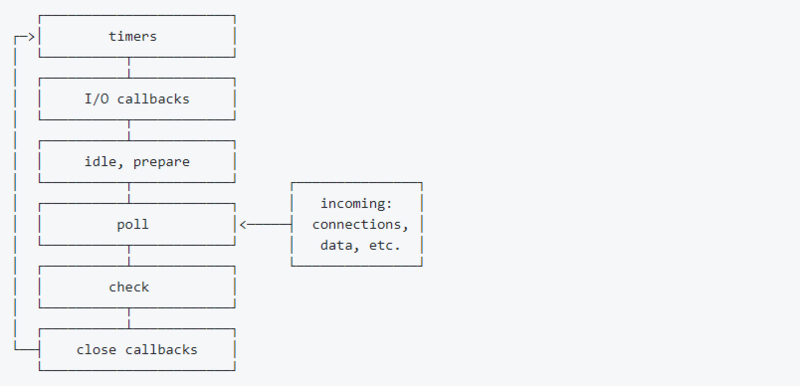

# 从实现Promise看Event Loop(二)

**本系列将学习**

* [基于typeacript实现Promise](前端进阶/TypeScript实现Promise上.md)
* [引伸到Event Loop](前端进阶/TypeScript实现Promise中.md)
* Event Loop与浏览器渲染机制

## Event Loop

在[promise/A+ 规范中](https://promisesaplus.com/)有提到 

>  事件队列可以采用“宏任务（macro-task）”机制或者“微任务（micro-task）”机制来实现

关于`宏任务`和`微任务`，网上很多资料分析的很全面，大家可以上网查阅。

根据我的理解，给大家总结一下：

* `宏任务`和`微任务`产生源：
	
	* `宏任务`：`script（整体代码）`, `setTimeout`, `setInterval`, `setImmediate`, `I/O`,` UI rendering`
	* `微任务`:  `process.nextTick`, `Promises`（**原生 Promise**）, `Object.observe`, `MutationObserver`
	
* 针对**浏览器环境**事件循环机制：
  javascript代码执行过程中，会根据函数的执行顺序，利用执行栈来执行同步任务，而异步任务会放入任务队列中等待执行。当执行栈中的同步任务都执行完后，会将任务队列中的异步任务推入执行栈中执行。如此往复，形成了`Event Loop`。
	
	任务队列中分为`宏任务`和`微任务`。每个`宏任务` 里面包含了多个`微任务`，这些`微任务`形成了`宏任务`中的“`任务队列`”，与`宏任务`中的“`同步任务`”形成了一个“小型的`Event Loop`”。一个“小型的`Event Loop`”结束之后，会继续下一个“小型的`Event Loop`”

### setTimeout 与 setInterval在Event Loop中的表现

`setTimeout`和`setInterval`都可用于制定时间后运行代码，可实际真是如此吗？看以下代码

```javascript
const startTime = Date.now()
const _setTimeout = setTimeout(function() {
  console.log("use time: ", Date.now() - startTime);
}, 300);
// sleep 睡眠函数
(function() {
  for(i=1; i<=500000000;i++){
    if(i==500000000){
       // TODO
    }
  }
  console.log('sleep time:', Date.now() - startTime);
})();
```

在chrome中运行结果

> sleep time: 1132
>
> use time:  1134

我们去掉`睡眠函数`

```javascript
const startTime = Date.now()
const _setTimeout = setTimeout(function() {
  console.log("use time: ", Date.now() - startTime);
}, 300);
```

在chrome中运行结果

> use time:  300

对比以上两次结果，我们发现加入了睡眠函数后，setTimeout的执行结果远远大于其设定的时间

因此，我们得出以下结论(**注意：下述结论都只针对chrome浏览器环境**)：

* 在`Event Loop`中，`setTimeout`并不能精确按照设定的时间执行。必须等到当前`执行栈`里的代码执行完后，才会去执行`setTimeout`中的回调函数

* 当`执行栈`中代码执行时间小于`setTimeout`设置时间，`setTimeout`会安照其设置时间执行

* 当`执行栈`中代码执行时间大于于`setTimeout`设置时间，`setTimeout`会在`执行栈`完成后立即执行

  第三点比较有意思，我们发现上述加了睡眠函数后的执行结果，`use time`近乎可以视为在`sleep time`之后立即执行

  > sleep time: 1132
  >
  > use time:  1134

#### setInterval的怪异现象

`setInterval`在`Event Loop`中的表现与`setTimeout`几乎相同，但存在一个比较有趣的想象，继续看代码

```javascript
const startTime = Date.now()
let lastTime = Date.now()
let count = 0
// sleep 睡眠函数 延长至 2000000000
function sleep() {
   (function() {
        for(i=1; i<=2000000000;i++){
            if(i==2000000000){
            // TODO
            }
        }
   })();
}
setInterval(function() {
    if(count === 10) {
        // TODO
    } else {
        sleep()
        console.log("use time: ", Date.now() - lastTime);
        lastTime = Date.now()
        count ++
    }
}, 3000)
   
```
上述代码，我们延长了睡眠函数时间，以3000ms的间隔运行`setInterval`,	发现如下怪异的现象
> sleep time:  4341
>
> use time:  4346
>
> use time:  1658
>
> use time:  2997
>
> use time:  3003

可以看到第二次`use time`远远小于我们设置的3000ms。按照我们上面得出的结论：当`执行栈`中代码执行时间大于`setInterval`设置时间，`setInterval`会在`执行栈`完成后立即执行。按这一结论只有第一次`use time`的执行时间会受到影响。可实践表明第二次`use time`也受到了影响。

由此可知

>`setInterval`指定的是“开始执行”之间的间隔，并不考虑每次任务执行本身所消耗的时间。因此实际上，两次执行之间的间隔会小于指定的时间。比如，`setInterval`指定每 100ms 执行一次，每次执行需要 5ms，那么第一次执行结束后95毫秒，第二次执行就会开始。如果某次执行耗时特别长，比如需要105毫秒，那么它结束后，下一次执行就会立即开始

如何解决`setInterval`这一特性带来的影响？我们可以用`setTimeout`来实现自定义的`setInterval`，上代码

```js
function mySetInterval(fn, wait) {
        const _setInterval = function() {
            setTimeout(function(){
                fn()
                _setInterval()
            }, wait)
        }
        _setInterval()
}
```

用`mySetInterval`代替`setInterval`

```javascript
mySetInterval(function() {
        if(count === 30) {
            // TODO
        } else {
            // sleep()
            console.log("use time: ", Date.now() - lastTime);
            lastTime = Date.now()
            count ++
        }
}, 3000)
```

运行结果，第二次`use time`符合我们的需求

> sleep time:  4314
>
> use time:  4319
>
> use time:  3003
>
> use time:  3001
>
> use time:  3004

由此，当我们需要指定间隔循环执行代码时，为了确保两次执行之间有固定的间隔，**可以用`setTimeout`来替代`setInterval`**

**参考**：

* [定时器](http://javascript.ruanyifeng.com/advanced/timer.html)

## Node中的Event Loop

### Node v11之前的版本

Node中的`Event Loop`与浏览器大相径庭（**我的node版本：v10.15.3**）

首先在Node中运行以下代码

```javascript
setTimeout(function() {
	console.log('setTimeout');
}, 0);
setImmediate(function() {
  console.log('setImmediate');
})
```

多次执行，我们发现存在两种结果

第一种

> setTimeout
>
> setImmediate

第二种

> setImmediate
>
> setTimeout

出现上述结果的原因与Node的Event Loop机制有关

#### Event Loop的六个阶段

与浏览器不同，node的Event Loop是分不同阶段进行，如下图所示



> 每一个阶段都有一个装有callbacks的队列，当event loop运行到一个指定阶段时， node将执行该阶段的fifo 队列，当队列callback执行完或者执行callbacks数量超过该阶段的上限时，event loop会转入下一下阶段

每个阶段分别表示如下：

* timers 阶段：这个阶段执行timer（setTimeout、setInterval）的回调

* I/O callbacks 阶段：处理一些上一轮循环中的少数未执行的 I/O 回调

* idle, prepare 阶段：仅node内部使用

* poll 阶段：获取新的I/O事件, 适当的条件下node将阻塞在这里

* check 阶段：执行 setImmediate() 的回调

* close callbacks 阶段：执行 socket 的 close 事件回调

其中，poll 是一个至关重要的阶段，这一阶段中，系统会做以下事情

1.回到 timer 阶段执行回调

2.执行 I/O 回调

并且在进入该阶段时如果没有设定了 timer 的话，会发生以下两件事情

- 如果 poll 队列不为空，会遍历回调队列并同步执行，直到队列为空或者达到系统限制
- 如果 poll 队列为空时，会有两件事发生 
  - 如果有 setImmediate 回调需要执行，poll 阶段会停止并且进入到 check 阶段执行回调
  - 如果没有 setImmediate 回调需要执行，会等待回调被加入到队列中并立即执行回调，这里同样会有个超时时间设置防止一直等待下去

当然设定了 timer 的话且 poll 队列为空，则会判断是否有 timer 超时，如果有的话会回到 timer 阶段执行回调。

#### 以上阶段都不包括**microtask(微任务)**

> 在node中**microtask**会在事件循环的各个阶段之间执行，也就是一个阶段执行完毕，就会去执行**microtask**队列的任务

我们用代码来解释

```javascript
setTimeout(()=>{
    console.log('setTimeout1')
    Promise.resolve().then(function() {
        console.log('promise1')
    })
}, 0)
setTimeout(()=>{
    console.log('setTimeout2')
    Promise.resolve().then(function() {
        console.log('promise2')
    })
}, 0)
```

执行上述代码

> setTimeout1
>
> setTimeout2
>
> promise1
>
> promise2

可见，当timers 阶段中的回调(setTimeout回调)结束后，才会执行microtask(Promise)

#### 再看setImmediate

根据node事件循环的六个阶段，既然setImmediate发生的阶段(check阶段)，在setTimeout发生阶段(timers阶段)之后，但实际中为何会出现 `setImmediate ->setTimeout` ?

这是根据Node的运行机制决定的

> Node 开始执行脚本时，会先进行事件循环的初始化，但是这时事件循环还没有开始，会先完成下面的事情(准备阶段)。
>
> - 同步任务
> - 发出异步请求
> - 规划定时器生效的时间
> - 执行process.nextTick()等等

上面这些事情都干完了，事件循环才正式开始。

`setTimeout(fn, 0)`，虽然我们将时间间隔设置为0，但在实际运行中，不可能精确到0ms(如**浏览器中把setTimeout的最小间隔设置成4ms**)。在node中，我们以 `n`代替`setTimeout(fn, 0)`的最小间隔。

我们将事件循环之前到准备阶段花费的时间视为`m`，那么就存在以下两种情况

* m >= n：根据setTimeout的机制，准备阶段结束后，setTimeout会立即执行，此时setTimeout顺序先于setImmediate
* m < n：说明准备阶段结束后，还没到setTimeout回调函数的执行时间，因此会先执行setImmediate

### Node v11之后的版本

（本文完成时，node最新版本为 v12.6.0）

以上我们讲到在node中**microtask**会在事件循环的各个阶段之间执行，但在`node v11`版本之后，对此做了改变

尝试在` v12.6.0`版本中执行以下代码

```
setTimeout(()=>{
    console.log('setTimeout1')
    Promise.resolve().then(function() {
        console.log('promise1')
    })
}, 0)
setTimeout(()=>{
    console.log('setTimeout2')
    Promise.resolve().then(function() {
        console.log('promise2')
    })
}, 0)
```

输出

> setTimeout1
>
> promise1
>
> setTimeout2
>
> promise2

发现跟浏览器中的执行结果一致


### 小结：

我们知道`Event Loop`中会发生`UI渲染`, 而又js可以操作dom，因此`js线程`和`UI渲染`是互斥的。那么`UI渲染机制`与`Event Loop`之间又有何种联系，该系列的最后一篇文章我们将对此进行学习。

### 参考：

* [JavaScript 运行机制详解：再谈Event Loop](http://www.ruanyifeng.com/blog/2014/10/event-loop.html)

* [浏览器与Node的事件循环(Event Loop)有何区别?](https://juejin.im/post/5c337ae06fb9a049bc4cd218#heading-15)

* [又被node的eventloop坑了，这次是node的锅](https://juejin.im/post/5c3e8d90f265da614274218a)