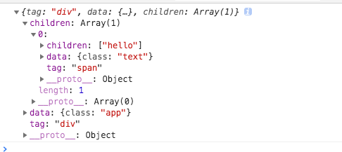
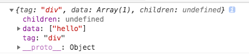
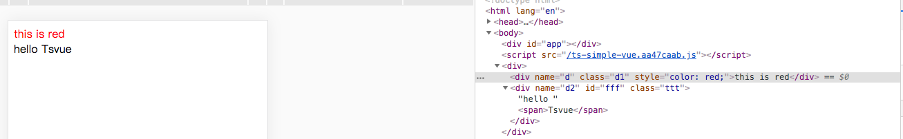

# typescript从零开始实现vue(一) - 实例化和 Virtual DOM 

本文开始，将学习用`typescript`从零开始实现一个基础的`vue`。目的是为了学习`vue`整个实现流程。通过这一系列的学习，将实现`vue`以下几个基础功能：

* 实例化和虚拟dom
* 响应式
* 计算属性`computed` 和 侦听器`watch`
* 组件化和生命周期
* 虚拟`DOM`更新(`diff`)

## 准备工作

用`start-tslib`[https://www.npmjs.com/package/start-tslib]创建项目

> npm install start-tslib -g
>
> tlc --f 
>
> cd libraryname
>
> npm install


##  VNode 与 jsx

我们编写`vue html`结构通常有两种方式：1）模板 2）渲染函数`render`。

当采用模版的方式时，`vue`内部实现其实最终会把模版编译成`render`函数，这一过程涉及到编译方面的知识，我们暂且不讨论。所以在我们这次的实现中，采用渲染函数`render`的方式

### render函数

`vue`中`render`函数的基本实现如下

```js
render: function (createElement) {
    return createElement('h1', {
     attrs: {
        id: 'title'
      },
    }, this.blogTitle)
}
```

在这里，`createElement`函数的作用就是生成虚拟dom(`VNode`)。

#### VNode

虚拟dom就是用js对象，来描述dom节点，包括标签、内容、子节点等等信息

#### jsx

 用`createElement`语法过于繁琐，通常我们会用 `jsx`语法 来代替。为了使用`jsx`, 需要借助[@vue/babel-preset-jsx](https://github.com/vuejs/jsx)这一插件，它内部其实是使用[babel-plugin-transform-vue-jsx](https://github.com/vuejs/babel-plugin-transform-vue-jsx) 这插件，作用是将

```js
<div id="foo">{this.text}</div>
```

转化为

```js
h('div', {
  attrs: {
    id: 'foo'
  }
}, [this.text])
```

##### 安装配置babel

> npm install @vue/babel-preset-jsx @vue/babel-helper-vue-jsx-merge-props

配置.babelrc

```json
{
  "presets": ["@vue/babel-preset-jsx"]
}
```

##### 尝试写一下jsx

安装好babel后，新建一个html文件。

```html
<script>
const hello = (
    <div>hello world</div>
)
</script>
```

浏览器打开，查看源代码，可以发现，这段代码被编译成

```html
<script>
  var hello = h("div", ["hello world"]);
</script>
```


## 实现构造函数

由于是用`typescript`实现`vue`，所以将我们的库命名为`Tsue`

```js
class Tsue {
  	_options: VmOptions | undefined;
    _self: TsVue | undefined;
    _el: string | undefined;
    _vnode: VNode | undefined;
  
  	constructor(options: VmOptions) {
        this._init(options)
    }
}

// 实例化Vue对象时的参数
export interface VmOptions {
    el?: string;
    render?: Render;
}

// render函数
export interface Render {
    (h: CreateElement): VNode
}
```

定义了`Tsue`的几个属性：

_options：实例化传入的参数，比如 { el: '#app';  render: function(h) {...} }

_self：表示`Tsue`实例

_el：挂载的dom节点

_vnode：虚拟dom

#### 实现初始化方法

整个初始化流程是这样的：根据`render`函数生成`vnode`  => 将`vnode`转化为真实dom => 挂载到`el`上

根据上述流程，定义`_render`和`_update`方法

```js
_init() {
  this._options = options;
  this._el = this._options.el;
  this._update(this._render())
}
// 生成vnode
_render() {
  // TODO
}
// 将vnode转化为真实dom，并挂载到dom节点上
_update(vnode: VNode) {
  // TODO
}

```

接下来一一实现

#### _render方法

先看代码实现

```js
// 生成vnode
_render(): VNode{
	const render = this._options!.render;
	const h = (tag: any, attr: any, children: any[]): VNode => {
		return createElement(this, tag, attr, children)
	};
	const vnode: VNode = render.call(this,h);
	return vnode
}
```

`_render`内部调用的是实例化传入的`render`函数。上面[babel-plugin-transform-vue-jsx](https://github.com/vuejs/babel-plugin-transform-vue-jsx) 插件的实现，需要有一个`h`函数，并将其作为参数传给`render`函数。`h`函数其实就是`vue`内部提供的`createElement`。接下来，实现它

#### createElement

`vue`内部，真正用于生成`vnode`的方法就是`createElement`。根据[vue文档对createElement的定义](https://cn.vuejs.org/v2/guide/render-function.html#createElement-参数), `createElement`接收三个参数，分别为：

tag：类型为`String | Object | Function`, 表示  一个 HTML 标签名、组件选项对象

data:  类型为`Object`.节点数据

children: 类型为`Array` 。子节点`vnode`

回到jsx那个例子

```js
const h = function(tag, data, children) {
  return {
    tag, data, children
  }
}
const Hello = (
	<div>
  	<span>hello</span>
  </div>
)
console.log(Hello)
```

浏览器打开，查看打印结果



接下来完善`createElement`函数

```js
const createElement = 
function(
	 context?: TsVue, 
   tag?: string | Function , 
   data?: VNodeData, children?: any[]): VNode {
      if(Array.isArray(data)) {  // 如果是数组，将data值赋给children
          children = data
          data = undefined
      } 
      let vnode;
      if(children) {
          children = normalizeArrayChildren(children)
      }
      if(tag) {
          vnode = new VNode(tag, data, children, undefined, undefined, context);
      }
      return vnode;
}
```

这里存在一种情况，当节点上没有属性：

```js
const Hello = (
	<div>hello</div>
)
```

此时的打印结果是



此时`data`表示子节点，所以把`data`赋值给`children`

#### normalizeArrayChildren

当存在子节点时，子节点可以为文本节点和普通节点。需要做一下处理，当为文本节点时，生成文本类型的`vnode`， 否则生成普通`vnode`

```js
/**
 * 区分文本节点和普通节点
 * @param children 
 */
function normalizeArrayChildren(children: any[]): any[] {
    let res: any[] = []
    children.forEach((node) => {
        if(typeof node  === 'string' || typeof node  === 'number') {
            res.push(createTextVNode(node))
        } else if(Array.isArray(node)){
            res = res.concat(normalizeArrayChildren(node))
        } else {
            res.push(node)
        }
    })
    return res;
}
/**
 * 创建文本节点
 * @param text 
 */
function createTextVNode(text: any): VNode {
    return new VNode(undefined, undefined, undefined, String(text))
}
```

#### VNode类

```js
class VNode {
    tag?: string | undefined;
    data?: VNodeData | undefined;
    children?: VNode[] | undefined;
    text?: string | undefined;
    element?: Node | undefined;
    context?: TsVue | undefined;
    key?: string;

    constructor(
        tag?: string,           // 标签
        data?: VNodeData,       // 节点数据，包括节点属性等
        children?: VNode[],     // 子节点
        text?: string,          // 文本
        element?: Node,         // 挂载的dom
        context?: TsVue         // vnode的实例对象，组件或vue实例, 若为undefined则为顶点vnode
    ) {
        this.tag = tag;
        this.data = data;
        this.children = children;
        this.text = text;
        this.element = element;
        this.context = context;
        this.key = data && data.key
    }
}
```

根据[babel-plugin-transform-vue-jsx](https://github.com/vuejs/babel-plugin-transform-vue-jsx) 文档中的定义，`vue`的`vnode`中`data`有以下这些属性

```js
 {
    // Component props
    props: {
      msg: 'hi',
      onCustomEvent: this.customEventHandler
    },
    // normal HTML attributes
    attrs: {
      id: 'foo'
    },
    // DOM props
    domProps: {
      innerHTML: 'bar'
    },
    // Event handlers are nested under "on", though
    // modifiers such as in v-on:keyup.enter are not
    // supported. You'll have to manually check the
    // keyCode in the handler instead.
    on: {
      click: this.clickHandler
    },
    // For components only. Allows you to listen to
    // native events, rather than events emitted from
    // the component using vm.$emit.
    nativeOn: {
      click: this.nativeClickHandler
    },
    // class is a special module, same API as `v-bind:class`
    class: {
      foo: true,
      bar: false
    },
    // style is also same as `v-bind:style`
    style: {
      color: 'red',
      fontSize: '14px'
    },
    // other special top-level properties
    key: 'key',
    ref: 'ref',
    // assign the `ref` is used on elements/components with v-for
    refInFor: true,
    slot: 'slot'
  }
```

本次实现为了方便起见，仅考虑部分属性

```js
// 只考虑部分: attrs, class, key, on, style
export interface VNodeData {
    attrs?: Attrs
    class?: string
    key?: string
    on?: OnFn
    style?: string
}
```

#### _update

`_update`根据`_render`返回的`vnode`树，生成真实的`dom结构`。

```js
// 把 VNode 渲染成真实的 DOM, 在 首次渲染 或 数据更新 会调用
_update(vnode: VNode){
   const prevVnode = this._vnode;
   this._vnode = vnode;
   if(prevVnode) {  
      // 数据更新  
      this._el = patch(prevVnode, vnode)
   } else {   
      // 首次渲染
      this._el = patch(this._el!, vnode) 
   }
}
/**
 * 生成真实dom
 * @param oldVnode vnode or dom节点
 * @param vnode 
 */
function patch(oldVnode: VNode | string, vnode: VNode) {
    if(typeof oldVnode === 'string') {
        // 如果是dom节点，说明是初始化，首次渲染，转化为vnode
        const reallyDom = document.querySelector(oldVnode);
        oldVnode = new VNode(reallyDom!.tagName, {}, [], undefined, reallyDom!)
        createElm(oldVnode.element!, vnode)
    } else {
        // 否则就是数据更新
        const parentNode = getParentNode(oldVnode.element!)
        if(parentNode) {
            parentNode.removeChild(oldVnode.element)
            createElm(parentNode, vnode)
        }
    }
		return vnode.element
}
/**
 * 创建节点并挂载
 * @param parentNode 
 * @param vnode 
 */
export function createElm(parentNode: Node, vnode: VNode) {
    if(vnode.tag) {
        // 有tag是普通节点
        vnode.element = document.createElement(vnode.tag!);
      	updateAttrs(vnode);
        updateClass(vnode);
        updateStyle(vnode);
        updateListeners(vnode);
        createChildren(vnode, vnode.children)
        parentNode.appendChild(vnode.element)
    } else {
        // 没有tag就是文本节点
        vnode.element = document.createTextNode(vnode.text || '')
        parentNode.appendChild(vnode.element)
    }
}
/**
 * 遍历子节点
 * @param vnode 
 */
export function createChildren(vnode: VNode, children: VNode[] | undefined) {
    if(Array.isArray(children)) {
        children.forEach((v) => {
            createElm(vnode.element!, v)
        })
    }
}
/**
 * 获取父节点
 * @param node 
 */
function getParentNode(node: Node): Node | null {
    return node.parentNode 
}
```

`_update`函数最终调用`createElm`函数，根据是否有`tag`分别创建文本节点和普通节点。然后遍历子节点，生成完整的`dom`结构

##### VNodeData

在创建节点的时候，我们要需要对节点属性等进行处理。

`updateAttrs`

```js
/**
 * 设置节点属性 attr
 * @param vnode 
 */
function updateAttrs(vnode: VNode) {
    const { data, element } = vnode;
    if( data && data.attrs) {
        const attrs = data.attrs;
        for (let key in attrs) {
            const value = attrs[key];
            element && (element as Element).setAttribute(key, value)
        }
    }
}
```

`updateClass`

```js
/**
 * 设置class
 * @param vnode 
 */
function updateClass(vnode: VNode) {
    const { data, element } = vnode;
    if( data && data.class) {
        element && (element as Element).setAttribute('class', data.class)
    }
}
```

`updateStyle`

```js
/**
 * 设置 style
 * @param vnode 
 */
function updateStyle(vnode: VNode) {
    const { data, element } = vnode;
    if(data && data.style) {
        const _parseStyle: CSSStyleDeclaration = parseStyleText(data.style)
        for(let key in _parseStyle) {
            (element as HTMLElement).style[key] = _parseStyle[key]; 
        }
    }
}

const parseStyleText = function (cssText: string) {
    const res = Object.create(null);
    const listDelimiter = /;(?![^(]*\))/g;
    const propertyDelimiter = /:(.+)/;
    cssText.split(listDelimiter).forEach(function (item: string) {
      if (item) {
        const tmp = item.split(propertyDelimiter);
        tmp.length > 1 && (res[tmp[0].trim()] = tmp[1].trim());
      }
    });
    return res
};
```

`updateListeners`

```js
/**
 * 绑定事件
 * @param vnode 
 */
function updateListeners(vnode: VNode) {
    const { data, element } = vnode;
    if(data && data.on) {
        if(element) {
            for(let key in data.on) {
                element.addEventListener(key, () => {
                    data.on
                })
            }
        }
    }
}
```

### 尝试一下

接下来我们实例化构造函数

```js
function clickHandler() {
    console.log('red click')
}

const options = {
    el: '#app',
    render: function(h) {
        return (
            <div>
                <div name='d'  class='d1' style='color:red;' key='ddd' onClick={clickHandler}>this is red</div>
                <div name='d2' class='ttt' id='fff'>hello <span>Tsvue</span></div>   
            </div>
        )
    }
}

const tsue = new Tsue(options)
```

在浏览器上查看效果



`jsx`已经成功被渲染到了页面上，点击红色部分，会打印出"red click"


## 小结

本章已经完成了`Tsue`的实例化过程：

`_init`获取实例化参数

 => 	调用`_mount`函数

 => 	`_render`内部通过`_createElement`生成`VNode` 树结构

 =>	`_update`根据生成的`VNode` 树结构 , 生成真实的`dom`结构。同时给`dom`节点设置`class`、`attr`、`style`，以及绑定事件 

=>    挂载到`el`上。

我们知道`vue`的一大特色就是响应式，下一章就来实现这一功能。


