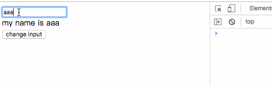

# typescript从零开始实现vue(二) : 实现响应式

本章给我们的`Tsue`增加响应式的功能，通过数据的改变触发真实DOM结构改变


## Object.defineProperty

相信大家或多或少都了解到 vue内部是通过 `Object.defineProperty` 来实现。具体用法大家可以查阅[MDN-defineProperty](https://developer.mozilla.org/zh-CN/docs/Web/JavaScript/Reference/Global_Objects/Object/defineProperty)。

这里我用代码来模拟双向绑定的实现。

```html
<input id='input' type='text'/>
<div>my name is <span id='name'></span></div>

<button id='btn'>change input</button>

<script>
const input = document.getElementById('input')

const vueData = {}    
Object.defineProperty(vueData, 'name', {
    enumerable: true,
    configurable: true,
    get() {
        return vueData.name
    },
    set(newVal) {
      	input.value = newVal
        document.getElementById('name').innerText = newVal
    }
})
vueData.name = ''
input.addEventListener('input', (e) => {
    vueData.name = e.target.value  // 值改变，会触发setter
})

document.getElementById('btn').onclick = function() {
    vueData.name = 'heiheihei'    // 值改变，会触发setter
}  
</script>
```

效果如图




## 观察者模式

上面的模拟实现很简陋，接下来我们结合观察者模式来强壮我们的代码

### 生成响应式对象

#### 工厂函数 `observe`

定义一个`observe`函数, 用于生成`observer`实例

```js
/**
 * 用于生成observer实例, observer会把value变成响应式，返回 Observer 实例
 * @param value 
 */
function observe(value: any): Observer | void{
    if(!(typeof value === 'object' && value !== null)) { 
        // 只有对象类型才需要变为响应式
        return;
    }
    let ob: Observer
    if(value.__ob__){       
        // 如果value上已经存在 __ob__（即：observer实例）， 说明value已经是响应式对象
        ob = value.__ob__
    }
    ob = new Observer(value)
    return ob;
}

```

#### Observer类

`observe`返回的`Observer`， 用于生成响应式对象，调用`Object.defineProperty`，给对象添加`setter`和`getter`

```js
// 给对象添加属性
function def (obj: Object, key: string, val: any, enumerable?: boolean) {
    Object.defineProperty(obj, key, {
      value: val,
      enumerable: !!enumerable,
      writable: true,
      configurable: true
    })
}

class Observer {
    value: any;
    constructor(value: any) {
      	// 给 value 增加一个 __ob__ 值，指向 Observer 实例，表示value已经是响应式对象
        def(value, '__ob__', this); 
      	this.walk(value)
    }
    // 遍历value的属性， 将每个属性变成响应式
    walk(value: any) {
        Object.keys(value).forEach((key) => {
            defineReactive(value, key)
        })
    }
} 
```

`walk`会遍历`value`，调用`defineReactive`方法，将`value`的每个属性都变为响应式。为了方便起见，这里只考了`value`为对象的情况。在`vue`中还会对数组类型的`value`做处理，原理也是大同小异，即遍历数组的每个元素。

#### defineReactive

真正把`value`变为响应式对象的方法就是`defineReactive`，调用了`Object.defineProperty`

```js
/**
 * 定义一个响应式对象，给对象添加 getter 和 setter
 * @param obj 对象
 * @param key 对象子属性
 * @param val 对象子属性值
 */
export function defineReactive(obj: Record<string, any>, key: string, val?: any) {
    const property = Object.getOwnPropertyDescriptor(obj, key)
    if (property && property.configurable === false) {    // 属性不可更改就直接返回
        return
    }
    const getter = property && property.get
    const setter = property && property.set
    if ((!getter || setter) && arguments.length === 2) {
        val = obj[key]
    }
    
  	// 对子对象递归调用observe，使子对象也变为响应式。childOb为Observer实例
    let childOb = observe(val) 
    
    Object.defineProperty(obj, key, {
        enumerable: true,
        configurable: true,
        get: function() {
            const value = getter ? getter.call(obj) : val
            return value
        },
        set: function(newVal) {
            const value = getter ? getter.call(obj) : val
            if (newVal === value || (newVal !== newVal && value !== value)) {
                return
            }
            val = newVal              // 将val变为新值。必包
            childOb = observe(newVal) // 如果 newVal 是 object类型，则将其也变为响应式对象
        }
    })     
}
```

注意，这里有个处理

```ts
let childOb = observe(val) 
```

`val`是对象的子对象属性值，`oberve(val)`就是将对象的子对象的属性值也变为响应式。

如以下形式的对象

```js
const value = {
  data1: {
    data2: 'kkk'
  }
}
```

此时`data1`的值为`{ data2: 'kkk' }`，是个对象，那么再调用`observe{ data2: 'kkk' }`，使得`{ data2: 'kkk' }`也成为一个响应式对象

#### 初始化时调用`_initState`

接下来，我们在`Tsue`初始化过程中在调用`_mount`之前先调用`_initState`方法，用于初始化相关数据

```js
class Tsue{
  ...
  _init(options: VmOptions & ComponentOptions<TsVue>){
     ...
     this._initState()
     if(this._options.el && document.querySelector(this._options.el)) {  
        this._el = this._options.el;
        this._mount(this._options.el);
     } 
  }
  // 初始化数据
  _initState(){
    if(this._options && this._options.data) {
       this._initData(this._options.data)
    }
  }

	// 合并data，将data的每个值代理到实例上，并把data变成响应式
   _initData(data: any) {
        data = this._data = typeof data === 'function'? data.call(this, this): data
        // 将data的每个值代理到实例上， 这样就能通过 this.key 访问到 data 上的某个值
        Object.keys(data).forEach((key) => {
            proxy(this, '_data', key)
        })  
  
        // 调用observe，把data变成响应式
        observe(data)
   }
	...
}

```

所以，把`Tsue`实例化时传入的`data`变为响应式对象的处理就发生在`_initState`的`_initData`方法中


### 订阅收集

上文通过`Observer`给`data`添加了` getter` 和 `setter`，使之变为响应式对象。接下来，我们来实现`getter`和`setter`时具体做的事

根据观察者模式，我们需要订阅收集者(`Dep`)和观察者(`Watcher`)。订阅收集者收集所有的观察者，在数据更新时，通知观察者，观察者再根据数据变化作出响应。

#### 实例初始化

更改一下初始化时候`_mount`方法

```js
class Tsue{
  ...
  // 挂载到真实dom上
   _mount(el: string){
    const updateComponent = () => {
      this._update(this._render())     
    }
    const wacther = new Watcher(this, updateComponent, noop, {});       
  }
  ...
} 

   
```

在这里，实例化`Watcher`, 并把`_update`的调用时机交给`wacther`去处理

接下来，实现收集者(`Dep`)和观察者(`Watcher`)

#### 订阅收集者-Dep

首先实现订阅收集者(`Dep`)

```js
let uid = 0
// 发布者，订阅收集
 default class Dep {
    static target: Watcher  // 当前观察者。不同的观察者做的事情不同
    id: number              // 每个dep的序号
    subs: Watcher[]         // 数组，watcher实例 
    constructor () {
        this.id = uid++
        this.subs = []
    }
    /**
     * 收集订阅
     * @param sub： Watcher实例
     */
    addSub (sub: Watcher) {
        this.subs.push(sub)
    }
    /**
     * 每个对象值的 getter 都持有一个 dep
     * 在触发 getter 的时候会调用 dep.depend() 方法，也就会执行 Watcher.addDep(this)。
     * 用来收集依赖，这样notify() 能够通知到 watcher
     */
    depend () {
        if (Dep.target) {
          Dep.target.addDep(this)
        }
    }
  
    /**
    * 删除观察者watcher
    */
    removeSub(sub: Watcher) {
        // 删除subs数组中某一项 
        function remove (arr: Watcher[], item: Watcher) {
          if (arr.length) {
            const index = arr.indexOf(item)
            if (index > -1) {
              return arr.splice(index, 1)
            }
          }
        }
        remove(this.subs, sub)
    }

    /**
     * 通知观察者, 作出响应
     */
    notify () {
        this.subs.forEach((sub) => {
            sub.update()
        })
    }
}

const targetStack: Watcher[] = []; // 观察者数组


// 给Dep设置当前的观察者
export function pushTarget (target: Watcher) {
    targetStack.push(target)
  	Dep.target = target
}

// 删除当前观察者
export function popTarget () {
    targetStack.pop()
    Dep.target = targetStack[targetStack.length - 1]
}
```

##### `Dep`最主要的两个方法`addSub`和`notify`：

`addSub`收集观察者实例，不同的观察者做的事情不同

`notify`在特定的时机，通知该`Dep`下所有的观察者实例，依次执行观察者的`update`方法。

同时提供`pushTarget`和`popTarget`, 分别用来设置当前观察者和删除当前观察者。

#### 观察者-Watcher

接下来实现观察者(`Watcher`)

```js
let wid = 0
interface WatchOptions {
    user?: boolean;
    lazy?: boolean;
    sync?: boolean
}
// 观察者
class Watcher {
    user: boolean;       // 用户自定义的watcher user = true
    lazy: boolean;       // 有计算属性的watcher lazy = true
    sync: boolean;       // true： 同步执行回调函数
    getter: Function
    vm: TsVue;           // Tsue实例
    id: number;
    cb: Function;        // 回调函数
    dirty: boolean;

    depIds: Set<any> = new Set();     // Watcher关联的Dep实例id数组
    deps: Dep[] = [];         				// Watcher关联的Dep实例数组

    value: any;          // expOrFn返回值
    constructor(vm: TsVue, expOrFn: Function, cb: Function, options: WatchOptions) {
        if (options) {
            this.user = !!options.user       
            this.lazy = !!options.lazy       
            this.sync = !!options.sync        
        } else {
            this.user = this.lazy = this.sync = false
        }
        this.dirty = this.lazy 

        this.getter = expOrFn // 初始化，即执行响应式对象的getter的时候
        this.vm = vm
        this.cb = cb          // 回调函数
        this.vm = vm
        this.id = ++wid

        this.value = this.lazy ? undefined: this.get()
    }
    // 执行expOrFn，并返回expOrFn()的值
    get() {
        pushTarget(this) // 设置当前观察者
        let value;
        const vm = this.vm
        value = this.getter.call(vm, vm)
        popTarget()
        return value
    }
    addDep(dep: Dep) {
        const id = dep.id // 唯一值
        if (!this.depIds.has(id)) {
            // 把watcher关联的收集者添加到deps列表中
          	this.depIds.add(id)
            this.deps.push(dep)
            // 把当前的 watcher 订阅到 dep 的 订阅收集列表中
            dep.addSub(this)
        }
    }
    // 数据更新的时候执行
    update() {
        if (this.lazy) {
            this.dirty = true
          } else if (this.sync) {
            // 同步执行
            this.run()
          } else {
            // 异步执行，queueWatcher 最终也会执行 run()
            queueWatcher(this)
        }
    }
    // 数据更新的时候最终执行的方法
    run() {
        const value = this.get();
        if(value !== this.value) { // 如果新值和旧值不相等
            const oldValue = this.value
            this.value = value
            if (this.user) {  
               // 用户自定义的wtcher，传入了value, oldValue。
               // 所以在自定义watcher中，我们可以拿到新值和旧值
               this.cb.call(this.vm, value, oldValue)
            } else {
               this.cb.call(this.vm, value, oldValue)
            }
        }
    }
}

/**
 * 异步执行队列
 * 为了提高性能，不会在每次数据更新的之后立即执行，而是会把所有的回调函数放到队列里
 * 最后调用nextTick在下一个事件循环中执行
 * @param watcher 
 */
function queueWatcher(watcher: Watcher) {
    setTimeout(funciton(){
       watcher.run()        
    })	
}
```

##### `Watcher`有几种类型：

`user === true`: 用户自定义的`watch`;

`lazy === true`: 有计算属性(`computed`)的`watch`。关于这部分实现，在下一章再来讨论。

`sync === true`：同步执行`watch`的回调函数。

##### 在`_mount`中`Watcher`的实例化流程是这样的：

=> 判断是否为计算属性的`watcher`

=> 如果不是计算属性的`watcher`, 执行`this.get()`。

=> `this.get`中设置当前订阅收集的观察者，并执行`this.getter()`

=>` this.getter`就是实例化时传入的参数`expOrFn`, 对应到实例化`Tsue`的`_mount`中就是

```js
const updateComponent = () => {
	this._update(this._render())
}
```

=> `this._update(this._render())`生成`vnode`并渲染成真实`DOM`

**`Watcher` 几个方法**：

`addDep`：`Dep`的`depend`方法，会调用`Watcher`的`addDep`方法，`addDep`最终调用`Dep`的`addSub`方法，把当前的`watcher`添加到`Dep`的队列中，由此完成**订阅收集**

`update`：`Dep`在数据更新时，会调用队列中每个`watcher`的`update`方法，`update`根据传入的参数是否为同步。

同步的话立即执行`run`方法，异步则执行`run`方法。关于`queueWatcher`的具体实现，在接下来会实现，在这里先用`setTimeout`模拟一下

`run`: `run`方法是数据更新的时候最终执行的方法。首先会执行`this.get()`拿到新值。根据新旧值是否相等，如果不相等，则执行初始化传入回调函数，并把新旧值作为参数传递给回调函数。

#### 订阅收集 + 数据更新

实现了`Dep`和`Watcher`，那么订阅收集和数据更新的时机发生在哪呢？接下来，就来实现这一过程。

回到生成响应式对象的方法-`defineReactive`

```js
/**
 * 定义一个响应式对象，给对象添加 getter 和 setter
 * @param obj 
 * @param key 
 * @param val 
 */
function defineReactive(obj: Record<string, any>, key: string, val?: any) {
    const dep = new Dep()

    const property = Object.getOwnPropertyDescriptor(obj, key)
    if (property && property.configurable === false) {    // 属性不可更改就直接返回
        return
    }
    const getter = property && property.get
    const setter = property && property.set
    if ((!getter || setter) && arguments.length === 2) {
        val = obj[key]
    }
    
  	// 对子对象递归调用observe，使子对象也变为响应式。childOb为Observer实例
    let childOb = observe(val) 
    Object.defineProperty(obj, key, {
        enumerable: true,
        configurable: true,
        get: function() {
            const value = getter ? getter.call(obj) : val
            if (Dep.target) {
                dep.depend()
                if (childOb) {
                  childOb.dep.depend()
                }
            }
            return value
        },
        set: function(newVal) {
            const value = getter ? getter.call(obj) : val
            if (newVal === value || (newVal !== newVal && value !== value)) {
                return
            }
            val = newVal              // 将val变为新值。必包
            childOb = observe(newVal) // 如果 newVal 是 object类型，则将其也变为响应式对象
            dep.notify()              // 数据更新，通知watcher
        }
    })     
}
```

在`defineReactive`方法里，实例化订阅收集者`dep`。然后在`getter`中`dep.depend()`完成订阅收集，在这里，为了给子对象也收集订阅，需要给`Observer`增加一个`dep`实例，用于订阅收集。

```js

class Observer {
    ...
    dep: Dep;
    constructor(value: any) {
        this.dep = new Dep()
      	...
    }
} 

```

最后就是在`setter`中，用`dep.notify()`通知`watcher`执行响应的回调函数

### 尝试一下

在尝试之前，在扩展一下实例化方法

```js
class Tsue {
  ...
  _initState() {
    if(this._options && this._options.methods) {
       this._initMethods(this._options.methods)
     }     
     ...  
  }
  // 合并 methods
  _initMethods(methods: Record<string, Function>) {
    for(let key in methods) {
      this[key] = methods[key].bind(this)
    }   
  }
  ...
}
```

通过`_initMethods`合并`methods`，这样在`Tsue`实例上，就能通过`this.methodName`获取到传入的方法

```js
const tsue = new Tsue({
    el: '#app',
    data: function(){ 
        return {
            name: 'Tsue',
            age: 1
         }
    },
    methods: {
        clickHandler: function() {
            this.name = 'kkk'
            this.age = this.age + 1
        }
    },
    render: function(h) {
        const name = this.name;
        const age = this.age;
        return (
            <div>
                <div name='d'  class='d1' style='color:red;' key='ddd' onClick={this.clickHandler}>click to change</div>
                <div name='d2' class='ttt' id='fff'>hello <span>{name}</span> !!!</div>   
                <div>{age}</div>
            </div>
        )
    }
})
```

效果如下：


## 小结

我们来梳理一下整个订阅收集和数据更新的实现过程：

=> `Tsue`实例化的时候，会把传入的`data`传化为响应式对象。给`data`添加`getter`和`setter`。`getter`会实例化订阅收集者`new Dep()`,  执行`dep.depend()`把当前的观察者放入订阅收集者的队列中。**注意此时并没有进行订阅收集**，因此这时候没有对`data`进行访问，所以不会触发`getter`

=>转化为响应式对象后， `Tsue`实例化还会创建`watcher`实例，并把生成`VNode`和挂载真实`DOM`的方法-`updateComponent`传递给`watcher`。

=> `watcher`实例化时，会指定当前观察者为自己，并执行`watcher.get()`(即`updateComponent`)。因此就能通过`Tsue`实例化 ->  `watcher`实例化 -> `updateComponent()`，实现挂载真实`DOM`

=> `updateComponent`里会分别执行`_render`和`update`。`_render`用于生成`VNode`，此时如果页面中有引入`data`，就会触发`data`的`getter`，从而进行订阅收集。此时的观察者就是`Tsue`初始化时实例化时候的`watcher`

=> 最后，每当`data`值改变时，就会触发`data`的`setter`。`setter`利用`dep.notify()`通知`watcher`，执行`watcher.run`

=> `watcher.run`做了两件事：首先是`watcher.get()`(即`updateComponent`)，所以每次数据更改，页面也会改变。第二件就是当`watcher`实例有回调函数时，会执行回调函数（如：当自定义`watcher`时，就会传入回调函数）。

`vue`的计算属性`computed` 和 侦听器`watch`也与响应式息息相关，下一章，我们就来实现这两个功能


