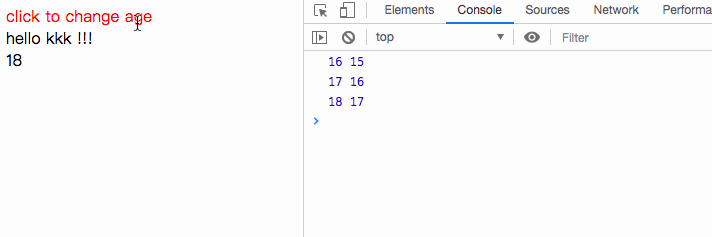
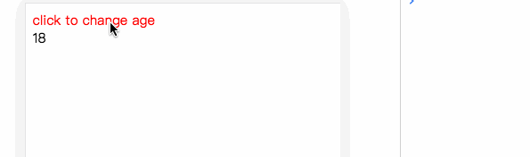
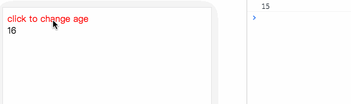
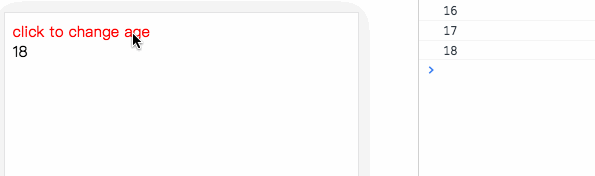
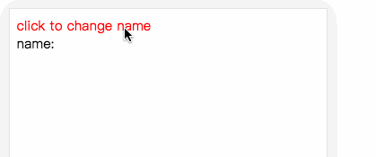
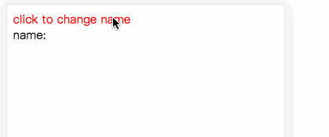

# typescript从零开始实现vue(三) : computed 和watch

这一章，我们来实现计算属性`computed` 和 侦听器`watch`。


## 侦听器`watch`

首先在初始化`Tsue`的时候对创建自定义的`watch`。实例化观察者`watcher`，参数`expOrFn`为当前`watch`的数据名称，`opations={user:true} `。

```js
class Tsue {
  ...
  // 初始化数据
  _initState() {
    if (this._options && this._options.watch ) {
      this._initWatch(this._options.watch)
    }
  }
  // 初始化watch
  _initWatch(watch: Record<string, Function>) {
     for(const key in watch) {
       const func = watch[key]
       this._createWatcher(key, func)
     }
  }
	// 创建自定义watcher
  _createWatcher(key: string, func: Function) {
     const expOrFn = key
     const watcher = new Watcher(this, expOrFn, func, {
         user: true
     })
  }
	...
}
```

在`Watcher`实例化的时候，对`expOrFn`做判断

```js
class Watcher {
  ...
  constructor(vm: TsVue, expOrFn: Function | string, cb: Function, options: WatchOptions) {
     ...
     if(typeof expOrFn === 'function') {
        this.getter = expOrFn // 实例化watcher的时候执行的方法
     } else {
        this.getter = function() {
           return vm[expOrFn]
        }
     }
     ...
  }
  ...
}
```

当传入的参数`expOrFn`不是一个方法时，做以下处理

```js
 this.getter = function() {
    return vm[expOrFn]  
 }
```

举个例子，比如：

```js
data: function() {
  return {
		name：kkk
	}
},
watach: {
  name: function() {
    // TODO
  }
}
```

此时

```js
this.getter = function() {
  return data['name'] // kkk
}
```

最后，在数据更新的时候, 判断当为自定义的`watcher`时，则执行自定义时传入的回调函数，并传入变化前后的值。

```js
class Watcher {
  ...
  // 数据更新的时候最终执行的方法
  run() {
    const value = this.get();
    if(value !== this.value) { // 如果新值和旧值不相等
        const oldValue = this.value
        this.value = value
         if (this.user) {  
            // 用户自定义的wtcher，传入了value, oldValue。
            // 所以在自定义watcher中，我们可以拿到新值和旧值
            this.cb.call(this.vm, value, oldValue)
          } else {
             this.cb.call(this.vm, value, oldValue)
          }
        }
   }
}

```

#### 尝试一下

```js
const tsue = new Tsue({
    el: '#app',
    data: function(){ 
        return {
            name: 'Tsue',
            age: 15
         }
    },
    methods: {
        clickHandler: function() {
            this.name = 'kkk'
            this.age = this.age + 1
        }
    },
    watch: {
        age(newVal, oldVal) {
            console.log(newVal, oldVal)
        } 
    },
    render: function(h) {
        const name = this.name;
        const age = this.age;
        return (
            <div>
                <div name='d'  class='d1' style='color:red;' key='ddd' onClick={this.clickHandler}>click to change age</div>
                <div name='d2' class='ttt' id='fff'>hello <span>{name}</span> !!!</div>   
                <div>{age}</div>
            </div>
        )
    }
})
```

效果如下：




## 计算属性`computed`

`computed`实现比`watch`逻辑稍微绕一点，我们一步一步来实现

首先和`watch`一样，需要初始化`computed`

```js
class Tsue {
   ...
   
     // 挂载到真实dom上
    _mount(el: string){
        const updateComponent = () => {
            this._update(this._render())
        }
        const wacther = new Watcher(this, updateComponent, noop, {});
    }
   
     _initState() {
        ...
        if(this._options && this._options.data) {
          this._initData(this._options.data)
        }
        if (this._options && this._options.computed ) {
          this._initComputed(this._options.computed)
        }
     		...      
    }
   
   
    // 初始化计算属性
    _initComputed(computed: Record<string, Function>) {
        const watchers: Record<string, Watcher> = Object.create(null) // 创建空对象 {}
        const sharedPropertyDefinition = {
            enumerable: true,
            configurable: true,
            get: noop,
            set: noop
        }
          
        function createComputedGetter (key: string) {
            return function computedGetter () {
              const watcher = watchers[key]
              if (watcher) {
                if (watcher.dirty) {
                    watcher.evaluate() // 即执行 watcher.get()，即计算属性用户设置的getter
                }
                if (Dep.target) {
                    watcher.depend()
                }
                return watcher.value  // value = watcher.get()
              }
            }
        }
       
        for(let key in computed) {
           const fuc = computed[key]
           // 实例化计算属性观察者
           watchers[key] = new Watcher(
              this,
              fuc,
              noop,
              { lazy: true }
           )

          if(key in this) {
            // 已经在data上的值不能设置为计算属性
            throw Error(`The computed property ${key} is already defined in data`)
          } else {
            // 将计算属性设置为响应式对象
            sharedPropertyDefinition.get = createComputedGetter(key)
            sharedPropertyDefinition.set = noop
            Object.defineProperty(this, key, sharedPropertyDefinition)
          }
        }
    }
   
  ... 
}
```

`_initComputed`中我们将每个计算属性转化为响应式对象，并且为每个计算属性创建一个`watcher`实例。

每当我们获取计算属性的值的时候，将会执行计算属性的`getter`。在`getter`中，先执行计算属性`watcher`的`evaluate`方法，实现如下

```js
class watcher {
  ...
  // 设置当前观察者，执行expOrFn，并返回expOrFn()的值
  get() {
    pushTarget(this) // 设置当前观察者
    let value;
    const vm = this.vm
    value = this.getter.call(vm, vm)
    popTarget()     // 移除当前观察者
    return value
  }
  evaluate() {
    this.value = this.get()
    this.dirty = false
  }
	// 将Dep当前的观察者添加到关联的订阅收集者中
  depend() {
    let i = this.deps.length
    while (i--) {
        this.deps[i].depend()
    }    
  }
  ...
}
```

在`evaluate`中，获取`value`值，即计算属性`return`的值。然后执行`watcher.depend`将当前的观察者添加到计算属性`watcher`关联的订阅收集者中

这一部分看起来很绕口，我们**看个例子来解释一下**：

```js
const tsue = new Tsue({
    el: '#app',
    data: function(){ 
        return {
            age: 15
         }
    },
  	methods: {
        clickHandler: function() {
            this.age = this.age + 1
        }
    },
   	computed: {
        age2: function() {
            return this.age
        }
    },
    render(h) {
      const age2 = this.age2
      return (
        <div>
        	<div name='d'  class='d1' style='color:red;' key='ddd' onClick={this.clickHandler}>click to change age</div>
  				<div>{age2}</div>
        </div>
      )
    }
})  
```

`computed`流程:

=>在`Tsue`实例化的 `_mount`中，生成`watcher`实例，该`watcher`用于数据变化后渲染页面，我们称之为渲染`watcher`

=> 在渲染`watcher`初始化时，执行`this.get()`

=>执行 `pushTarget()`：将当前观察者(`Dep.target`)设置为渲染`watcher`

=> 执行`this.getter.call(vm, vm)`时，即执行`_render`函数，会读取`age2`，即计算属性，触发计算属性的`getter`

=> 在计算属性的`getter`中，先执行` watcher.evaluate()`，即计算属性`watcher.get()`。在这里发生的事为：

1）执行`pushTarget(this) `，将计算属性`watcher`设置为当前观察者

2）执行`this.getter.call(vm, vm)`，即 `function() { return this.age }`，这会访问`this.age`，就会触发`this.age`的`getter`，`this.age`的`getter`中，会进行订阅收集，把当前观察者（即计算属性`watcher`）订阅到`dep`的观察者列表中，同时把该`dep`添加到计算属性`watcher`关联的`dep`列表中。注意，此时，**`this.age`的`dep`的观察者列表中只有一个计算属性`watcher`**。

3）执行`popTarget() `，把当前观察者设置为上一次的观察者，即渲染`watcher`。

=> 执行完`watcher.evaluate()`后，我们就会拿到计算属性的值，同时当前观察者(`Dep.target`)依然为渲染`watcher`。

=> 最后执行计算属性`watcher.depend()`，将当前观察者（即**渲染`watcher`**）添加到计算属性`watcher`关联的`dep`（即`this.age`的`dep`）的观察者列表中。注意，此时，**`this.age`的`dep`的观察者列表中就会有两个`watcher`:计算属性`watcher`和渲染`watcher`**。

=> 这样，每当`this.age`的值改变，触发`setter`，将会通知所有收集的`watcher`（在我们这个例子里就是计算属性`watcher`和渲染`watcher`），执行`watccher.update`

```js
// 数据更新的时候执行
update() {
   if (this.lazy) {
       // 如果为计算属性的watcher 
       this.dirty = true
   } else if (this.sync) {
       // 同步执行
       this.run()
   } else {
      // 异步执行，queueWatcher 最终也会执行 run()
      queueWatcher(this)     
   }     
}
    
```

对于计算属性`watcher`（即`lazy===true`）,  不会执行操作。而 渲染`watcher`就会重新渲染页面。

这样就达到了在计算属性关联的`data`值改变后，页面重新渲染的目的。




## nextTick

#### queueWatcher

在`watcher.update`中，我们还遗留了一个功能，异步执行`queueWatcher`。接下来，我们来实现

```js
const queue: Watcher[] = []
const hasIds = new Set()
let waiting: boolean = false
/**
 * 异步执行队列
 * 为了提高性能，不会在每次数据更新的之后立即执行，而是会把所有的回调函数放到队列里
 * 最后调用nextTick在下一个事件循环中执行
 * @param watcher 
 */
function queueWatcher(watcher: Watcher) {
    const id = watcher.id
    if(!hasIds.has(id)) {
        hasIds.add(id)
        // 将watcher添加到队列中
        queue.push(watcher)
    }
    if (!waiting) {
        waiting = true
        nextTick(flushQueue)
    }
}

// 依次执行 watcher
function flushQueue() {
    let watcher: Watcher;
    let id: number;
    // 将watcher按创建顺序排序
    queue.sort((a, b) => a.id - b.id);

    for (let index = 0; index < queue.length; index++) {
        watcher = queue[index]
        id = watcher.id
        hasIds.delete(id)
        watcher.run()
    }

    // 重置
    waiting = false
    hasIds.clear()
    queue.length = 0
}
```

在`queueWatcher`中，将所有的`watcher`缓存到队列中，然后利用`nextTick`在下一个事件循环中执行队列中每个`watcher`的`run`方法。

`nextTick`的实现涉及到js事件循环机制，大家可以看我的这篇文章[TypeScript实现Promise中-引伸到Event Loop](前端进阶/TypeScript实现Promise中.md)

#### 实现nextTick

我们先来看看`vue`源码中对`nextTick`是如何实现的

```js
export let isUsingMicroTask = false

const callbacks = []
let pending = false

function flushCallbacks () {
  pending = false
  const copies = callbacks.slice(0)
  callbacks.length = 0
  for (let i = 0; i < copies.length; i++) {
    copies[i]()
  }
}

// Here we have async deferring wrappers using microtasks.
// In 2.5 we used (macro) tasks (in combination with microtasks).
// However, it has subtle problems when state is changed right before repaint
// (e.g. #6813, out-in transitions).
// Also, using (macro) tasks in event handler would cause some weird behaviors
// that cannot be circumvented (e.g. #7109, #7153, #7546, #7834, #8109).
// So we now use microtasks everywhere, again.
// A major drawback of this tradeoff is that there are some scenarios
// where microtasks have too high a priority and fire in between supposedly
// sequential events (e.g. #4521, #6690, which have workarounds)
// or even between bubbling of the same event (#6566).
let timerFunc

// The nextTick behavior leverages the microtask queue, which can be accessed
// via either native Promise.then or MutationObserver.
// MutationObserver has wider support, however it is seriously bugged in
// UIWebView in iOS >= 9.3.3 when triggered in touch event handlers. It
// completely stops working after triggering a few times... so, if native
// Promise is available, we will use it:
/* istanbul ignore next, $flow-disable-line */
if (typeof Promise !== 'undefined' && isNative(Promise)) {
  const p = Promise.resolve()
  timerFunc = () => {
    p.then(flushCallbacks)
    // In problematic UIWebViews, Promise.then doesn't completely break, but
    // it can get stuck in a weird state where callbacks are pushed into the
    // microtask queue but the queue isn't being flushed, until the browser
    // needs to do some other work, e.g. handle a timer. Therefore we can
    // "force" the microtask queue to be flushed by adding an empty timer.
    if (isIOS) setTimeout(noop)
  }
  isUsingMicroTask = true
} else if (!isIE && typeof MutationObserver !== 'undefined' && (
  isNative(MutationObserver) ||
  // PhantomJS and iOS 7.x
  MutationObserver.toString() === '[object MutationObserverConstructor]'
)) {
  // Use MutationObserver where native Promise is not available,
  // e.g. PhantomJS, iOS7, Android 4.4
  // (#6466 MutationObserver is unreliable in IE11)
  let counter = 1
  const observer = new MutationObserver(flushCallbacks)
  const textNode = document.createTextNode(String(counter))
  observer.observe(textNode, {
    characterData: true
  })
  timerFunc = () => {
    counter = (counter + 1) % 2
    textNode.data = String(counter)
  }
  isUsingMicroTask = true
} else if (typeof setImmediate !== 'undefined' && isNative(setImmediate)) {
  // Fallback to setImmediate.
  // Techinically it leverages the (macro) task queue,
  // but it is still a better choice than setTimeout.
  timerFunc = () => {
    setImmediate(flushCallbacks)
  }
} else {
  // Fallback to setTimeout.
  timerFunc = () => {
    setTimeout(flushCallbacks, 0)
  }
}

export function nextTick (cb?: Function, ctx?: Object) {
  let _resolve
  callbacks.push(() => {
    if (cb) {
      try {
        cb.call(ctx)
      } catch (e) {
        handleError(e, ctx, 'nextTick')
      }
    } else if (_resolve) {
      _resolve(ctx)
    }
  })
  if (!pending) {
    pending = true
    timerFunc()
  }
  // $flow-disable-line
  if (!cb && typeof Promise !== 'undefined') {
    return new Promise(resolve => {
      _resolve = resolve
    })
  }
}
```

通过对`timerFunc`的定义，我们可以看到，`vue`会判断浏览器环境，是否是IE、是否是IOS、是否支持`Promise`、`MutationObserver`、`setImmediate`、`setTimeout`，来选取对应的方法。

在我们的`Tsue`中，为了方便起见，我们采用`Promise`来执行异步队列

```js
const callbacks: Function[] = []
let pending = false

const timerFunc = () => {
  const p = Promise.resolve().then(flushCallbacks)
}

/**
 * 遍历callbacks，并执行回调函数
 */
function flushCallbacks () {
  pending = false
  const copies = callbacks.slice(0)
  callbacks.length = 0 // 清空callbacks
  for (let i = 0; i < copies.length; i++) {
    copies[i]()
  }
}

/**
 * 把同一时间的cb放入callbacks中，在下一个事件循环中一起执行
 * @param cb 
 */
function nextTick(cb: Function) {
  callbacks.push(() => {
    cb()
  })
  if (!pending) {
    pending = true
    timerFunc()
  }
}
```

因为用户也可以调用`nextTick`方法，所以在同一时间，`nextTick`有可能执行多次，我们把同一个事件循环内的`cb`回调函数，放到`callbacks`队列中，在下一个事件循环中一起执行。

#### `Tsue`实例的`nextTick`

我们把`nextTick`赋给`Tsue`实例，这样我们就能通过`this._nextTick`调用

```js
class Tsue{
	...
	// 异步执行
  _nextTick(cb: Function){
     nextTick(cb)
  }
	...
}
```

#### 尝试一下

**当不使用`nextTick`时**：

```js
const tsue = new Tsue({
    el: '#app',
    data: function(){ 
        return {
            age: 15
         }
    },
  	methods: {
        clickHandler: function() {
            this.age = this.age + 1;
            // this._nextTick(function() {
            //     console.log(document.getElementById('age').innerHTML)
            // })
            console.log(document.getElementById('age').innerHTML)
        }
    },
   	computed: {
        age2: function() {
            return this.age
        }
    },
    render(h) {
      const age2 = this.age2
      return (
        <div>
        	<div name='d'  class='d1' style='color:red;' key='ddd' onClick={this.clickHandler}>click to change age</div>
  				<div id='age'>{age2}</div>
        </div>
      )
    }
})  

```



如图，由于页面重新渲染是在下一个事件循环中，所以我们拿不到更新的数据

**使用`nextTick`**

```js
this._nextTick(function() {
  console.log(document.getElementById('age').innerHTML)
})
```



如图，利用`_nextTick`把我们的回调函数和页面重新渲染放入了同一个事件循环，所以拿到了更新的数据


### Set

 用`Object.defineProperty`实现响应式的对象，给这个对象添加属性，该属性不是响应式。向响应式对象中添加一个属性，并确保这个新属性同样是响应式的，且触发视图更新，像`vue`一样，我们实现一个`set`方法

```js
class Tsue {
  ...
  _set(target: Record<any, any>, key: any, val: any): any {
        if(key in target) {
            target[key] = val;
            return val;
        }
        const __ob__: Observer = target.__ob__;  // __ob__即Observer实例
        if(!__ob__) {                       
            // 如果target上没有__ob__值，说明target不是响应式对象
            target[key] = val;
            return val
        }
        // 将新值变为响应式
        defineReactive(target, key, val)
        // 通知页面更新
        __ob__.dep.notify()
  }
}
```

在`set`中，如果如果`target`上没有`__ob__`值，说明`target`不是响应式对象。

`set`的具体实现原理是这样的：

```js
function defineReactive(obj: Record<any, any>, key: string, val?: any) {
  	if ((!getter || setter) && arguments.length === 2) {
        val = obj[key]
    }
  	let childOb = observe(val); 
    Object.defineProperty(obj, key, {
        enumerable: true,
        configurable: true,
        get: function() {
            const value = getter ? getter.call(obj) : val;
            if (Dep.target) {
                dep.depend()
                if (childOb) {
                  childOb.dep.depend()
                }
            }
            return value
        },
        set: function(newVal) {
            const value = getter ? getter.call(obj) : val
            if (newVal === value || (newVal !== newVal && value !== value)) {
                return
            }
            val = newVal              // 将val变为新值。必包
            childOb = observe(newVal) // 如果 newVal 是 object类型，则将其也变为响应式对象
            dep.notify()              // 数据更新，通知watcher
        }
    })     
}
```

=> 首次渲染收集订阅时，`obj: { form: { } }` ，`val: {}`，`val`是对象类型，所以`childOb`存在

=> 在`getter`中，由于`childOb`存在，执行`childOb.dep.depend()`，收集当前的观察者，即渲染`watcher`

=> 当我们执行`_set`方法时，` __ob__.dep`即为上面的`childOb.dep`。因此我们可以通过`__ob__.dep.notify()`来通知渲染`watcher`重新渲染页面

#### 尝试一下

**不使用`set`**

```js
const tsue = new Tsue({
    el: '#app',
    data: function(){ 
        return {
            form: {},
            age: 1
         }
    },
  	methods: {
        clickHandler: function() {
            this.form.name = 'kkk'
        }
    },
    render(h) {
      return (
        <div>
        	<div name='d'  class='d1' style='color:red;' key='ddd' onClick={this.clickHandler}>click to change name</div>
            <div>name: {this.form.name || ''}</div>  
        </div>
      )
    }
})  
```



**使用`set`**

```js
methods: {
 	clickHandler: function() {
     this._set(this.form, 'name', 'kkk')
  }       
}
```




## 小结

`Tsue`的响应式功能到此就实现完毕。下一章，我们来实现`Tsue`的组件化功能