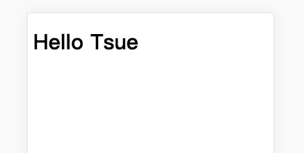
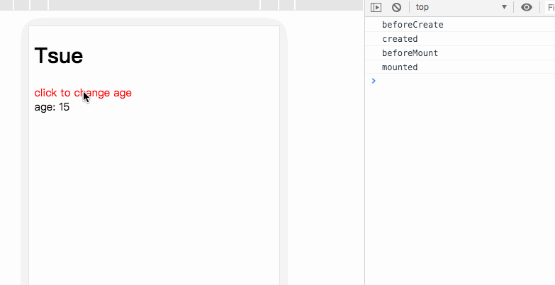

# typescript从零开始实现vue(四) - 组件化和生命周期

这一章，我们给`Tsue`增加组件化和生命周期的功能。


## createElement

第一章，我们实现了`createElement`将页面转化为`vnode`。在`vue`中我们用模版写组件的时候

```js
<template>
   <div>我是vue组件</div>
</template>
<script>
   export default {
			name: 'a',
      ...  
	 }
</script>  
```

可以看到，组件导出的是一个对象，因此在`createElement`中，我们需要对`tag`做判断

```js
const  createElement = function(context: Tsue, tag?: any, data?: VNodeData, children?: any[]): VNode {
    if(Array.isArray(data)) {  // 如果是数组，将data设为children
        children = data
        data = undefined
    } 
    let vnode = new VNode();
    if(children) {
        children = normalizeArrayChildren(children)
    }
    
    if(tag) {
        if (typeof tag === 'string') {        
            // 普通节点
            vnode = new VNode(tag, data, children, undefined, undefined, context);
        } else if((tag !== null) && (typeof tag === 'object')){   
            // 组件节点, 对象类型, 创建组件vnode
            vnode = createComponent(tag, data, context)
        } else if(typeof tag === 'function'){ 
            // jsx中的组件节点，创建组件vnode
            vnode = createComponent(tag(), data, context)
        }
    }
    return vnode;
}

```

当`tag`为对象时，就说明是组件节点，调用`createComponent`方法，创建组件`vnode`。如

```js
const Welcome =  {
		name: 'welcome',
    data() {
        return {
            name: 'Tsue'
        }
    },
    render(h) {
        return <h1>Hello <span>{this.name}</span></h1>;
    }
}
new Tsue({
   el: '#app',
   render(h) {
      return ( 
        <div>
            <Welcome></Welcome>
        </div>
      )
    }
})  
```

这里我们再多一个判断，当`tag`为`function`时，说明是`jsx`中的组件节点。因为参考[ts中的jsx](https://www.tslang.cn/docs/handbook/jsx.html)，可知在`jsx`中，组件需要为函数，比如：

```js
function Welcome () {
    return {
        name: 'welcome',
        data() {
            return {
                name: 'Tsue'
            }
        },
        render(h) {
            return <h1>Hello <span>{this.name}</span></h1>;
        }
    }
    
}
```


## createComponent

接下来实现`createComponent`方法，用于创建组件`vnode`。

```js
/**
 * 创建组件vnode
 * @param Ctor  options参数，对应就是转化为vnode的时候的Object类型的tag
 * @param data  
 * @param context 
 */
function createComponent(Ctor: VmOptions, data: VNodeData | undefined, context: Tsue): VNode {
    // _Ctor为Tsue子类构造函数
    const _Ctor = context._extend(Ctor)
    if(!data) {
        data = {}
    }
    installComponentHooks(data, context)
    // 创建组件vnode
    const vnode = new VNode(
        Ctor.name || 'tsue-component',
        data,
        undefined,
        undefined,
        undefined,
        context,
        {              // componentOptions
            Ctor: _Ctor
        }
    )
    return vnode
}

```

### _extend

`_extend`在`Tsue`实例上定义，返回一个子组件构造函数。子组件构造函数继承`Tsue`，同时拥有
`super`属性，表示父实例；
`options`表示创建组件构造函数时候传入的options，即组件构造函数的options

```js
class Tsue {
   ...
   _isMounted: boolean = false;      // 是否已经挂载到真实DOM上  
   ...
   
   /**
     * 创建子类
     * @params extendOptions 组件传入的options
     */
    _extend(extendOptions: VmOptions): VueComponentClassStatic {
        const Super = this
        class TsueComponent extends Tsue {
            static super: Tsue = Super
            static options = extendOptions
            constructor(options: ComponentOptions<Tsue>) {
                super(options)
            }
        }
        return TsueComponent
    }
}

/**
 * 定义子组件构造函数
 */
interface VueComponentClassStatic {
    new (options: ComponentOptions<Tsue>): Tsue;
    super: Tsue
    options: VmOptions | null
}
```

### installComponentHooks

`installComponentHooks`方法用于创建组件钩子函数。在组件`vnode`上定义两个钩子函数：

* `init`：在挂载组件到真实`DOM`时候执行

* `mounted`：组件挂载到真实`DOM`后执行

然后将钩子函数传递给`data`，这样就能通过`vnode.data.hook`获取到这两个钩子函数

```js
/**
 * 创建组件钩子函数
 * @param data 
 * @param parent 
 */
function installComponentHooks(data: VNodeData, parent: Tsue) {
    const hook = Object.create({})
    hook.init = function(vnode: VNode) { // 创建组件时候执行
        if(vnode.componentOptions) {
            const child = createComponentInstance(vnode, parent)  // 创建组件实例
            vnode.componentInstance  = child
            child && child._mount(undefined)
        }
    }
    hook.mounted = function(vnode: VNode) { // 组件插入完成后执行
        const componentInstance = vnode.componentInstance;
        if (componentInstance && !componentInstance._isMounted) { // 挂载完成
          componentInstance._isMounted = true;
        }
    }
    data.hook = hook
}
```

### createComponentInstance

组件钩子函数`init`中调用`createComponentInstance`，用于创建组件`tsue`实例

```js
/**
 * 创建子组件实例
 * @param vnode 
 * @param parent 
 */
function createComponentInstance(vnode: VNode, parent: Tsue) {
    const options = {
        _isComponent: true,          // 是否是组件
        parentVnode: vnode,          // 组件vnode
        parent                       // Tsue实例
    }
    if(vnode.componentOptions) {
        return new vnode.componentOptions.Ctor(options)  // 创建组件tsue
    }    
}
```

`vnode.componentOptions.Ctor`就是调用`_extend`创建的组件`tsue`构造函数。组件`tsue`的`options`与实例`tsue`不同，多了`_isComponent`、`parentVnode`、`parent`，分别表示是否是组件、组件`vnode`、实例`tsue`

### VNode

给`VNode`增加两个属性：

`componentOptions`: 用于表示组件的设置，其中`Ctor`表示子组件构造函数

`componentInstance`：表示对应的组件`tsue`实例

```js

class VNode {
  ...
  componentOptions?: VNodeComponentOptions | void;     // 组件option
  componentInstance?: Tsue;                            // 组件tsue实例
  ...
  
  constructor(
        ...
        componentOptions?: VNodeComponentOptions        
    ) {
        ...
        this.componentOptions = componentOptions
    }
}

interface VNodeComponentOptions {
    Ctor: VueComponentClassStatic;
}

```


## patch

创建完`vnode`树后，需要将其挂载到真实`DOM`上。第一章我们实现的`_update`，最终调用的`patch`函数，做的事就是渲染并挂载`DOM`。

```js
function patch(oldVnode: VNode | string | undefined, vnode: VNode) {
    if(typeof oldVnode === 'string') {
        // 如果是dom节点，说明是初始化，首次渲染，转化为vnode
        const reallyDom = document.querySelector(oldVnode);
        if(reallyDom) {
            oldVnode = new VNode(reallyDom.tagName, {}, [], undefined, reallyDom)
            createElm(vnode, oldVnode.element)
        }
    } else {
        ...
    }
    return vnode.element
}
```

在首次实例化渲染中`oldVnode`为我们实例化传入的`el`。依次走到`createElm`中


### createElm

`createElm`用于创建真实`DOM`节点并挂载。我们在这里先判断传入的`vnode`是否是组件`vnode`。如果是，则不进行后续操作

```js
/**
 * 创建节点并挂载
 * @param parentNode 
 * @param vnode 
 */
function createElm(vnode: VNode, parentElem?: Node | undefined) {
    if (patchCreateComponent(vnode, parentElem)) {
        // 判断是否是组件，是则不进行后续操作
        return;
    }
    ...
}
```


### patchCreateComponent

`patchCreateComponent`，如果`vnode.data.hook`(即组件`vnode`钩子)存在，说明当前的`vnode`是组件`vnode`。

然后就执行`init`钩子函数

```js
/**
 * 判断是否是组件vnode，是则创建组件tsue实例
 * @param vnode 
 * @param parentElem 
 */
function patchCreateComponent(vnode: VNode, parentElem: Node | undefined): boolean {
    if(vnode.data) {
        if(vnode.data.hook) {
            const init = vnode.data.hook.init;
            if(init) {   
                // 有init钩子，说明是组件，则执行init钩子
                init(vnode)
            }
        }
        if(vnode.componentInstance && (typeof vnode.componentInstance._el !== 'string')) {
            vnode.element = vnode.componentInstance._el
            if(vnode.element) {
                parentElem && vnode && parentElem.appendChild(vnode.element)
            }
            return true  
        }
    }
    return false;
}
```


### 组件`tsue`实例

#### `init`钩子函数

`init`钩子函数在上面已经定义，传入组件`vnode`，创建组件`tsue`实例

```js
 hook.init = function(vnode: VNode) { // 创建组件时候执行
   if(vnode.componentOptions) {
     const child = createComponentInstance(vnode, parent)  // 创建组件实例
     vnode.componentInstance  = child
     child && child._mount(undefined)       
  }      
}
```

组件`tsue`实例继承自`Tsue`。

修改一下实例化方法，如果是组件实例，我们把组件实例化传入的`parent`、`parentVnode`赋值给`this._options`

```js
class Tsue {
   ...
   _init(options: VmOptions & ComponentOptions<Tsue>){
        if(options && options._isComponent) { 
            // 如果是组件实例
            this._options = Object.create(this.constructor.options); // 组件传入的options
            this._options.parent = options.parent;
            this._options.parentVnode = options.parentVnode;
        } else {        
            ...
        }
        
     		...
    }
}
```

实例化后调用`_mount`函数，即执行

```js
this._update(this._render())
```

因此，在这一步，我们又会对组件内的`DOM`结构，进行转化`vnode`并渲染

#### 把组件内的`DOM`结构为转化`vnode`

在`render`中，由于是组件实例，所以`this._options.parentVnode`有值，即组件`vnode`。而此时`render`生成的`vnode`是组件内的`DOM`结构的`vnode`，我们简称**组件DOM的`vnode`**。我们把组件`vnode`赋值给**组件DOM的`vnode`**的`parent`属性。

```js
class Tsue {
  	...
  	// 生成vnode
    _render(): VNode{
        const render = this._options.render;
        const parentVnode = this._options.parentVnode
        this.$parentVnode = parentVnode;
        if(!render) {
            return {}
        } 
        const h = (tag: any, attr: any, children: any[]): VNode => {
            return createElement(this, tag, attr, children)
        };
        // vnode实例
        const vnode: VNode = render.call(this, h);
        // 组件vnode才会存在parent
        vnode.parent = parentVnode;

        return vnode
    }
}
```

##### 举个例子

比如有个`welcome`组件

```js
const Welcome =  {
		name: 'welcome',
    data() {
        return {
            name: 'Tsue'
        }
    },
    render(h) {
        return <h1>Hello <span>{this.name}</span></h1>;
    }
}
```
此时的组件`vnode`就是`vnode-welcome`。组件DOM的`vnode`就是

```js
 <h1>Hello <span>{this.name}</span></h1>
```

#### 渲染并挂载组件DOM的`vnode`

在`_update`中，当`prevVnode`和`this._el`不存在，就说明是组件实例渲染

```js
class Tsue {
   ...
   // 把 VNode 渲染成真实的 DOM, 在 首次渲染、组件实例渲染 或 数据更新 会调用
    _update(vnode: VNode){ 
        const prevVnode = this._vnode;
        this._vnode = vnode;
        if(prevVnode) {  
            // 数据更新  
            this._el = patch(prevVnode, vnode)
        } else {   
            if(!this._el) {
                // 组件实例渲染
                this._el = patch(undefined, vnode) 
            } else if(typeof this._el === 'string') {
                // 首次渲染
                this._el = patch(this._el, vnode) 
            }   
        }
    }
}
```

然后再次执行`patch`。这一步，我们暂称之为**组件实例`patch`**。因此，我们需要再对`patch`增加判断

```js
function patch(oldVnode: VNode | string | undefined, vnode: VNode) {
    if(typeof oldVnode === 'string') {
        // 初始化，首次渲染
        ...
    } else {
        if(oldVnode && oldVnode.element) {
            // 数据更新
            ...
        } else {
            // 组件实例首次渲染
            createElm(vnode)
            // 组件渲染完成后执行mounted钩子
            if(vnode.parent && vnode.parent.data && vnode.parent.data.hook) {
                vnode.parent.data.hook.mounted(vnode.parent)
            }
        }   
    }
    return vnode.element
}
```

组件实例`patch`传入的`oldVnode === undefined`，因此判断会走到

```js
// 组件实例首次渲染
 createElm(vnode)
// 组件DOM的vnode渲染完成后执行mounted钩子
if(vnode.parent && vnode.parent.data && vnode.parent.data.hook) {
   vnode.parent.data.hook.mounted(vnode.parent)
}      

```

注意，此时的`vnode`是组件DOM的`vnode`，不是组件`vnode`。所以此时`patchCreateComponent`返回`false`，执行后续的操作。

```js
function createElm(vnode: VNode, parentElem?: Node | undefined) {
    ...
    if(vnode.tag) {
        vnode.element = document.createElement(vnode.tag!);
        updateAttrs(vnode);
        updateClass(vnode);
        updateStyle(vnode);
        updateListeners(vnode);
        createChildren(vnode, vnode.children)
        parentElem && parentElem.appendChild(vnode.element)
    } else {
        // 没有tag就是文本节点
        vnode.element = document.createTextNode(vnode.text || '')
        parentElem && parentElem.appendChild(vnode.element)
    }
}
```

但在这里需要注意的是，执行` createElm(vnode)`没有传入`parentElem`，因此只会创建`vnode.element`，不会将`vnode.element`挂载到`DOM`上

执行到这里，已经完成了组件`tsue`实例化，并把渲染的`element`赋值给组件`tsue`实例。


### 挂载组件`tsue`实例

执行完`init`钩子函数后，又回到了首次实例化`Tsue`时的`patchCreateComponent`。我们需要把组件`tsue`实例的渲染`element`挂载到真实`DOM`上。

注意，此时的`vnode`为组件`vnode`，**而不是**组件DOM的`vnode`。`vnode.componentInstance._el`就是组件`tsue`实例的渲染`element`。此时的`parentElem`存在，对应我们最开始的例子，就是`document.querySelector('#app')`

```js
function patchCreateComponent(vnode: VNode, parentElem: Node | undefined): boolean {
    if(vnode.data) {
        ...
        if(vnode.componentInstance && (typeof vnode.componentInstance._el !== 'string')) {
            vnode.element = vnode.componentInstance._el
            if(vnode.element) {
                parentElem && vnode && parentElem.appendChild(vnode.element)
            }
            return true  
        }
    }
    return false;
}
```

因此执行完`patchCreateComponent`后，我们的组件就会被渲染并挂载到真实`DOM`上

#### 看下效果

```js
const Welcome =  {
		name: 'welcome',
    data() {
        return {
            name: 'Tsue'
        }
    },
    render(h) {
        return <h1>Hello <span>{this.name}</span></h1>;
    }
}
new Tsue({
   el: '#app',
   render(h) {
      return ( 
        <div>
            <Welcome></Welcome>
        </div>
      )
    }
}) 
```

如图




## 生命周期钩子

接下来我们来添加生命周期钩子

### 定义生命周期类型

```js
interface VmOptions {
    ...
    
    // 生命周期函数
    beforeCreate?: Function;
    created?: Function;
    beforeMount?: Function;
    mounted?: Function;
    beforeUpdate?: Function;
    updated?: Function;
    beforeDestroy?: Function;
    destroyed?: Function;
}

type lifehook = 'beforeCreate' | 'created' | 'beforeMount' | 'mounted' | 'beforeUpdate' | 'updated' | 'beforeDestroy' | 'destroyed';
```

定义执行生命周期钩子的函数

```js
function callHook(vm: Tsue, hook: lifehook) {
    const hander = vm._options[hook]
    if(hander) {
        hander.call(vm)
    }
}
```

这样，在需要执行生命周期的地方，比如通过调用`callHook(tsue, 'created')`，就能执行`created`生命周期钩子

接下来，我们一一实现这些生命周期钩子

### beforeCreate

根据`vue`文档定义，`beforeCreate`的调用时机为

> 在实例初始化之后, 数据观测 (data observer) 和 event/watcher 事件配置之前被调用

因此，我们在`Tsue`初始化方法中，在`_initState`前执行`beforeCreate`钩子
```js
class Tsue {
  ...
  /**
  * 初始化方法
  */
  _init(options: VmOptions & ComponentOptions<Tsue>) {
    ...
    
    callHook(this, 'beforeCreate')
    
    this._initState() // 初始化methods、data、computed、watch数据
    ...
  }
  ...
}
```


### created

根据文档

> 在实例创建完成后被立即调用。在这一步，实例已完成以下的配置：数据观测 (data observer)，属性和方法的运算，watch/event 事件回调。然而，挂载阶段还没开始，`$el` 属性目前不可见。

因此在`_initState`之后，`_mount`之前执行`created`钩子

```js
class Tsue {
  ...
  /**
  * 初始化方法
  */
  _init(options: VmOptions & ComponentOptions<Tsue>) {
    ...
    callHook(this, 'beforeCreate')
    this._initState() // 初始化methods、data、computed、watch数据
    
    callHook(this, 'created')
    
    if(this._options.el && document.querySelector(this._options.el)) {  
       this._el = this._options.el;
       this._mount(this._options.el);
    }
  }
  ...
}
```


### beforeMount

根据文档

> 在挂载开始之前被调用：相关的 `render` 函数首次被调用。

挂载方法是`_mount`，在`render`之前执行`beforeMount`钩子

```js
class Tsue {
  ...
  _mount(el: string | undefined) {
    
    callHook(this, 'beforeMount')
    
    const updateComponent = () => {
        this._update(this._render())
    }    
    ...
  }
  ...
}
```


### mounted

根据文档

> 挂载到实例上去之后调用该钩子

这里，挂载实例分为两种：

一种是`Tsue`初始化实例挂载，调用时机也是在`_mount`中，由于`Watcher`实例化的时候就会执行 `updateComponent`，` updateComponent`则会进行挂载，所以`mounted`钩子调用在`Watcher`实例化之后

```js
class Tsue {
  ...
  _mount(el: string | undefined) {
    ...
    
    const wacther = new Watcher(this, updateComponent, noop, {}); 
    
    if(!this.$parentVnode) {
        // 没有$parentVnode 说明是 Tsue实例化
        this._isMounted = true;
      
        callHook(this, 'mounted')    
    }
  }
  ...
}
```

还有一种是组件挂载，在组件钩子函数中，组件挂载完成后就会执行`hook.mounted`

```js
hook.mounted = function(vnode: VNode) { // 组件插入完成后执行
    const componentInstance = vnode.componentInstance;
        if (componentInstance && !componentInstance._isMounted) { // 挂载完成
        componentInstance._isMounted = true;
          
        // mounted生命周期钩子
        callHook(componentInstance, 'mounted');     
    }    
}
```


### beforeUpdate

根据文档

> 数据更新时调用，发生在虚拟 DOM 打补丁之前。这里适合在更新之前访问现有的 DOM，比如手动移除已添加的事件监听器

`DOM`的更新是执行`watcher.run`。前面响应式中，我们实现了`flushQueue`函数，就是用来执行`watcher.run`

```js
// 依次执行 watcher
function flushQueue() {
    let watcher: Watcher;
    let id: number;

    // 将watcher按创建顺序排序
    queue.sort((a, b) => a.id - b.id);

    for (let index = 0; index < queue.length; index++) {
      
        watcher = queue[index]
        if (watcher.before) {
            // beforeUpdate 生命周期
            watcher.before()
        }
      
        id = watcher.id
        hasIds.delete(id)
        watcher.run()
    }
    
}
```

在`watcher.run`之前，执行`watcher.before()`

`watcher.before()`就是执行`beforeUpdate`钩子，定义在`watcher`初始化的时候

```js
class Tsue {
    ...
     // 挂载到真实dom上
    _mount(el: string | undefined){
        ...
        const updateComponent = () => {
            this._update(this._render())
        }
        const vm = this
        
        // Watcher实例化的时候就会执行 updateComponent
        const wacther = new Watcher(this, updateComponent, noop, {
            before() {
                if (vm._isMounted) {
                    // beforeUpdate 生命周期
                    callHook(vm, 'beforeUpdate')
                }
            }
        }); 
      
        ...
    }
    ...
}
    

class Watcher {
  ...
  before: Function | undefined;    // beforeUpdate 钩子
  ...
  
  constructor(vm: Tsue, expOrFn: Function | string, cb: Function, options: WatchOptions) {
        if (options) {
            ...
            this.before = options.before
        } else {
            ...
        }
        ...
    }
}    
```


### updated

根据文档

> 由于数据更改导致的虚拟 DOM 重新渲染和打补丁，在这之后会调用该钩子。

可见`updated`钩子调用在`watcher.run`之后。

```js
// 依次执行 watcher
function flushQueue() {
    ...
    
    for (let index = 0; index < queue.length; index++) {
        ...
        watcher.run()
    }
  
    const updatedQueue = queue.slice()
    let i = updatedQueue.length
    
    while (i--) {
        const watcher = queue[i]
        const vm = watcher.vm
        if (vm._isMounted) {
          
            // updated 生命周期
            callHook(vm, 'updated')
        }
    }
}
```


### 尝试一下

结合组合和生命周期，实践一下

```js
function Welcome () {
    return {
        name: 'welcome',
        data() {
            return {
                age: 15
            }
        },
        beforeCreate() {
            console.log('beforeCreate')
        },
        created() {
            console.log('created')
        },
        beforeMount() {
            console.log('beforeMount')
        },
        mounted() {
            console.log('mounted')
        },
        beforeUpdate() {
            console.log(this.age, 'beforeUpdate')
        },
        updated() {
            console.log(this.age, 'updated')
        },
        methods: {
            clickHandler: function() {
                this.age = this.age + 1
            }
        },
        
        render(h) {
            return (
                <div>
                    <div name='d'  class='d1' style='color:red;' key='ddd' onClick={this.clickHandler}>click to change age</div> 
                    <div>age: {this.age}</div>  
                </div>
            );
        }
    }
    
}

const tsue = new Tsue({
    el: '#app',
    data: function(){ 
        return {
            name: 'Tsue'
         }
    },
    
    render(h) {
      return ( 
        <div>
            <h1>{this.name}</h1>
            <Welcome></Welcome>
        </div>
      )
    }
})
```

效果如下




## 小结

组件化到此就完成了。不过我们的`Tsue`还有一点需要完善。就是每次更新`DOM`的时候，整个`DOM`结构都会重新渲染，而对`DOM`的操作对性能影响很大，当`DOM`结构复杂的时候，性能开销会很大。下一章，我们就来对此进行优化