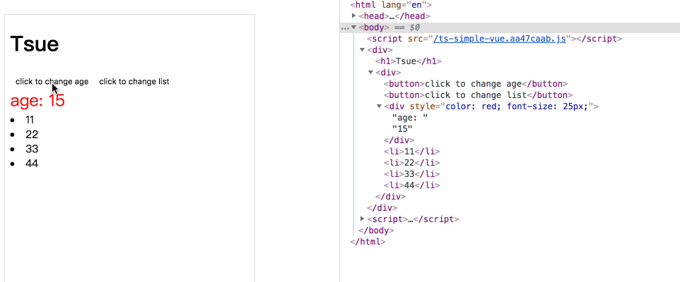

# typescript从零开始实现vue(五): 组件更新-diff算法

操作`DOM`对性能的开销很大，这章我们对`Tsue`进行优化，通过对比变化前后的数据，只更新需要重新渲染的`DOM`。


## patch

在前面的实现中，可以知道页面的渲染发生在`patch`中。页面渲染分为四种情况：

1. `Tsue`初始化，实例首次渲染
2. 组件实例首次渲染
3. 数据更新，新旧节点不同
4. 数据更新，新旧节点相同

因此，我们修改下`patch`中的判断。

```js
/**
 * 渲染并挂载DOM
 * @param oldVnode
 * @param vnode 
 */
export default function patch(oldVnode: VNode | string | undefined, vnode: VNode) {
    if(!oldVnode) {
         // 没有oldVnode，说明是组件实例首次渲染
         createElm(vnode)
         // 组件DOM的vnode渲染完成后执行mounted钩子
         if(vnode.parent && vnode.parent.data && vnode.parent.data.hook) {
             vnode.parent.data.hook.mounted(vnode.parent)
         }
    } else {
        if(
          typeof oldVnode !== 'string' 
          && oldVnode.element && isSameVnode(oldVnode, vnode)
        ) {
            // 数据更新, 新旧节点相同
            patchVnode(oldVnode, vnode)
        } else {
            if(typeof oldVnode === 'string') {
                // 如果是dom节点，说明是Tsue初始化，首次渲染，转化为vnode
                const reallyDom = document.querySelector(oldVnode);
                if(reallyDom) {
                    oldVnode = new VNode(reallyDom.tagName, {}, [], undefined, reallyDom)
                } else {
                    return
                }
            } 
            if(oldVnode.element) {
                // 数据更新，新旧节点不同 或 Tsue实例首次渲染
                const parentNode = getParentNode(oldVnode.element)
                if(parentNode) {
                    createElm(vnode, parentNode)
                    // 替换老的节点
                    parentNode.removeChild(oldVnode.element)
                }
            }
        }
    }
    return vnode.element
}

```

实例首次渲染和组件实例首次渲染前面已经实现。

如果是，数据更新，新旧节点不同，处理很简单，直接删除老的节点，新建新节点

```js
// 数据更新，新旧节点不同 或 Tsue实例首次渲染
const parentNode = getParentNode(oldVnode.element)
if(parentNode) {
		createElm(vnode, parentNode)
		// 替换老的节点
		parentNode.removeChild(oldVnode.element)
}                
```

所以，我们的diff主要处理的就是数据更新，新旧节点相同的情况


## 数据更新，新旧节点相同

我们写个方法`isSameVnode`，用来判断是否是相同的节点。相同的节点的判断条件是`key`值相同、节点`tag`类型相同、都有`data`值或都没有`data`值

**isSameVnode**

```js
/**
 * 判断是否是同一节点, key是否相同，节点类型是否相同，是否都有data值
 * @param oldVnode 
 * @param newVnode 
 */
export function isSameVnode(oldVnode: VNode, newVnode: VNode) {
    return oldVnode.key === newVnode.key && (
        (oldVnode.tag === newVnode.tag) && ((oldVnode.data && newVnode.data) || (!oldVnode.data && !newVnode.data))
    )
}
```

### patchVnode

我们写个`patchVnode`方法，用来处理新旧节点相同时的情况。我们的`diff`算法处理逻辑是这样的：

1. 如果新节点是文本节点，则判断新旧节点文本内容是否相同，不相同则改变节点文本
2. 如果老的节点不存在子节点，新的节点存在子节点，则新增子节点
3. 如果新的节点不存在子节点,  老的节点存在子节点，则删除老的节点的子节点
4. 如果新老节点都存在子节点，则比较子节点

根据上述逻辑，`patchVnode`代码实现如下

```js
/**
 * 新旧节点相同，diff更新DOM
 * @param oldVnode 
 * @param newVnode 
 */
function patchVnode( oldVnode: VNode, newVnode: VNode) {
    const element = newVnode.element = oldVnode.element
    const oldChildren = oldVnode.children;
    const children = newVnode.children;

    // 对data做更新
    if(newVnode.data) {
        const cbs = [ updateAttrs, updateClass, updateStyle ]
        cbs.forEach((cb: Function) => {
            cb(newVnode, oldVnode)
        })
    }

    if(element) {
        if(!newVnode.text) { 
            // 如果新节点不是文本节点
            if(oldChildren && children) {
                // 子vnode都存在
                updateChildren(element, oldChildren, children)
            } else if(children) {
                // 老的节点不存在子节点，新增新的子节点
                addVnodes(element, undefined, children, 0, children.length - 1)
            } else if(oldChildren) {
                // 新的节点不存在子节点, 删除老的子节点
                removeVnodes(oldChildren, 0, oldChildren.length - 1)
            }
        } else {
            if(oldVnode.text !== newVnode.text) {
                // 如果文本内容不同
                element.textContent = newVnode.text
            }
        }
    }    
}
```

**`addVnodes`**用于新增节点

```js
/**
 * 遍历vnode数组，新增节点
 */
function addVnodes(
	parentElm: Node, refElm: Node | undefined, 
  vnodes: VNode[], 
  startIdx: number, endIdx: number
  ): void{
    while(startIdx <= endIdx) {
        createElm(vnodes[startIdx], parentElm, undefined)
        ++startIdx
    }
}
```

**`removeVnodes`**用于删除节点

```js
/**
 * 遍历vnode数组，删除节点
 */
function removeVnodes(vnodes: VNode[], startIdx: number, endIdx: number): void {
    while(startIdx <= endIdx) {
        let vnode = vnodes[startIdx];
        if(vnode && !vnode.isNull) {      
            // 因为在老节点中，只要是相同的节点，都已经做过处理，vnode.isNull===true
            if(vnode.tag) {
                // 不是文本节点
                if(vnode.element) {
                    removeNode(vnode.element)
                }   
                invokeDestroyHook(vnode)  // 执行distory钩子函数
            } else {                      
                // 文本节点直接删除 
                if(vnode.element) {
                    removeNode(vnode.element)
                }   
            }
        }
        ++startIdx
    }
}

/**
 * 删除节点
 * @param element 
 */
function removeNode(element: Node): void {
    const parentNode = element.parentNode;
    if(parentNode) {
        parentNode.removeChild(element)
    }
}

/**
 * 执行distory钩子函数，执行beforeDestroy、destroyed生命周期
 * @param vnode 
 */
function invokeDestroyHook(vnode: VNode): void {
    ...
}
```

**`removeVnodes`**中我们将调用`invokeDestroyHook`方法，用于执行`distory`钩子函数。具体代码我们稍后实现

### updateChildren

当新老节点都存在子节点时，我们新建一个`updateChildren`，比较子节点，这也是我们的`diff`算法最关键且复杂的地方。

先看代码实现

```js
/**
 * diff更新子节点
 * @param parentElm 父节点
 * @param oldCh     老的子节点数组, 已经挂载到DOM上
 * @param newCh     新的子节点数组, 还未挂载到DOM上
 */
function updateChildren(parentElm: Node, oldCh: VNode[], newCh: VNode[]) {

    let oldStartIdx = 0;
    let oldEndIdx = oldCh.length - 1;
    let oldStartVnode = oldCh[0];     

    let newStartIdx = 0;
    let newEndIdx = newCh.length - 1;
    let newStartVnode = newCh[0];

    let oldKeyToIdx; // 缓存节点和key的对应关系
  
    while(oldStartIdx <= oldEndIdx && newStartIdx <= newEndIdx) {
        if(!oldStartVnode || oldStartVnode.isNull) {              // 情况1
            // 老节点为空，则对比下一个老节点。会产生这种情况是因为经过了情况3
            oldStartVnode = oldCh[++oldStartIdx]
        } else if(isSameVnode(oldStartVnode, newStartVnode)) {    // 情况2
            // 相同节点, 对比子节点
            patchVnode(oldStartVnode, newStartVnode)
            oldStartVnode = oldCh[++oldStartIdx];
            newStartVnode = newCh[++newStartIdx];
        }  else {                                                 // 情况3
            // 不遍历老节点，而是遍历新节点，与老节点key的对应关系对比
            if(!oldKeyToIdx) {
                oldKeyToIdx = createKeyToOldIdx(oldCh, oldStartIdx, oldEndIdx)
            } 
            let idxInOld;
            if(newStartVnode.key) { // 如果新节点有key值
                idxInOld = oldKeyToIdx[newStartVnode.key]
            } else {                
                idxInOld = findIdxInOld(newStartVnode, oldCh, oldStartIdx, oldEndIdx)
            }
            if(idxInOld !== undefined) {     
                 // 如果老节点中存在和新节点相同的节点
                 const vnodeToMove = oldCh[idxInOld];              // 需要移动的节点
                 if(vnodeToMove && vnodeToMove.element) {
                    if (isSameVnode(vnodeToMove, newStartVnode)) { // 判断节点类型是否相同
                        // key相同，节点类型也相同
                        patchVnode(vnodeToMove, newStartVnode)
                        // 将老节点数组中，相同的老节点重置为空
                        oldCh[idxInOld] = new VNode(undefined, undefined, undefined, undefined, undefined, undefined, undefined, true);
                        // 移动相同的老节点
                        parentElm.insertBefore(vnodeToMove.element, oldStartVnode.element || null)
                     } else {
                         // key相同，但节点类型不同，则创建新节点
                        createElm(newStartVnode, parentElm, oldStartVnode.element)
                     }  
                 }   
            } else {
                // 没有相同的节点，则新建节点
                createElm(newStartVnode, parentElm, oldStartVnode.element)
            }
            newStartVnode = newCh[++newStartIdx];
        }
    }
    if(oldStartIdx > oldEndIdx) { 
        // 说明是情况2, 老节点遍历完了，新节点可能还没遍历完
        // 将剩余的节点插入
        addVnodes(parentElm, undefined, newCh, newStartIdx, newEndIdx)
    } else if(newStartIdx > newEndIdx){
        // 情况3，所有的新节点都遍历完了
        // 删除多余的不同的老节点
        removeVnodes(oldCh, oldStartIdx, oldEndIdx)
    }
}

/**
 * 旧的子节点中，生成节点和key的对应关系
 * @param children 
 * @param beginIdx 
 * @param endIdx 
 */
export function createKeyToOldIdx(
	children:VNode[], beginIdx: number, endIdx:number
): Record<any, number> {
    let i = 0
    let key: any;
    let map: Record<any, number> = {};
    for (i = beginIdx; i <= endIdx; i++) {
      key = children[i].key;
      if(key) {
        map[key] = i; 
      }
    }
    return map
}

/**
 * 遍历寻找新老节点中是否有相同的节点
 * @param node 
 * @param oldCh 
 * @param start 
 * @param end 
 */
export function findIdxInOld (node: VNode, oldCh: VNode[], start: number, end: number) {
    for (let i = start; i < end; i++) {
       let c = oldCh[i];
       if (c && isSameVnode(node, c)) { 
          return i 
       }
    }
}
```

我们同时遍历新老子节点数组：

1. 如果同一位置下，新老节点是相同的节点, 则调用`patchVnode`，对比它们的子节点

2. 如果同一位置下，新老节点不同，我们就用设置的`key`值，在老的子节点数组中，生成节点和`key`的对应关系--`idxInOld`。

   然后只遍历新节点，通过新节点的`key`值，找到老的子节点数组中相同的节点（**这也是建议设置`kay`的原因，可以帮我们快速的找到相同的节点**）。

   2.1. 如果没有相同的节点，则新建节点

   2.2.若果有相同的节点，我们就将相同的老节点移动到新的位置，并删除老节点数组中对应的老节点。这样就免去了新建节点操作，性能也会提高

注意，当新节点数组或老节点数组遍历完成后，还存在以下两种情况：

1. 如果`oldStartIdx > oldEndIdx`，说明老的子节点数组已经遍历完了，所有相同位置上的新老子节点都是相同类型的节点。但可能还存在新的子节点比老的子节点多的情况，因此我们将剩余的新的子节点插入
2. 如果`newStartIdx > newEndIdx`，说明新的子节点数组已经遍历完了，但可能老的子节点数组还存在与新的子节点不同的节点，因此我们需要将其删除

这样子节点的`diff`算法就完成了。

### data做更新

我们的节点上不光有子节点，还有属性、`css`样式、`className`等数据，我们也需要对这些数据做对比更新

在`patchVnode`对`data`做更新

```js
function patchVnode( oldVnode: VNode, newVnode: VNode) {
    ...
  	// 对data做更新
    if(newVnode.data) {
        const cbs = [ updateAttrs, updateClass, updateStyle ]
        cbs.forEach((cb: Function) => {
            cb(newVnode, oldVnode)
        })
    }
    ...
} 

```

#### updateAttrs

```js
/**
 * 设置或更新节点属性 attr
 * @param vnode 
 */
function updateAttrs(vnode: VNode, oldVnode?: VNode) {
    const { data, element } = vnode;
    const oldData  = oldVnode ? oldVnode.data: null;
    const attrs = data && data.attrs ? data && data.attrs: null;
    const oldAttrs = oldData && oldData.attrs ? oldData.attrs: null;

    if(oldAttrs) {
        // 遍历老的属性, 删除新css上不存在的属性
        for(let key in oldAttrs) { 
            if(!attrs || !attrs[key]) {
                // 如果新的没有该属性，则删除该属性
                if(element) {
                    (element as HTMLElement).setAttribute(key, ''); 
                }
                
            }
        }
    }
    if( attrs ) {
        // 遍历新属性
        for (let key in attrs) {
            const value = attrs[key];
            if( oldAttrs && oldAttrs[key] ) {
                // 如果老节点也有该属性，则对比，不一样就改变
                if ( oldAttrs[key] !== value ) {
                    element && (element as Element).setAttribute(key, value)
                }
            } else {
                // 老节点没有该属性，则新增
                element && (element as Element).setAttribute(key, value)
            }
        }
    }
}
```

#### updateClass

```js
/**
 * 设置或更新class
 * @param vnode 
 */
function updateClass(vnode: VNode, oldVnode?: VNode) {
    const { data, element } = vnode;
    const oldData  = oldVnode ? oldVnode.data: null;
    const className = data && data.class ? data.class: null;
    const oldClassName = oldData && oldData.class ? oldData.class: null;
    if( className ) {
        // 新节点有className，则与老的对比是否相同
        if( oldClassName ) {
            if(oldClassName !== className) {
                element && (element as Element).setAttribute('class', className)
            }
        } else {
            element && (element as Element).setAttribute('class', className)
        }
    } else {
        // 新节点没有className则清空className
        element && (element as Element).setAttribute('class', '')
    }
}
```

#### updateStyle

```js
/**
 * 设置或更新style
 * @param vnode 
 */
function updateStyle(vnode: VNode, oldVnode?: VNode) {
    const { data, element } = vnode;
    const oldData  = oldVnode ? oldVnode.data: null;
    const styleName = data && data.style ? data.style: null;
    const oldStyleName = oldData && oldData.style ? oldData.style: null;

    const _parseStyle: CSSStyleDeclaration | undefined = styleName ? parseStyleText(styleName): undefined
    const _oldParseStyle: CSSStyleDeclaration | undefined = oldStyleName ? parseStyleText(oldStyleName): undefined

    if(_oldParseStyle) {
        // 遍历老的css, 删除新css上不存在的样式
        for(let key in _oldParseStyle) { 
            if(!_parseStyle || !_parseStyle[key]) {
                // 如果新css没有该样式，则删除该样式
                if(element) {
                    (element as HTMLElement).style[key] = ''; 
                }
                
            }
        }
    }

    if(_parseStyle) {
        // 遍历新的css, 改变与老css不一样的属性的值
        for(let key in _parseStyle) { 
            const value = _parseStyle[key]
            if(!_oldParseStyle) {
                if(element) {
                    (element as HTMLElement).style[key] = value; 
                } 
            } else if(_oldParseStyle[key] !== value) {
                (element as HTMLElement).style[key] = value; 
            }
        }
    }
}

```


## 执行distory钩子函数

我们在节点删除方法`removeVnodes`中调用`invokeDestroyHook`方法，用于执行`distory`钩子函数

```js
/**
 * 执行distory钩子函数，执行beforeDestroy、destroyed生命周期
 * @param vnode 
 */
function invokeDestroyHook(vnode: VNode): void {
    if(vnode.data && vnode.data.hook && vnode.data.hook.destroy) {
        vnode.data.hook.destroy(vnode)
    }
    // 遍历子节点, 执行子节点的distory钩子函数
    if (vnode.children) {
        for (let j = 0; j < vnode.children.length; ++j) {
          invokeDestroyHook(vnode.children[j]);
        }
    }
}

```

`destroy`钩子函数定义在`installComponentHooks`(创建组件钩子函数)，我们在`installComponentHooks`中新增`destroy`钩子函数

```js
/**
 * 创建组件钩子函数
 * @param data 
 * @param parent 
 */
function installComponentHooks(data: VNodeData, parent: Tsue) {
    const hook = Object.create({})
    hook.init = function(vnode: VNode) { // 创建组件时候执行, 这里的vnode是组件vnode
        if(vnode.componentOptions) {
            const child = createComponentInstance(vnode, parent)  // 创建组件tsue实例
            vnode.componentInstance  = child
            child && child._mount(undefined)
        }
    }
    hook.mounted = function(vnode: VNode) { // 组件插入完成后执行
        const componentInstance = vnode.componentInstance;
        if (componentInstance && !componentInstance._isMounted && !componentInstance._isDestroyed) { // 挂载完成
          componentInstance._isMounted = true;
          // mounted生命周期
          callHook(componentInstance, 'mounted');
        }
    }
    hook.destroy = function(vnode: VNode) {           // 组件销毁时执行
        const componentInstance = vnode.componentInstance;
        if (componentInstance && !componentInstance._isDestroyed) {
            componentInstance._destroy();
        }
    }
    data.hook = hook
}
```

`destroy`钩子函数会执行`Tsue`组件实例的`_destroy`方法。我们来实现它

```js
class Tsue{
    ...
    _parent: Tsue | undefined;        // 父Tsue实例
    _childrens: Tsue[] = [];          // 子Tsue实例
		_isDestroyed: boolean = false;    // 是否已经销毁
    _watchers: Watcher[] = [];        // 关联的观察者
   
    ...
    
     /**
     * 初始化方法
     */
    _init(options: VmOptions & ComponentOptions<Tsue>){
        ...
        this._self = this;

        let parent: Tsue | undefined;
        if(options.parent) {
            parent = options.parent
            while (parent._parent) {  // 遍历到最外层父实例
                parent = parent._parent;
            }
            parent._childrens.push(this)

        }
        this._parent = parent;

        callHook(this, 'beforeCreate')
        ...
    }
    ...
    
    // 节点销毁时执行
    _destroy() {
        // beforeDestroy 生命周期
        callHook(this, 'beforeDestroy');

        // 删除watcher订阅
        let i = this._watchers.length;
        while (i--) {
            this._watchers[i].teardown();
        }
        // 从父实例中删除
        if(this._parent) {
            remove<Tsue>(this._parent._childrens, this);
        }

        this._isDestroyed = true;
        // destroyed 生命周期
        callHook(this, 'destroyed');

    }
   
}

/**
 * 删除数组中的某一元素
 * @param arr 
 * @param item 
 */
function remove<T> (arr: T[], item: T) {
  if (arr.length) {
    const index = arr.indexOf(item);
    if (index > -1) {
      return arr.splice(index, 1)
    }
  }
}
```

在`_destroy`方法中我们删除`watcher`订阅、从父实例中删除实例，同时在生命周期中遗留的`beforeDestroy`和

`destroyed`生命周期也会在这一步执行


## 实践一下

```js
function Welcome () {
    return {
        name: 'welcome',
        data() {
            return {
                age: 15,
                list: {
                    a: 11,
                    b: 22,
                    c: 33,
                    d: 44
                },
                css: 'color:red; font-size: 25px'
            }
        },
        methods: {
            clickHandler1: function() {
                this.age = this.age + 1
                this.css = 'color: blue;  font-size: 25px'
            },
            clickHandler2: function() {
                this.list = {
                    d: 44,
                    a: 11,
                    b: 22,
                    c: 33
                }
            }
        },
        
        render(h) {
            return (
                <div>
                    <button onClick={this.clickHandler1}>click to change age</button> 
                    <button onClick={this.clickHandler2}>click to change list</button> 

                    <div style={this.css} >age: {this.age}</div>  
                

                    {
                        Object.keys(this.list).map((key) => {
                            return <li key={key}>{this.list[key]}</li>
                        })
                    }
                </div>
            );
        }
    }
    
}

const tsue = new Tsue({
    el: '#app',
    data: function(){ 
        return {
            name: 'Tsue'
         }
    },
    
    render(h) {
      return ( 
        <div>
            <h1>{this.name}</h1>
            <Welcome></Welcome>
        </div>
      )
    }
})
```

效果如下，可以看到，每次数据更新，没有整个页面都渲染，只有需要变化的部分发生了渲染




## vue中的diff算法

在这里，我们的`diff`算法是对`vue`中的`diff`算法做了简化处理。我们来看`vue`中的`diff`算法实现

```js
function updateChildren (parentElm, oldCh, newCh, insertedVnodeQueue, removeOnly) {
    var oldStartIdx = 0;
    var newStartIdx = 0;
    var oldEndIdx = oldCh.length - 1;
    var oldStartVnode = oldCh[0];
    var oldEndVnode = oldCh[oldEndIdx];
    var newEndIdx = newCh.length - 1;
    var newStartVnode = newCh[0];
    var newEndVnode = newCh[newEndIdx];
    var oldKeyToIdx, idxInOld, vnodeToMove, refElm;

    // removeOnly is a special flag used only by <transition-group>
    // to ensure removed elements stay in correct relative positions
    // during leaving transitions
    var canMove = !removeOnly;

    if (process.env.NODE_ENV !== 'production') {
      checkDuplicateKeys(newCh);
    }

    while (oldStartIdx <= oldEndIdx && newStartIdx <= newEndIdx) {
      if (isUndef(oldStartVnode)) {
        oldStartVnode = oldCh[++oldStartIdx]; // Vnode has been moved left
      } else if (isUndef(oldEndVnode)) {
        oldEndVnode = oldCh[--oldEndIdx];
      } else if (sameVnode(oldStartVnode, newStartVnode)) {
        patchVnode(oldStartVnode, newStartVnode, insertedVnodeQueue, newCh, newStartIdx);
        oldStartVnode = oldCh[++oldStartIdx];
        newStartVnode = newCh[++newStartIdx];
      } else if (sameVnode(oldEndVnode, newEndVnode)) {
        patchVnode(oldEndVnode, newEndVnode, insertedVnodeQueue, newCh, newEndIdx);
        oldEndVnode = oldCh[--oldEndIdx];
        newEndVnode = newCh[--newEndIdx];
      } else if (sameVnode(oldStartVnode, newEndVnode)) { // Vnode moved right
        patchVnode(oldStartVnode, newEndVnode, insertedVnodeQueue, newCh, newEndIdx);
        canMove && nodeOps.insertBefore(parentElm, oldStartVnode.elm, nodeOps.nextSibling(oldEndVnode.elm));
        oldStartVnode = oldCh[++oldStartIdx];
        newEndVnode = newCh[--newEndIdx];
      } else if (sameVnode(oldEndVnode, newStartVnode)) { // Vnode moved left
        patchVnode(oldEndVnode, newStartVnode, insertedVnodeQueue, newCh, newStartIdx);
        canMove && nodeOps.insertBefore(parentElm, oldEndVnode.elm, oldStartVnode.elm);
        oldEndVnode = oldCh[--oldEndIdx];
        newStartVnode = newCh[++newStartIdx];
      } else {
        if (isUndef(oldKeyToIdx)) { oldKeyToIdx = createKeyToOldIdx(oldCh, oldStartIdx, oldEndIdx); }
        idxInOld = isDef(newStartVnode.key)
          ? oldKeyToIdx[newStartVnode.key]
          : findIdxInOld(newStartVnode, oldCh, oldStartIdx, oldEndIdx);
        if (isUndef(idxInOld)) { // New element
          createElm(newStartVnode, insertedVnodeQueue, parentElm, oldStartVnode.elm, false, newCh, newStartIdx);
        } else {
          vnodeToMove = oldCh[idxInOld];
          if (sameVnode(vnodeToMove, newStartVnode)) {
            patchVnode(vnodeToMove, newStartVnode, insertedVnodeQueue, newCh, newStartIdx);
            oldCh[idxInOld] = undefined;
            canMove && nodeOps.insertBefore(parentElm, vnodeToMove.elm, oldStartVnode.elm);
          } else {
            // same key but different element. treat as new element
            createElm(newStartVnode, insertedVnodeQueue, parentElm, oldStartVnode.elm, false, newCh, newStartIdx);
          }
        }
        newStartVnode = newCh[++newStartIdx];
      }
    }
    if (oldStartIdx > oldEndIdx) {
      refElm = isUndef(newCh[newEndIdx + 1]) ? null : newCh[newEndIdx + 1].elm;
      addVnodes(parentElm, refElm, newCh, newStartIdx, newEndIdx, insertedVnodeQueue);
    } else if (newStartIdx > newEndIdx) {
      removeVnodes(parentElm, oldCh, oldStartIdx, oldEndIdx);
    }
  }
```

在我们的`diff`算法对子节点遍历中，在每一轮循环时，只会对同一位置上的新老节点做对比。而`vue`中多了这段代码

```js
else if (sameVnode(oldEndVnode, newEndVnode)) {
        patchVnode(oldEndVnode, newEndVnode, insertedVnodeQueue, newCh, newEndIdx);
        oldEndVnode = oldCh[--oldEndIdx];
        newEndVnode = newCh[--newEndIdx];
} else if (sameVnode(oldStartVnode, newEndVnode)) { // Vnode moved right
        patchVnode(oldStartVnode, newEndVnode, insertedVnodeQueue, newCh, newEndIdx);
        canMove && nodeOps.insertBefore(parentElm, oldStartVnode.elm, nodeOps.nextSibling(oldEndVnode.elm));
        oldStartVnode = oldCh[++oldStartIdx];
        newEndVnode = newCh[--newEndIdx];
} else if (sameVnode(oldEndVnode, newStartVnode)) { // Vnode moved left
        patchVnode(oldEndVnode, newStartVnode, insertedVnodeQueue, newCh, newStartIdx);
        canMove && nodeOps.insertBefore(parentElm, oldEndVnode.elm, oldStartVnode.elm);
        oldEndVnode = oldCh[--oldEndIdx];
        newStartVnode = newCh[++newStartIdx];
} 
```

可见，在每一轮循环时，`vue`还会将

1.老的最后一个节点和新的最后一个节点

2.老的第一个节点和新的最后一个节点

3.老的最后一个节点和新的第一个节点

做对比，每次循环都会向中间位置靠拢。`vue`这样处理，也是为了尽可能的减少循环的次数，从而提高效率。


## 小结

在`typescript`从零开始实现`vue`中，我们实现了虚拟dom、响应式、组件化和生命周期、diff算法这些功能，我们的这一系列也到此结束。

`Tsue`中有些地方的代码可能不尽完善，但这一系列的初衷也是为了梳理`vue`的实现原理。相信经过本次学习，大家也会对`vue`有更深入的了解。

