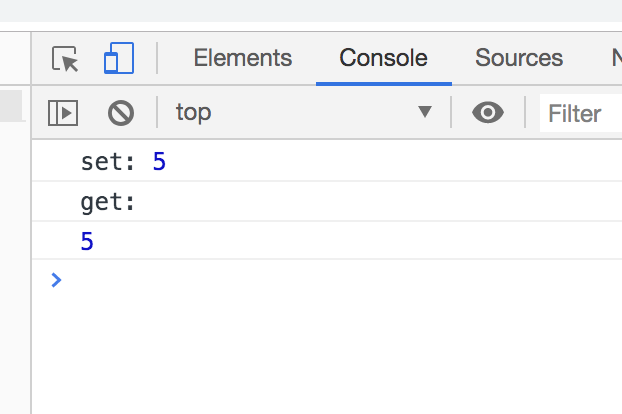
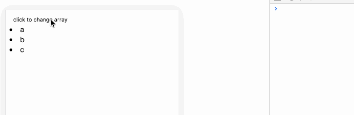
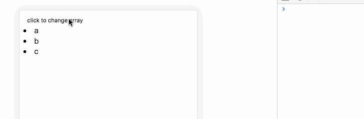

# typescript从零开始实现vue(补充): 数组的响应式

前面在实现响应式的时候，遗留了对数组的处理，后来发现这块在日常使用中还是用到挺多的，因此再补充一章，对此进行实现。


## Object.defineProperty的误区

在`vue`官网文档中，这么写道

> 由于 JavaScript 的限制，Vue **不能**检测以下数组的变动：
>
> 1. 当你利用索引直接设置一个数组项时，例如：`vm.items[indexOfItem] = newValue`
> 2. 当你修改数组的长度时，例如：`vm.items.length = newLength`

因此，很多同学误以为`Object.defineProperty`不能对数组处理。那么到底是不是呢，直接看代码

```js
const arr = [1, 2, 3, 4]
const tmp = arr.concat([])
for (let i = 0; i < arr.length; i ++) {
  Object.defineProperty(arr, i, {
     get: function() {
        console.log('get:')
        return tmp[i]
     },
      set: function(newVal) {
          console.log('set:', newVal)
          tmp[i] = newVal
        }
    })
}

 
arr[1] = 5
console.log(arr[1])
```

结果如下：



可见`Object.defineProperty`会对数组进行监听。那么为什么在`vue`中不这么处理呢？我们先来实现数组更新检测


## 数组更新检测

我们将数组的方法分为两类：改变原始数组的方法和不会改变原始数组的方法。

不会改变原始数组的方法，例如 `filter()`、`concat()` 和 `slice()` 。对于这些方法，我们可以直接用新数组替换旧数组，来实现页面的重新渲染。如：

```js
example1.items = example1.items.filter(function (item) {
  return item.message.match(/Foo/)
})
```

改变原始数组的方法有：

- `push()`
- `pop()`
- `shift()`
- `unshift()`
- `splice()`
- `sort()`
- `reverse()`

对于这些方法，我们需要对其进行变异处理。

### Observer

把数据变为响应式是在`Observer`类中，我们现在新增对数组的判断：

```js
export interface ObserveValue {
    __ob__ ?: Observer
}
    
/**
 * 遍历value调用defineReactive，把value变成响应式
 */
export class Observer {
    value: any;
    dep: Dep;

    constructor(value: ObserveValue) {
        this.dep = new Dep()        // 订阅收集器
        def(value, '__ob__', this); 
        if(Array.isArray(value)) {  // 判断value是否是数组
            Object.setPrototypeOf(value, arrayMethods);  // value.__proto__ = arrayMethods
            this.observeArray(value)
        } else {
            this.walk(value)
        }
        
    }

    // 遍历obj的属性， 将每个属性变成响应式
    walk(obj: any) {
        Object.keys(obj).forEach((key) => {
            defineReactive(obj, key)
        })
    }

    // 遍历数组，把数组中的每个子项变成响应式。注意：并不是把数组变成响应式
    observeArray(arr: Array<any>) {
        for (let i = 0; i < arr.length; i++) {
            observe(arr[i])
        }
    }
} 
```

我们在原来的代码上，增加了如下代码

```js
...
if(Array.isArray(value)) {  // 判断value是否是数组
     Object.setPrototypeOf(value, arrayMethods);  // value.__proto__ = arrayMethods
     this.observeArray(value)       
}
...

// 遍历数组，把数组中的每个子项变成响应式。注意：并不是把数组变成响应式
observeArray(arr: Array<any>) {
  for (let i = 0; i < arr.length; i++) {
     observe(arr[i])
   }
}
```

判断当`value`是数组类型时，我们就将`value`的`__proto__`属性赋值为`arrayMethods`。这样，当我们调用数组的方法时，其实调用的就是`arrayMethods`中的方法。

然后我们遍历数组，把数组中的每个子项变成响应式。这里需要注意的是，并不是把数组变成响应式。举个例子:

```js
let arr = [{name: 'aa'}，{name: 'bb'}]

// 调用observeArray后，arr中的每个元素变成响应式
observeArray(arr)    

arr[0].name = 'cc'   		// 会触发页面更新

arr[0] = {name: 'ccc'}  // 不会触发页面更新
```


### arrayMethods

我们对数组方法的变异处理，在`arrayMethods`对象中实现。代码如下

```js
type arrMethod = 'push' | 'pop' | 'shift' | 'unshift' | 'splice' | 'sort' | 'reverse' 

const arrayProto = Array.prototype
const ArrayMethods: Record<string, Function> = Object.create(arrayProto)


// 以下这些方法都会改变数组，所以对其进行改写
// 每次调用下面的方法，都将触发更新
const methodsToPatch: arrMethod[] = [
    'push',
    'pop',
    'shift',
    'unshift',
    'splice',
    'sort',
    'reverse'
]

methodsToPatch.forEach(function(method) {
    ArrayMethods[method] = function (this: ObserveValue, ...args:any) { 
      let result;
      const ob = this.__ob__
      let inserted
      switch (method) {
        case 'push':
        case 'unshift':
          result =  arrayProto[method].apply(this, args);
          inserted = args
          break
        case 'splice':
          result =  arrayProto[method].apply(this, args);
          inserted = args.slice(2)
          break;
        default:
          result =  arrayProto[method].apply(this, args);
          break;
      }
      if(ob) {
        // 把新增的数据变为响应式
        if (inserted) ob.observeArray(inserted)
        
        // 通知数据更新
        ob.dep.notify()
      }
      
      return result
    }
})
```

`ArrayMethods`首先继承了数组的原始方法，然后对会改变原始数组的方法进行特殊处理。举个例子，比如`push`方法：每当调用`arr.push()`时，会先调用数组的原始`push`对数组处理获得结果，如果有新增元素，则调用`observeArray`方法，把新增元素变为响应式。最后调用` ob.dep.notify()`方法，通知`watcher`数据发生了更新。

### 尝试一下

不使用变异方法

```js
const tsue = new Tsue({
    el: '#app',
    data: function(){ 
        return {
            arr: [
                    {val: 'a', key: 'A'},
                    {val: 'b', key: 'B'},
                    {val: 'c', key: 'C'}
             ]
         }
    },
    methods: {
      clickHandler3: function() {
         // this.arr.splice(0, 1, {val: 'd', key: 'D'})
         this.arr[0] = {val: 'd', key: 'D'}
      }
    },
    render(h) {
      return ( 
        <div>
             <button onClick={this.clickHandler3}>click to change array</button> 
            {
               this.arr.map((item) => {
                        return <li key={item.key}>{item.val}</li>
               })         
            }
        </div>
      )
    }
})
```
结果如下，点击后页面没有变化


使用变异方法

```js
clickHandler3: function() {
  this.arr.splice(0, 1, {val: 'd', key: 'D'})
}
```

结果如下，点击后，页面第一条元素变化




## 小结

与对象的处理不同，对于数组的响应式，我们对会改变原始数组的方法进行了变异处理，每次调用变异方法的时候，再调用`ob.dep.notify()`触发页面更新。那么为什么不像对象那么处理呢？

我的理解是，当数组所包含的元素很多，每个元素又有嵌套，那么在数据初始化对数组绑定监听时，需要一层一层的遍历，这样会浪费性能。所以`vue`对数组做了特殊处理。