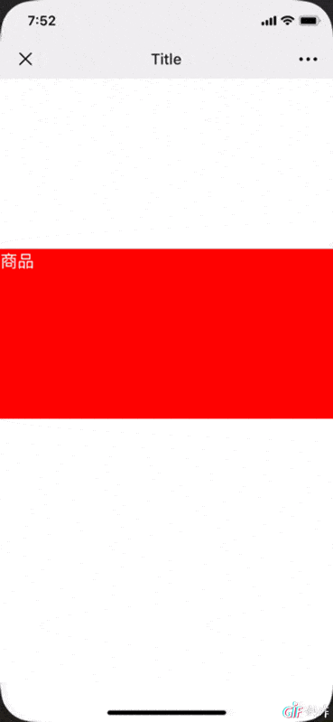
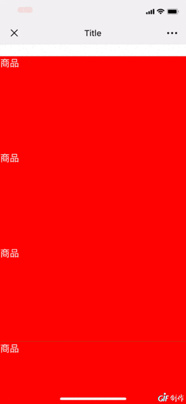
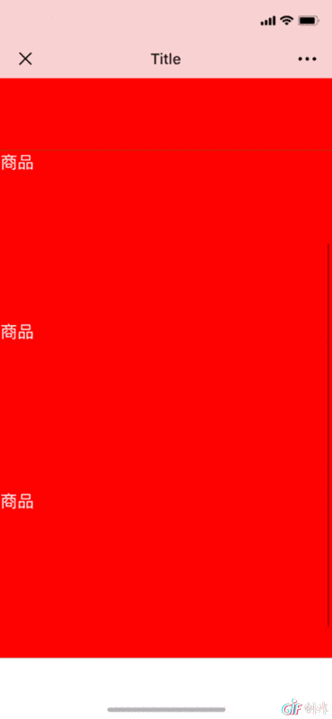
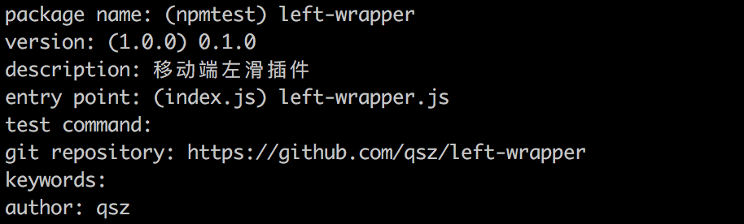

# 用TS实现实现一个移动端左滑插件left-wraper

本文将学习：

* 用ts实现移动端左滑插件

* 将插件发布到npm

## 需求分析

最近想优化下公司在移动端线上商城项目，在项目购物袋中需要实现一个左滑出现删除商品的效果。

类似如图淘宝app ios端购物车左滑效果


该效果有几点需要强调的地方

* 滑动结束时，若没到达边界，需自动回弹到边界处
* 组件滑动和页面的滚动效果不能同时出现


## 代码实现

[**left-wrapperw完整代码**](https://github.com/qsz/left-wrapper)

### html结构

组件的html结构如下：

```html
<div id='wrapper' class='left-wraper'>
    <div class="left-slide slide"></div>
    <div class="right-slide slide"></div>
</div>
```

css样式按项目自定义实现，比如下面这样

```css
* {
    padding: 0;
    margin: 0;
    box-sizing: border-box;
}

body {
    height: 3000px;
    padding-top: 500px;
}
.slide {
    height: 500px;
    width: 100%;
}

.left-slide {
    color: white;
    font-size: 50px;
    background-color: red;
}
.right-slide {
    background-color: green;
}
.right-slide p {
    color: white;
    font-size: 50px;
    float: right;
}
```

至于我们插件相关的样式，在插件中实现，这样能最大限度的增强我们插件的可扩展性，并不需要强制规定样式。


### 定义接口

1. 定义事件类型

	````typescript
	enum TouchEventsName {
    touchStart = 'touchstart',
    touchMove = 'touchmove',
    touchEnd = 'touchend'
	}
	````

2. 定义参数, 这两个参数分别表示左滑最大值和滑动结束后动画持续时间，具体用处我们下面会提到

   ```typescript
   interface WrapperOpts {
       slideWidth?: number;
       duration?: number;
   }
   ```

3. 将插件命名为“left-wrapper”。定义“left-wrapper”的基本结构

   ```typescript
   interface Wrapper {
       wrapper: HTMLElement | null;                     // 最外层元素 wrapper
       leftSlide: HTMLElement | null;                   // 左边元素 left-slide
       rightSlide: HTMLElement | null;                  // 右边元素 right-slide
       touchStart: (e: TouchEvent | MouseEvent) => void; // 滑动开始方法
       touchMove: (e: TouchEvent | MouseEvent) => void;  // 滑动中方法
       touchEnd: (e: TouchEvent | MouseEvent) => void;   // 滑动结束方法
   }
   ```

   

### 实现功能

#### 实现接口, 定义基本的属性

如果传入的参数wrapper不是HTMLElement类型，那么需要错误提示

```javascript
class LeftWrapper implements Wrapper {
  	wrapper: HTMLElement | null = null;                                 // 目标最外层
    leftSlide: HTMLElement | null = null;                               // 左滑元素
    rightSlide: HTMLElement | null = null;                              // 右边元素
    bodyInitStyle: string = '';                                         // body元素初始样式
    bodyDom: HTMLElement | null = document.querySelector('body');       // body元素
    slideWidth: number = 0;                                             // 左滑移动的最大距离
    slideX: number = 0;                                                 // 左滑移动的距离
    transitionDuration: number = 300;                                   // 过渡时间
  
  	constructor(wrapper: HTMLElement | null, opts: WrapperOpts = {}) {
        if (!wrapper || !(wrapper instanceof HTMLElement)) {
            console.error('Param wrapper must be HTMLElement');
            return this;
        }
        this.wrapper = wrapper!;
        this.leftSlide = this.wrapper!.children[0] as HTMLElement;
        this.rightSlide = this.wrapper!.children[1] as HTMLElement;
        this.bodyInitStyle = this.bodyDom!.getAttribute('style') || '';
        this.slideWidth = opts.slideWidth || 0;
        this.transitionDuration = opts.duration || 300;
    }

}
```

#### 定义滑动过程中的状态数据

在滑动中，有一些数据会随着过程改变，比如移动的距离，开始结束时左边等。放到state中

```javascript
initStateData = {
  	target: null,                                                   // 目标元素
    moveX: 0,                                                       // x轴移动的距离
    startX: 0,                                                      // 开始移动时x坐标
    endX: 0,                                                        // 结束移动时x坐标
    moveY: 0,                                                       // y轴移动的距离
    startY: 0,                                                      // 开始移动时y坐标
    endY: 0,                                                        // 结束移动时y坐标
    forbiddenScroll: false,                                         // 禁止页面滚动
    forbiddenWrapper: false,                                        // 禁止左滑
    isTrend: false,                                                 // 是否判断过趋势
    fixedTop: 0                                                     // body固定时的top值
};
state = { ...this.initStateData };                                  // 移动过程中的状态
```

#### 初始化插件

提供两个初始化的方法initStyle、initEventListener

* initStyle：初始化样式。我们把功能相关的样式写到js中，这样使用时就不需要额外引入样式文件
  ```javascript
   // 定义需要用到的样式
  cssInitStyles = { 
    overflow: {
      overflow: 'hidden'
    },
    zIndex: {
      zIndex: 1
    },
    relative: {
      position: 'relative'
    },
    absolute: {
      position: 'absolute',
      transform: 'translateX(0)'
    },
    fixed: {
      position: 'fixed',
      width: '100%'
    }
  };
  
  /**
  * 初始化样式
  */
  initStyle = (): void => {
    LeftWrapper.jsCss(this.wrapper!, { ...this.cssInitStyles.overflow, ...this.cssInitStyles.relative });
    LeftWrapper.jsCss(this.leftSlide!, { ...this.cssInitStyles.absolute, ...this.cssInitStyles.zIndex });
    LeftWrapper.jsCss(this.rightSlide!, { ...this.cssInitStyles.overflow, ...this.cssInitStyles.relative });
  };
  
  /**
  * 设置样式
  * @param element dom元素
  * @param cssStyles 样式
  */
  static jsCss = (element: HTMLElement, cssStyles: CssStyles): void => {
    const cssStyless = Object.keys(cssStyles);
    if (cssStyless.length > 0) {
      cssStyless.forEach((property) => {
        const cssStyle = cssStyles[property];
        element.style[property as any] = cssStyle;
      });
    }
  };
  ```

​       `jsCss`作为工具函数，我们将它封装成一个静态方法，这样直接用`LeftWrapper.jsCss`调用

* initEventListener：绑定监听事件。监听`touchStart`, `touchMove`和`touchEnd`

   ```javascript
   /**
   * 初始化监听事件
   */
   initEventListener = (): void => {
     if ('ontouchstart' in window) {
       Object.keys(TouchEventsName).forEach((event) => {
         this.leftSlide!.addEventListener(TouchEventsName[event as EventString], (e) => this[event as EventString](e), {
           capture: false
         });
       });
     }
   };
   ```
   
   作为移动端的插件，在这里我们只绑定touch事件，如果`window`对象上没有`ontouchstart`事件，就认为不是移动端的操作，就不再进行后续的绑定

#### 实现touch事件函数

#### 开始滑动瞬间touchStart

在触碰组件开始滑动的瞬间，记录当前触碰点的坐标，作为我们滑动的起始点

```javascript
/** 类型谓词
* 是否是移动事件
* @param e 事件对象
*/
isTouch(e: TouchEvent | MouseEvent): e is TouchEvent {
  return (e as TouchEvent).targetTouches !== undefined;
}

/**
* 开始移动
*/
touchStart(e: TouchEvent | MouseEvent): void {
  if (this.isTouch(e)) {
  	this.state.startX = e.targetTouches[0].pageX;
		this.state.startY = e.targetTouches[0].pageY;
  } else {
    this.state.startX = e.pageX;
    this.state.startY = e.pageY;
  }
}
```

#### 滑动中touchMove

在滑动过程中，我们根据当前触摸点的坐标和起始坐标的差值，计算出当前在x轴上移动的距离`moveX`。并同时根据`moveX`改变我们左滑元素的样式`translateX`, 依次来实现滑动效果

```javascript
		/**
     * 移动中
     */
    touchMove(e: TouchEvent | MouseEvent): void {
        let curerntX: number = 0;
        let curerntY: number = 0;
        if (this.isTouch(e)) {
            curerntX = e.targetTouches[0].pageX;
            curerntY = e.targetTouches[0].pageY;
        } else {
            curerntX = e.pageX;
            curerntY = e.pageY;
        }
        this.state.moveX = curerntX - this.state.startX;
        this.state.moveY = curerntY - this.state.startY;
        this.moveSlideX(this.state.moveX);
        this.state.startX = curerntX;
        this.state.startY = curerntY;
    }
     /**
     * 移动中设置滑动的x轴位置slideX
     * @param x 滑动的距离(moveX)
     */
    moveSlideX(x: number): void {
        let translateX = this.slideX + x;
        this.slideX = translateX >= 0 ? 0 : Math.abs(translateX) >= this.slideWidth ? -this.slideWidth : translateX;
        LeftWrapper.jsCss(this.leftSlide!, {
            transitionDuration: '0ms',
            transform: `translateX(${this.slideX}px)`
        });
    }
```

这里有个地方需要注意，观察这行代码

```typescript
this.slideX = translateX >= 0 ? 0 : Math.abs(translateX) >= this.slideWidth ? -this.slideWidth : translateX;
```

在实际滑动中，往左或右滑不能没有限制。左滑边界距离通过传入参数`slideWidth`规定，右滑边界距离则为0。

#### 触摸结束touchEnd

触摸结束后，将滑动过程中的状态重置，以便下次继续滑动

```javascript
	touchEnd(e: TouchEvent | MouseEvent): void {
         this.state = { ...this.initStateData };
   }
```


### 完善功能

到此，基本的功能已经实现。但在实际使用中，我们还是发现一些问题

#### 自动回弹

如图所示



当我们滑动一小段距离，发现此时触摸结束后，右边元素没有显示完整，看起来不好看。我们增加一个自动回弹的功能：

* 左滑时，当触摸结束后，如果滑动的距离大于设置的`slideWidth`值的一半，我们就自动将元素滑到最大处，否则将左滑元素滑动距离归零
* 右滑时，当触摸结束后，无论滑动的距离是否大于设置的`slideWidth`值的一半，都将左滑元素滑动距离归零
* 左滑还是右滑，可以根据滑动时坐标与初始坐标的差值是否为正数来判断

**完善touchEnd函数**

```javascript
touchEnd(e: TouchEvent | MouseEvent): void {
        const absMoveX = Math.abs(this.slideX);
        const halfSlide = this.slideWidth / 2;
        if (absMoveX >= halfSlide) {
            // 两种情况
            // 当前x轴位置大于设置距离的一半，则将当前x轴位置变成设置距离
            // this.state.moveX > 0表示右滑，右滑则将slideX直接变为0
            this.slideX = this.state.moveX > 0 ? 0 : -this.slideWidth;
        } else {
            this.slideX = 0;
        }
        this.transitionX();
        this.resetWrapperState();
}
```

#### 左滑与页面滚动互斥

再看下图这种情况



当我们左滑组件很多，导致页面需要滚动时。每次随着移动页面，都会导致组件的左滑，这样的用户体验不好。

接下来，我们将其完善，让组件滑动和页面的滚动效果不能同时出现

##### 左滑时固定页面

当滑动时我们将页面`body`元素设置成`postion:fixed`；当页面滚动时，在将`body`元素`fixed` 删除

##### 如何判断是左滑还是页面滚动

在这里引入趋势的概念，即通过判断前后两次滑动的x，y轴坐标，来判断是否有左滑的趋势

如果在x轴上滑动的距离大于在y轴上滑动的距离，就认为是左滑

```javascript
/**
* 是否有左滑的趋势
*/
wrapperTrend(): boolean {
	this.state.isTrend = true;
  if (Math.abs(this.state.moveX) >= Math.abs(this.state.moveY)) {
    // 有左滑的趋势，则禁止页面滚动
    this.stopScroll();
    return true;
  } else {
    // 没有左滑的趋势，允许页面滚动
    this.allowScroll();
    return false;
  }
}
```

**完善touchMove函数**

```javascript
		/**
     * 移动中
     */
    touchMove(e: TouchEvent | MouseEvent): void {
        if (this.state.forbiddenWrapper) {
            // 禁止左滑
            return;
        }
        ...
        this.state.moveX = curerntX - this.state.startX;
        this.state.moveY = curerntY - this.state.startY;
        if (!this.state.isTrend) {
            if (!this.wrapperTrend()) { // 可以滚动，不能左滑
                return;
            }
        }
        ...
    }
```

好了，如图所示，左滑时将页面固定，页面滚动时禁止左滑



##### 还原滚动条位置

当左滑时，我们会固定页面。但当左滑结束后，我们需要还原页面滚动条位置，否则页面会回到顶部。

我们在页面固定的时候，记录当前滚动条的位置`fixedTop`。当滑动结束重置状态时，重新设置页面滚动条位置为

`fixedTop`即可。

```javascript
 		/**
     * 每次滑动结束后，重置状态
     */
    resetWrapperState(): void {
        this.bodyDom!.setAttribute('style', this.bodyInitStyle);
        if (this.state.fixedTop > 0) {
            LeftWrapper.setScrollTop(this.state.fixedTop);
        }
        this.state = { ...this.initStateData };
    }
```


### 使用插件

到此为止“LeftWrapper”开发完成。使用方式很简单

```js
const wrapper = document.getElementById('wrapper'); // 最外层元素
new LeftWrapper(wrapper, { 
    slideWidth: 100        // 设置左滑的最大距离
});
```


## 发布插件

为了方便使用，我们将“LeftWrapper”发布到`npm`

#### 注册账号

首先需要到 [npm官网](https://www.npmjs.com/)，注册账号

#### 本地登入

在本地新建目录并进行，执行命令`npm login`。按照提示依次输入在官网注册的用户名、密码和邮箱

#### 初始化项目

执行命令`npm init`，依次输入以下信息



* package name: 包名字
* version：包版本
* description：描述这个包的功能
* entry point：入口文件
* git repository：git仓库地址
* author：作者

输入完成后，会在跟目录生成`package.json`文件, 里面的信息就是我们填写的信息

#### 定义加载的入口文件

打开`package.json`文件

> "name": "left-wrapper",
>
>  "version": "0.1.0",
>
>  "description": "移动端左滑插件",
>
>  "main": "left-wrapper.js",

其中`main`字段指定了加载的入口文件，`require('moduleName')`就会加载这个文件。

我们再追加`"module":"left-wrapper.js" `字段，同样是指定加载的入口文件，用于提供`ES6 `中的 `import`形式的加载。

关于`main`与`module`的区别，可以参考下面这篇文章

[**聊聊 package.json 文件中的 module 字段**](https://juejin.im/entry/5a99ed5c6fb9a028cd448d6a)

#### 发布

最后执行`npm publish `命令发布我们的插件。成功后，在"npm 官网"搜索插件名字，就能找到我们的插件。


## 小结

移动端左滑插件的基础功能已经实现。后续打算完善这个插件：优化代码提高性能、提供更多的左滑样式