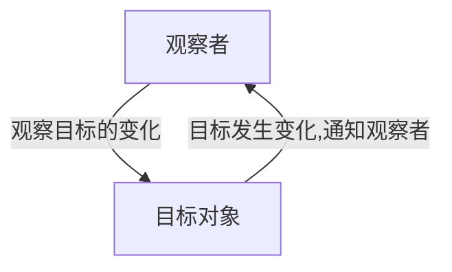
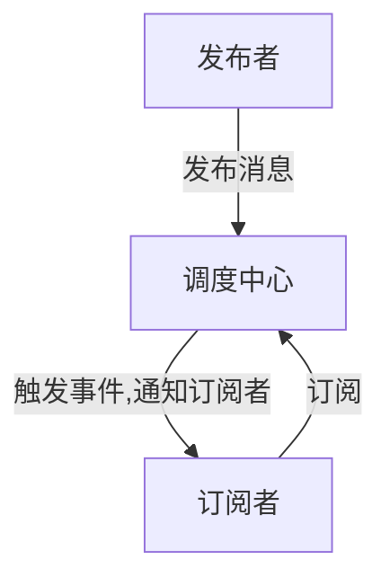

# 观察者模式和发布订阅模式真的不一样吗？

在论坛或博客中，讲到观察者模式时，我发现很多同学会与发布订阅模式区别开来讨论，那么观察者模式和发布订阅模式本质上是两种不同的设计模式吗？经过本次学习，我想谈谈自己的理解。


## 认为两种模式不一样，认为两种模式的流程图是这样的

首先，来看看讨论的比较多的，认为两种模式不一样，我研究了一下他们的看法，如下：

### 观察者模式

**流程图是这样的**



根据这个流程图，我觉得相应的代码是如下这样的：

```js
// 目标对象
class Target{
  constructor(){
    this.subs = []; // 观察者列表
  }
  // 把观察者放入观察者列表中
  addSub(sub){
    this.subs.push(sub);
  }
  // 通知所有的观察者作出响应
  notify(){
    this.subs.forEach(sub=> {
      sub.update();
    });
  }
}

// 观察者
class Observer{
  constructor(name){
    this.name = name
  }
  // 订阅目标对象, 调用目标对象的addSub方法，将自身添加到目标对象的观察者列表中
  addDep(target) {
    target.addSub(this)
  }
  // 目标触发更新
  update(){
    console.log(`update: My name is ${this.name}`);
  }
}

// 使用方式
const target = new Target();
const ob_a = new Observer('aaa');
const ob_b = new Observer('bbb');

// 观察者a订阅目标对象
// 也可以直接这样调用： target.addSub(ob_a)
ob_a.addDep(target); 
// 观察者b订阅目标对象
// 也可以直接这样调用： target.addSub(ob_b)
ob_b.addDep(target); 

target.notify();     // 目标对象通知a, b更新
```


### 发布订阅模式

**流程图是这样的**：与观察者相比，中间过程多了一个调度中心



根据这个流程图，我觉得相应的代码应该如下这样实现

```js
// 发布者
class Target{
  // 发布消息，告知调度中心通知给订阅者
  notify(pub){
    pub.publish()
  }
}

// 订阅者
class Observer{
  constructor(name){
    this.name = name
  }
  // 订阅调度中心
  addDep(pub) {
    pub.subscribe(this)
  }
  // 调度中心通知订阅者更新
  update(){
    console.log(`update: My name is ${this.name}`);
  }
}

// 调度中心
class PubSub {
  constructor(){
    this.subs = []; // 订阅者列表
  }
  // 把订阅者放入订阅者列表中
  subscribe(sub) {
    this.subs.push(sub);
  }
  // 发布消息，通知所有的订阅者作出响应
  publish() {
    this.subs.forEach(sub=> {
      sub.update();
    });
  }
}

// 使用方式:
const target = new Target();      // 发布者实例
const pubSub = new PubSub();      // 调度中心实例

 
const ob_a = new Observer('aaa'); // 订阅者a
const ob_b = new Observer('bbb'); // 订阅者b


// 途径1:
// 订阅者a 订阅 调度中心
// 也可以直接这样调用： pubSub.subscribe(ob_a)
ob_a.addDep(pubSub)               
// 订阅者b 订阅 调度中心
// 也可以直接这样调用： pubSub.subscribe(ob_b)
ob_b.addDep(pubSub)               

// 发布者发布消息，告知调度中心通知给订阅者做出响应
target.notify(pubSub)             
```


## 我的观点：发布订阅模式的本质就是观察者模式

通过比较上述两种代码实现，可以很明显的看到：

* 在发布订阅模式中的调度中心(`PubSub`)所做的事情，其实就是观察者模式中，目标对象的`addSub`、`notify`方法。调度中心只是把目标对象的订阅和发布方法抽离出来而已。

* 我们改写一下两种模式的使用方式，就可以看的非常清楚，如下所示。**调度中心和观察者`ob_a`、`ob_b`之间，其实也是观察者模式的体现**。

  **发布订阅模式中的调用过程本质就是下面这样**
  
	```js
		// pubSub：调度中心
	  pubSub.subscribe(ob_a)
  	pubSub.subscribe(ob_b)
  	pubSub.publish()
  ```
  **观察者模式的调用流程本质如下，其实也是一样的**
  
  ```js
  	// target: 目标对象
    target.addSub(ob_a)
  	target.addSub(ob_b)
  	target.notify();
  ```


因此，我认为发布订阅模式的本质就是观察者模式，其定义是这样的：

> 观察者模式又叫发布订阅模式（Publish/Subscribe），它定义了一种一对多的关系，让多个观察者对象同时监听某一个主题对象，这个主题对象的状态发生变化时就会通知所有的观察者对象，使得它们能够自动更新自己

引自：[汤姆大叔的博客-设计模式之观察者模式](https://www.cnblogs.com/TomXu/archive/2012/03/02/2355128.html)

------


## 小小的扩展1：Vue中的观察者模式

在[typescript从零开始实现vue(二) : 实现响应式](前端进阶/tsue2-响应式.md)中，我们就采用了观察者模式。在响应式中，`Dep`就是被观察的目标对象，`Watcher`就是观察者。

观察者订阅目标对象的变化和目标对象通知观察者的过程，则发生在`observe`方法中。`observe`在实现中会把数据变为响应式，在`getter`和`setter`中，分别进行订阅目标对象和通知观察者更新

```js
  Object.defineProperty(obj, key, {
        enumerable: true,
        configurable: true,
        get: function() {
            const value = getter ? getter.call(obj) : val
            if (Dep.target) {
                // 订阅收集
                dep.depend()
                if (childOb) {
                  childOb.dep.depend()
                }
            }
            return value
        },
        set: function(newVal) {
            const value = getter ? getter.call(obj) : val
            if (newVal === value || (newVal !== newVal && value !== value)) {
                return
            }
            val = newVal              
            childOb = observe(newVal) 
            // 数据更新，通知watcher
            dep.notify()             
        }
    })     
```


## 小小的扩展2：Markdown绘制流程图

不知道大家注意到没有，文中的流程图是在`Markdown`中直接绘制的，大家可以参考

* [如何在Markdown中画流程图](https://www.jianshu.com/p/b421cc723da5)